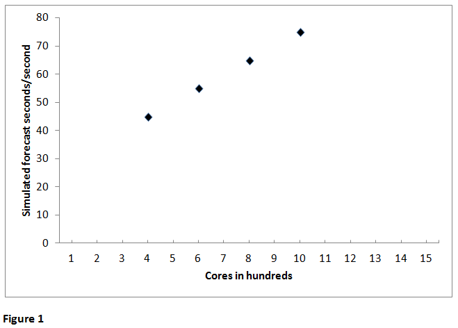
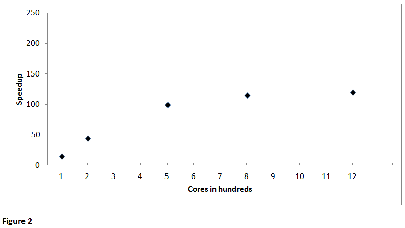

# Determining computational resource needs

Documenting your code’s performance and scalability to demonstrate that
your stated resource needs are reasonable is an important aspect of
preparing an allocation request.

These guidelines are intended to help you gather and present the data
you need to support your request. Ultimately, you will complete a table
like the one shown here to include in your application. With
accompanying narrative that describes each experiment or experimental
configuration, it will communicate clearly to reviewers what computing
resources you need and how you will use those resources.

#### Estimating Derecho allocation needs

Derecho users can expect to see a **1.3x** improvement over the Cheyenne
system's performance on a core-for-core basis. Therefore, to estimate
how many CPU core-hours will be needed for a project on Derecho,
multiply the total for a Cheyenne project by **0.77**.

When requesting an allocation for Derecho GPU nodes, please make your
request in terms of GPU-hours (number of GPUs used x wallclock hours).
We encourage researchers to estimate GPU-hour needs by making
test/benchmark runs on Casper GPUs, but will accept estimates based on
runs on comparable non-NCAR, GPU-based systems.

You can use a chart like this as a starting point. Review the
documentation for the relevant [allocation
opportunity](file:////display/RC/Allocations) to learn what else is
required.

<table style="width:100%;">
<colgroup>
<col style="width: 30%" />
<col style="width: 27%" />
<col style="width: 24%" />
<col style="width: 17%" />
</colgroup>
<thead>
<tr class="header">
<th><strong>Experiment</strong> 
<strong>(Experimental configuration)</strong></th>
<th><strong>Core-hours per simulation</strong></th>
<th><strong>Number of simulations</strong></th>
<th><strong>Total core-hours</strong></th>
</tr>
</thead>
<tbody>
<tr class="odd">
<td></td>
<td></td>
<td></td>
<td></td>
</tr>
<tr class="even">
<td></td>
<td></td>
<td></td>
<td></td>
</tr>
<tr class="odd">
<td></td>
<td></td>
<td></td>
<td></td>
</tr>
<tr class="even">
<td></td>
<td></td>
<td></td>
<td></td>
</tr>
<tr class="odd">
<td></td>
<td></td>
<td></td>
<td></td>
</tr>
<tr class="even">
<td></td>
<td></td>
<td></td>
<td></td>
</tr>
<tr class="odd">
<td></td>
<td></td>
<td></td>
<td></td>
</tr>
<tr class="even">
<td><strong>Totals</strong></td>
<td></td>
<td></td>
<td></td>
</tr>
</tbody>
</table>

## CESM and WRF

### Community Earth System Model

In the case of **CESM**, see the [<u>timing
tables</u>](https://csegweb.cgd.ucar.edu/timing/cgi-bin/timings.cgi)
provided by the CESM team at NCAR for information that will help you
develop a statement of resource requirements for your project.

The computational cost of CESM experiments typically is expressed in
core-hours (also known as processor element-hours or "pe-hrs") per
simulated year, so the “Cost pe-hrs/yr” column (the cost in core-hours
for each simulated year) provides the necessary value needed to
calculate the cost of a simulation; you provide the number of years.

Your allocation request should show that the number of years proposed
and the model resolution chosen are sufficient and necessary to answer
your scientific question(s).

### Weather Research and Forecasting Model

For **WRF** projects, review the guidance on our [Optimizing WRF
performance](file:////display/RC/Optimizing+WRF+performance) page.
Follow those recommendations as you do some benchmark runs to estimate
the number of core-hours you will need for each planned simulation. Cite
that page in your core-hour request and describe for the review panel
how you estimated your resource requirements.

## Other codes and models

Proposed experiments may be different enough from the documented CESM
and WRF simulations that you need to run your code several times to
determine how many core-hours you’ll need. If you are using other codes
or models that do not have well-known or published performance
information, you will need to document the performance and scalability
of your codes to complete your resource request. (A reference to a web
site or paper with performance and scalability details for the code or
model is acceptable for purposes of an allocation request.)

Presumably you’ve run your code on a multi-core system and have at least
a general idea of what resources you will need in order to run at the
same scale or larger on the Cheyenne or Casper systems.

To begin fine-tuning your general idea into a specific request for
resources, consider these questions:

- How large is any data set that you need to load?

- How much memory needs to be available for you to complete a run? (The
  [peak_memusage tool](file:////display/RC/Checking+memory+use) can tell
  you how much memory your program uses.)

Your answers will help you calculate the minimum number of nodes you can
use.

**Memory needed / memory per node = minimum nodes**

That minimum number of nodes can serve as your starting point unless you
already know that a larger number will work. You may need anything from
a few dozen to hundreds or thousands of cores.

Document your code’s performance with test runs on the Cheyenne system
if possible, or on a reasonably similar platform and software stack. You
will want to illustrate in a graph that your code performs well at
increasingly higher scale, showing **at least four points** indicating
the results of your runs (as in Figure 1).

If your application’s performance is not already well documented, you
may need to establish a baseline by running it on a single node before
scaling. On Cheyenne, your parallel code would be executed on a total of
36 cores on a single node or the equivalent of 72 cores with
[hyper-threading
support](file:////display/RC/Hyper-threading+on+Cheyenne). From that
baseline, you can generate scaling data by making a series of runs on
progressively greater numbers of nodes to determine the optimum number
to use.

Start by documenting the smallest run that you know will work. For
example, say you’ve run your parallel code on a similar system using
4,000 cores, or you’ve had an opportunity to do some similar-size test
runs on Cheyenne. Do additional larger runs to demonstrate that the code
scales as you expect it to scale. To ensure accuracy, it can help to do
several runs at each point on different days to detect variations that
might result from changes in the machine’s workload.

Based on the hypothetical results shown in Figure 1, a run could be done
efficiently using 1,000 cores. The job would finish more quickly, using
less wall-clock time, than it would using 400 cores.

To convert that into total core-hours needed for one type of simulation,
multiply core-hours per simulation (the time needed to complete one
simulation times the number of cores used) by the number of times you
are proposing to run that type of simulation.

**Core-hours per simulation x total simulations = total core-hours**

That gives you the information you need to fill out one row of your
table. Repeat the process for each type of simulation, then add the
figures in the last column to get the overall core-hour total.

## Strong vs. weak scaling

As you do your test runs, keep in mind that strong scaling – the degree
to which performance improves as more processors are applied to a
**fixed problem size** – is more useful for these purposes than weak
scaling, which reflects the ability to solve larger problem sizes with
more processors. Strong scaling will reflect the improvement in speed
(resulting in reduced overall run time) as more processors are used.

At some point, using more processors is likely to have little additional
benefit, because the potential for increasing speed is limited by the
ratio of serial to parallel code in the application. Figure 2 reflects
such a scenario, which shows little or no performance benefit from using
more than 5,000 cores. If you identify such a point in your test runs,
it would make little sense to base your allocation request on higher
numbers of cores.

## Reporting on performance

When submitting your allocation request, provide documentation on how
you generated your scaling data. Include a graph similar to those shown
here to illustrate the results.

Describe how flexible your code is regarding the number of processors it
can use and why you chose a certain number on which to base your
request. It also is helpful to include information on the portability of
the code to other platforms and on your team’s knowledge and experience
with systems that are similar to Cheyenne.

Use these links to download sample proposals:

- [Example proposal
  1](file:////download/attachments/75694337/Example_Proposal_1_Spring2020%2520%25281%2529.pdf%3fversion=1&modificationDate=1627489242000&api=v2)

- [Example proposal
  2](file:////download/attachments/75694337/Example_Proposal_2_Fall2019%2520%25281%2529.pdf%3fversion=1&modificationDate=1627489279000&api=v2)

They are specific to large university allocations but are good examples
of documenting performance that you can follow for other types of
requests.
