# Using remote desktops on Casper

## Using VNC

Most programs on Casper and Derecho are designed to run in the
terminal, but a few either require the use of a graphical interface or
work best in one. While using the default method – X-forwarding – is
sufficient for simple programs like text editors, it can be
prohibitively slow for more complex programs like MATLAB, IDL, VAPOR,
and RStudio.

When you log on to your workstation, you typically interact with
programs using a graphical desktop shell. With virtual network computing
(VNC), you can use a graphical desktop shell to work remotely on the
Casper data analysis and visualization cluster.

The remote desktop runs on Casper in a VNC session that is managed by
the *VNC server*. You access it with a *VNC client*, which runs on your
local workstation.

### To get started

Download and install a VNC client on your local machine. CISL recommends
the [TigerVNC](https://tigervnc.org/) client and provides this video to
help Mac users install it: [Installing TigerVNC on a Mac laptop](https://youtu.be/hVFN4AXLbWQ). (Installing on Windows machines
is less complex.)

[TurboVNC](https://www.turbovnc.org/) also works, but systems using Java
versions \>8 do not include the necessary runtime libraries to enable
TurboVNC's VNC viewer. Some other VNC clients – RealVNC, for example –
do not work well with the VNC software installed on Casper.

### Connecting to a VNC session

To begin using a remote desktop with VNC, you will need to start a VNC
session. Your session will run within a Casper job and can persist for
up to 24 hours.

These basic steps for starting a session are described in detail below:

- Run the `vncmgr` script, which enables you to configure your VNC
  desktop session and start both a Casper batch job and the VNC server.

- Connect to the Casper batch node with your VNC client, using a port
  that VNC specifies.

- Enter a one-time password to access your VNC session.

**If you are connected** to the NCAR Internal Network or using the [NCAR VPN](../../getting-started/vpn-access.md), you will be able to connect
directly to your session on the Casper batch node using the VNC client.

**If you are not** on the NCAR network or VPN, you will need to create
an SSH tunnel to connect your local machine and remote desktop. How to
create the SSH tunnel is described below.

#### Overview of the `vncmgr` script

CISL provides the `vncmgr` script for initiating and managing VNC
sessions on Casper. How to run it is described in detail in the
following section. It can be used in interactive mode or command-line
mode.

##### Interactive mode
If you run the script without any command-line
arguments, it will launch in the interactive mode. In this mode, you can
start a new session, list existing sessions, query a session to retrieve
connection instructions and obtain a new one-time-password, and kill a
running session. The script enables you to name your session, state how
long you want the server to run, and choose which GPU you'd like to request
for rendering support (GP100 or L40). It also allows for custom requests
to both the job scheduler and the VNC server program.

##### Command-line mode
In command-line mode, you specify a subcommand
and provide any desired options as command line arguments. Here are the
available commands:
```pre
vncmgr list

vncmgr create [SESSION] --account PROJECT [--time WALLTIME …]

vncmgr query [SESSION]

vncmgr kill [SESSION]
```

Choosing a name `SESSION` is optional. If you do not provide a name, the
name `default` will be assigned and referenced in each subcommand.

### Customizing the Casper job and VNC server

The `vncmgr` script allows you to customize both the Casper session in
which the server will run and the server itself. This customization can
be done in both interactive and command-line modes. The most common uses
involve increasing the resources allocated to your job. For example, you
could allocate 4 CPUs and 20 GB of memory to a 2-hour VNC session using
the command-line mode as follows:

!!! example "Creating a VNC session using `vncmgr create`"
    === "GP100 GPU"

        ```
        vncmgr create \
               --account PROJECT \
               --time 2:00:00 \
               --job-opts="-l select=1:ncpus=4:mem=20GB"
        ```

    === "L40 GPU"

        Request using `--gpu-model`:

        ```
        vncmgr create \
               --account PROJECT \
               --time 2:00:00 \
               --job-opts="-l select=1:ncpus=4:mem=20GB" \
               --gpu-model=l40
        ```

        Request using `--job-opts`:

        ```
        vncmgr create \
               --account PROJECT \
               --time 2:00:00 \
               --job-opts="-l select=1:ncpus=4:mem=20GB -l gpu_type=l40"
        ```

By default, all VNC jobs are automatically placed on nodes with NVIDIA
Quadro GP100 GPUs. You can optionally request that NVIDIA L40 GPUs are used
instead either via the `--gpu-model` flag to `vncmgr` or by specifying
`-l gpu_type=l40` in your `--job-opts`. The L40 GPUs are faster than
the GP100s and provide significantly more video RAM, so they are a good
choice for more resource-intensive rendering tasks.

Run `vncmgr --help` in a Casper login session for more
information about using the script and customizing your session.

### Running `vncmgr` from your local machine

You can run the `vncmgr` command directly from your local machine as
shown in the example below without first starting a login session on
Casper. While both command-line and interactive mode will
work, CISL recommends interactive mode as it will allow you to generate
new one-time passwords via the query option without having to
authenticate to Caspe every time.

### Example VNC Session

This demonstrates how to run `vncmgr`, create and configure a
customized VNC session, and then connect to the session with a VNC
client. In this example, the user is not connected to the NCAR VPN and
needs to use an SSH tunnel. ([Alternative for PuTTY users](#ssh-tunneling-with-putty).

1.  Run this command to get started, using your own username:
```pre
ssh -t -l username casper.hpc.ucar.edu /glade/u/apps/opt/vncmgr/bin/vncmgr
```
    You will be prompted to authenticate, after which you will have access
    to the vncmgr menu. (If you exit vncmgr, you will have to rerun the
    command to regain access to it.)

2.  Create your new VNC session with a name up to 10 characters long.
    The session is named "vapor" in this example. (Choose names that
    will help you avoid confusion if you run multiple sessions.)

    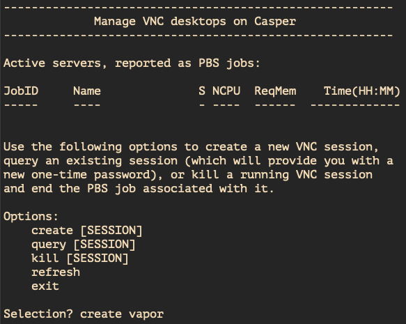

3.  A series of prompts on the next screen (below) will ask you to
    specify:

    - Your project code.
    - The wallclock time you want in `HH:MM:SS` format. The default is 4 hours and the maximum is 24 hours.
    - Which GPU you wish to use for hardware acceleration - a GP100 (default) or an L40 GPU.
    - Any optional arguments. In the example, the user requests 20 GB of memory.

    All VNC jobs must run on a node with a visualization GPU. If you specify
    custom resource requirements, those requirements will be modified if
    necessary to ensure that the job can run on the correct node.

    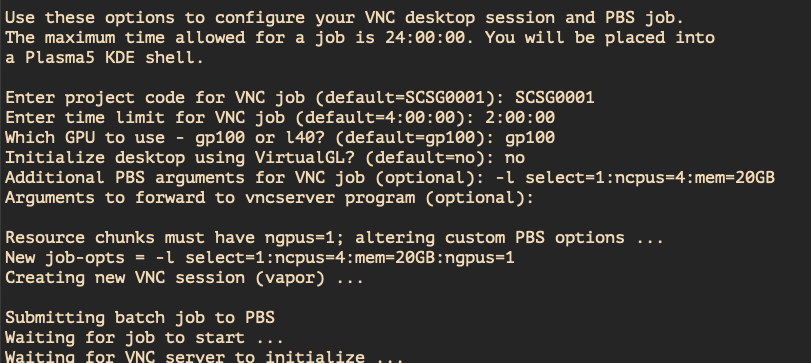

4.  When the job starts, follow the instructions and choose how you want
    to connect to your VNC session: tunneling or using the UCAR internal
    network or VPN.

    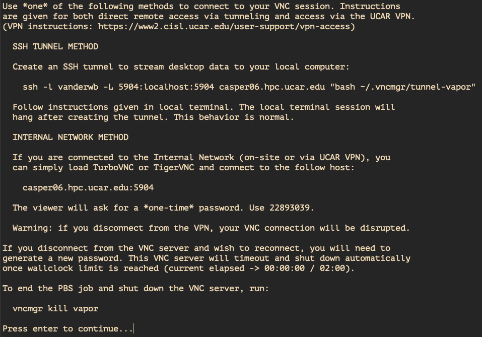

    Pressing enter at this point will return you to the interactive
    menu. Use the query option if you need to return to the instructions
    for creating the SSH tunnel later.

5.  Your desktop on Casper will be displayed after you connect to the
    specified host and enter the onetime password. On the desktop, start
    a Konsole (terminal) from the list of applications in the launcher.

    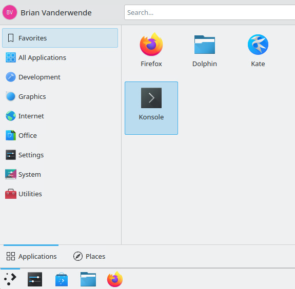

6.  To start an application, load any required modules and run the
    executable.

    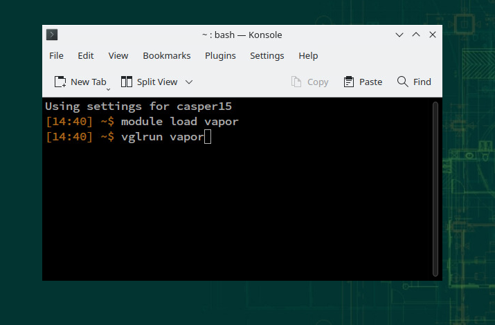

#### SSH tunneling with PuTTY
The general process for creating an `ssh` tunnel described above will work well for clients with a command line `ssh` installation, however additional steps are required for Windows users with PuTTY as their `ssh` client. Expand the note below for additional details.

??? note "SSH tunneling with PuTTY"

    The output from your `vncmgr` command includes a line in this format.
    (Each x is a number.)
    ```pre
    ssh -l username -L xxxx:localhost4:xxxx casperxx.hpc.ucar.edu "bash .vnctunnel-default"
    ```
    Follow these steps to copy and paste the necessary information from the `vncmgr` command into the PuTTY interface for Windows.

    - Load a PuTTY session with `casperxx.hpc.ucar.edu` as the hostname.
    - Select *Connection*, then *SSH*.
    - Enter the following in the **Remote command** field.
    ```pre
    bash .vnctunnel-default
    ```

    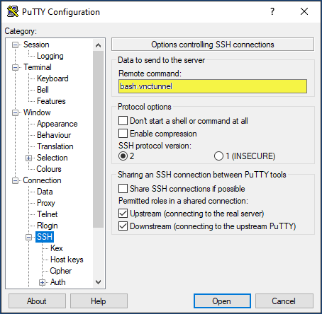

    - Under *SSH*, select *Tunnels*.
        - Paste the first four digits from the ssh command above into the **Source port** field.
        - Paste the `localhost4:xxxx` into the **Destination** field.

      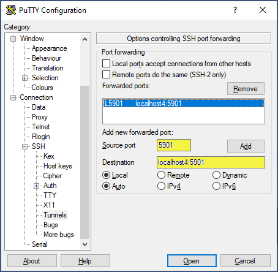

    - Click **Add**, Click **Open**, then log in.
    - Follow the instructions provided in your terminal window to start your
      VNC client.
    ```pre
    Starting SSH tunnel to the VNC server...

    Now load VNC on your local computer and connect to:

    localhost:xxxx

    VNC will ask for a one-time password. Use the following:

    xxxxxxxx

    This terminal session will hang until the tunnel is killed.

    To kill the tunnel, simply type C-c/Control-C.
    ```

---

## Using FastX

The **FastX** remote desktop service gives users access to Casper for
performing lightweight tasks such as text editing, running programs such
as `xxdiff` and `ncview`, or running analysis scripts that consume little in
the way of graphics resources.

A user can log out of a FastX remote desktop and return to it later.
This service will remain available while NCAR and UCAR building closures
are in effect.

FastX sessions that consume excessive resources are subject to being
killed. For resource-intensive workloads that do not require GPU-based
rendering, consider starting a Casper job instead by running
an `qinteractive` command from a FastX terminal window. For more
resource-intensive work with high-end, GPU-accelerated graphics,
consider using [VNC as described above](remote-desktops.md#using-vnc) rather
than FastX.

FastX can be accessed through a web browser or a desktop client. How to
use both of these options is described below.

### FastX via web browser with VPN access

To use FastX without installing any software, connect to the NCAR VPN
and use an updated version of any common browser. See the following
section for an alternative to using the VPN.

1.  Connect to the [NCAR VPN](../../getting-started/vpn-access.md).

2.  Go to [https://fastx.ucar.edu:3300](https://fastx.ucar.edu:3300/).

3.  Authenticate with your username and token response.

4.  Click the **+** button in the upper-left corner of the FastX window.

    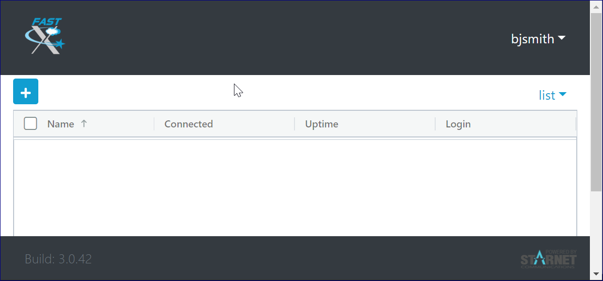

5.  In the next window, click the **KDE** button and then **Launch**.

    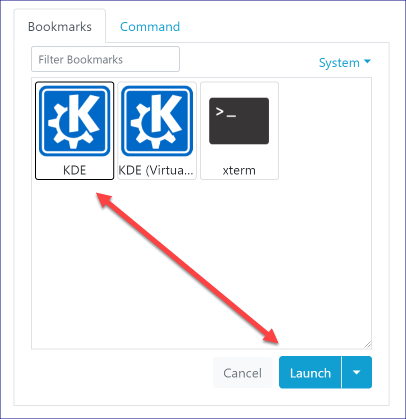{width="350"}

6.  The KDE desktop will open in a new tab or a new browser window.
    Right-click on the desktop to start a Kconsole terminal window.

    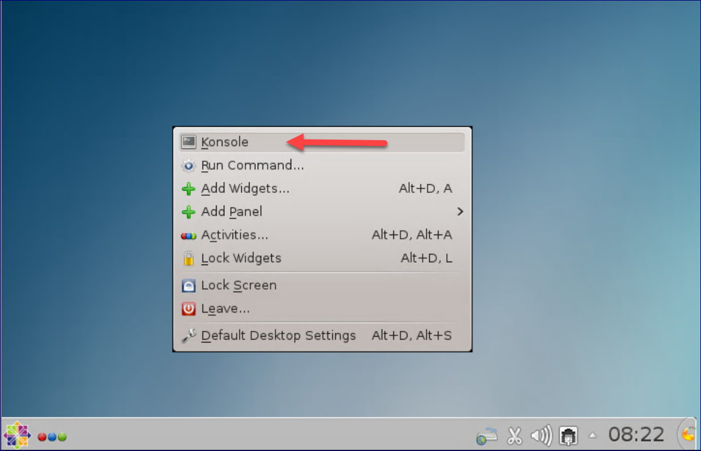


!!! note "Missing Modules under FastX?"
    Some users will find that their terminal environment configuration is
    not complete (module commands will not be available, for example). To
    initialize your environment, run the following command once you open the
    Kconsole:

    === "bash/zsh"
        ```bash
        # source bash/zsh login environment definition scripts:
        source /etc/profile
        ```

    === "tcsh"
        ``` tcsh
        # source tcsh login environment definition scripts:
        source /etc/csh.login
        ```

#### Reconnecting to your FastX session
If you want to retain your session to return to it later, just log
out or kill the browser window. When you log in again, select the icon
to re-open the session.
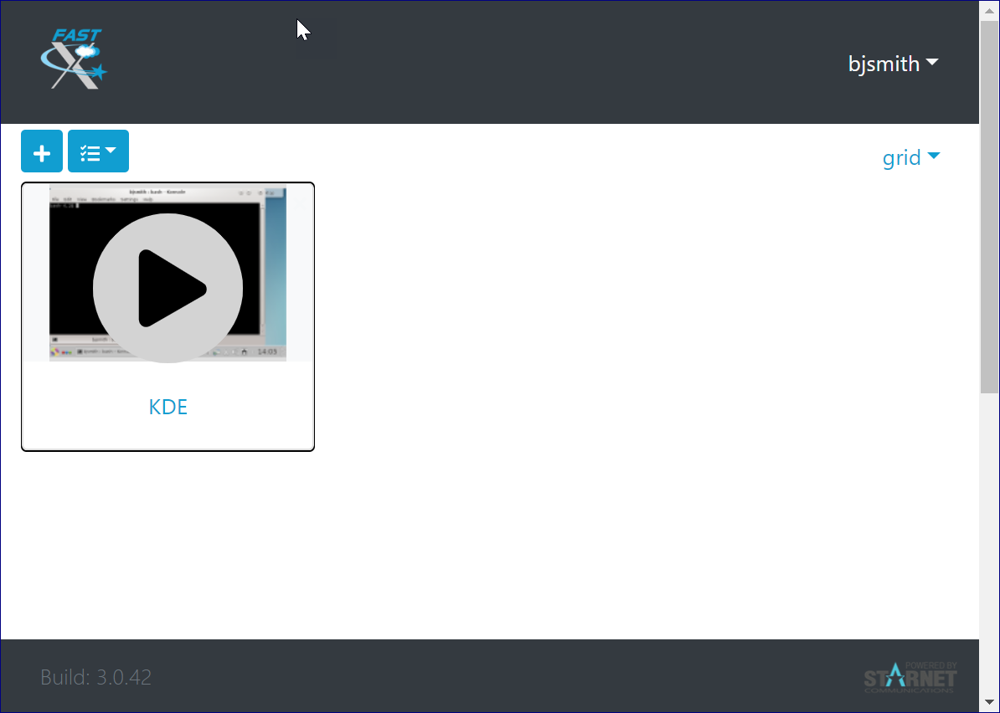{width="400"}

#### Terminating your FastX session
If you do not want to retain your session, terminate it as shown
here before logging out:  
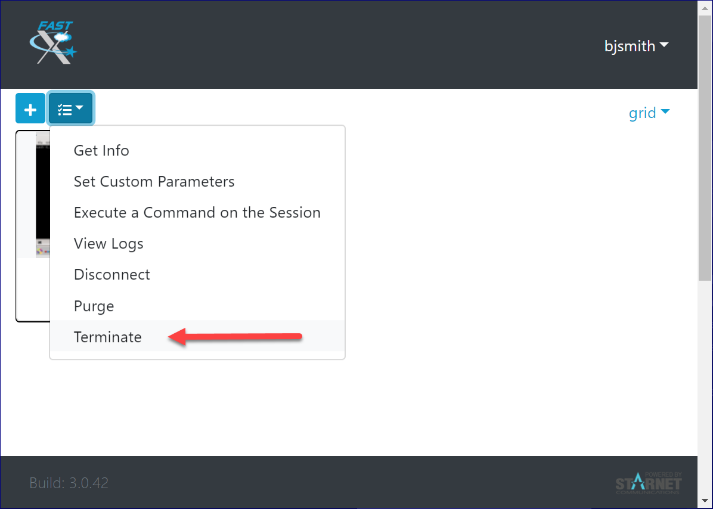{width="400"}

### FastX via web browser and ssh tunnel

If you are *not connected* to or *do not want to connect* to the NCAR
VPN, you can still use FastX via web browser by creating an **ssh
tunnel** from your laptop or desktop to FastX.

1.  Start by running the following on your command line, inserting your
    own username.
```pre
ssh -L 3300:fastx.ucar.edu:3300 username@fastx.ucar.edu
```
2.  Authenticate as usual and you will be in a terminal session on a Casper node.
3.  Leave that terminal session running, open your browser, and go to https://localhost:3300/. You may see a warning about the site being unsafe, but you may ignore the warning and continue.
4.  Authenticate with your username and token response.
5.  Continue as described in the previous section to launch the **KDE** desktop.

#### Alternatives for creating ssh tunnel

To create a tunnel using PuTTY or SecureCRT, following the examples in
these video demonstrations:

- [PuTTY ssh tunnel](https://youtu.be/ES-HZFpJqlc)
- [SecureCRT ssh tunnel](https://youtu.be/yC65MMNxJxc)

After creating the tunnel, proceed as described in the previous section.

### FastX via desktop client

If you’re not connected to the NCAR VPN or prefer to use a faster, more
robust remote desktop service, consider downloading and installing
the [FastX desktop client](https://www.starnet.com/download/fastx-client).


!!! note "FastX desktop client for Windows users"
    If you do not have admin privileges to install the client on your machine, choose the “Windows Nonroot” client.

1.  Start the FastX client.
2.  Click the **+** button in the upper-left corner.  
    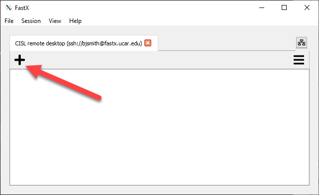{width="450"}

3.  Fill in the fields of the pop-up boxes as follows:
    - **Host:** `fastx.ucar.edu`
    - **User:**  *Enter your username*
    - **Port:** 22
    - **Name:** CISL remote desktop (*or any string*)
    - **Run** (advanced tab): `/ncar/opt/fastx/latest/bin/fastx-protocol`

    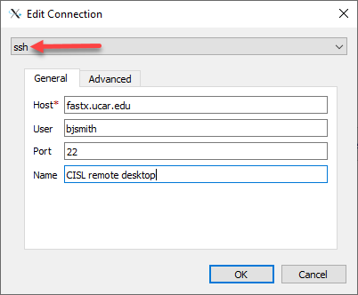{width="300"} 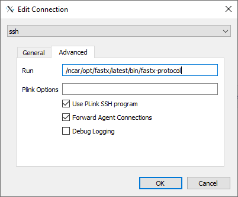{width="300"}

4.  Click **OK**.
5.  Select the remote desktop collection (double-click or press **Enter**).
6.  Authenticate with your username and token response.
7.  Click the **+** button in the upper-left corner of the next window.  
    {width="450"}

8.  Select the **KDE** icon that displays `startplasma-x11` in the required command field.
    1.  Double-click the icon to start the KDE desktop. You can then
        right-click on the desktop to get a Kconsole menu, **OR**
    2.  Double-click the **xterm** icon instead to get a single xterm.

     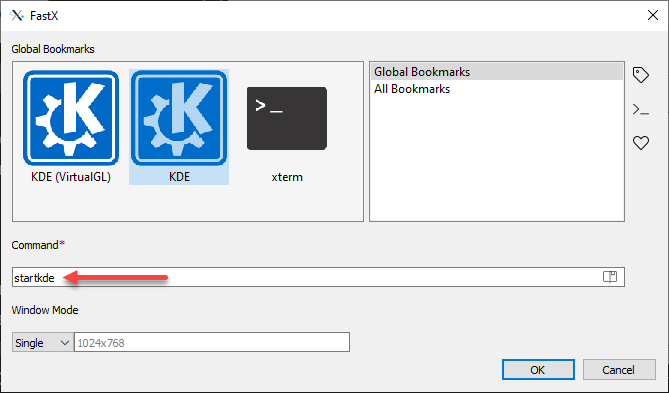
