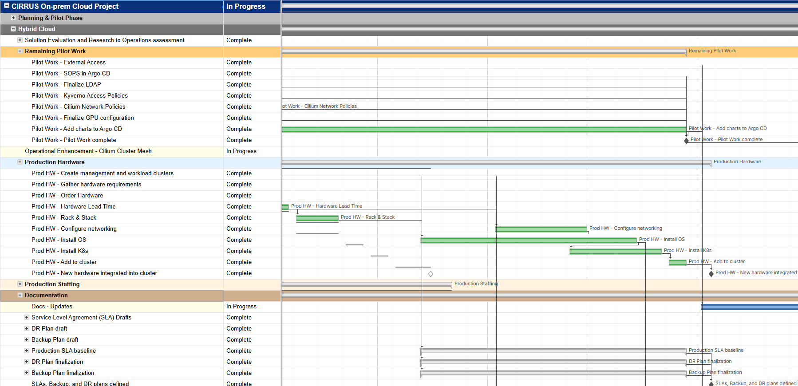
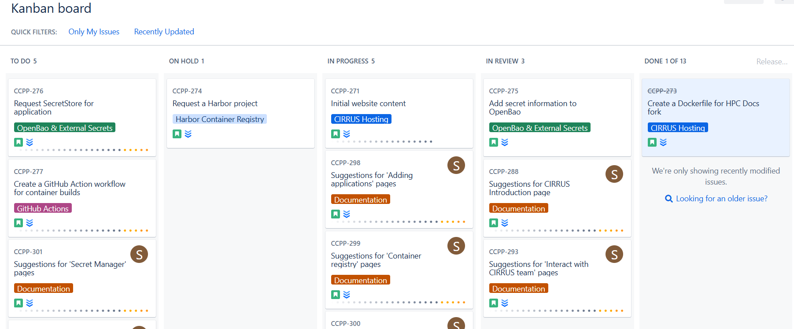
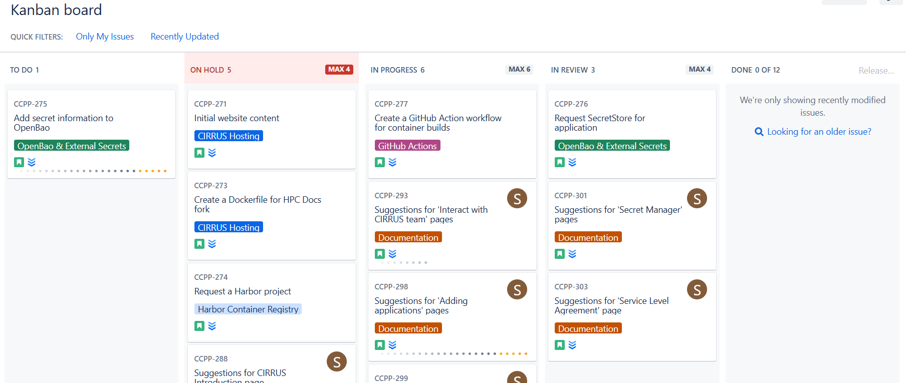

# Agile Methodology in CIRRUS

The CIRRUS team follows a **hybrid Agile Project Management** approach that combines elements of **Kanban** and <strong>Waterfall</strong>. This strategy helps to manage day-to-day work flexibly while tracking long-term progress and deliverables effectively.

## What is Agile Project Management?

Agile is a project management framework focused on:

- **Interaction and collaboration** over rigid processes  
- **Visibility** into project progress  
- Delivering a **working product** that aligns closely with user needs  

Agile emphasizes adaptability, short feedback loops, and iterative delivery to ensure the product evolves continuously based on stakeholder input.

## What is Waterfall?

Waterfall is a traditional, linear project management approach that breaks a project into sequential phases:

CIRRUS uses Waterfall to manage overall project status and track milestones and deliverables using <strong>Smartsheet</strong>.  

It helps with planning and high-level visibility, especially for reporting progress to stakeholders.

## What is Kanban?

Kanban is a flexible Agile framework focused on **continuous delivery** and **visual management**.

- Work is broken down into small, trackable units called <strong>User Stories</strong>.
- Each story is represented as a card on a <strong>Kanban board</strong>, moving through defined stages (e.g., **Backlog → To Do → In Progress → Done**).  

- Kanban helps identify bottlenecks by limiting the number of tasks in each stage, also known as <strong>Work In Progress (WIP) limits</strong>.  
  
## What are User Stories?

**User Stories** describe a feature or task from the end user's perspective. They are:

- **Short and focused** – designed to be completed in a few days
- **Testable** – with clearly defined <strong>Acceptance Criteria</strong>  
  - **Iterative** – if a story is too large, it’s broken into smaller, more manageable pieces

Example User Story:

> *As a CIRRUS user, I want to understand what acceptance criteria is so that I can ensure my completed user story meets my expectations of "done."*

## What is Acceptance Criteria?

To ensure the User Story has a clear definition of "done," the Product Owner (PO) will define **Acceptance Criteria**. It is written from a user perspective and defines a requirement, why it is needed, and what expectations are for successful completion.

Example:

> *As a CIRRUS user, I want to understand what Acceptance Criteria is so that I can ensure my completed user story meets my expectations of done.*

## How do I interact with the team?

### Via the Agile Product Owner (PO)

All requests & questions can be directed to the PO for the project. **Nick Cote** (<ncote@ucar.edu>) is the Agile Product Owner for CIRRUS. The Agile PO's responsibility is representing the customer and stakeholder and is their interface to the development team. This allows the development team members to focus on delivering valuable working product while the customer is still being accurately represented via the PO. All requests directed at the PO will be turned into user stories on our Kanban Board.

### Kanban Board

Issues can also be created in **Jira** and added to our Kanban backlog. The PO will ensure your request is understood and has valid acceptance criteria. It will then be prioritized appropriately against other tasks in the queue.

The CIRRUS Kanban board currently implements the following story states:

<table markdown="1" style="border:1px solid #666; border-collapse:collapse; margin:0 0 0 0; border-radius:6px; overflow:hidden; font-size:0.9rem;">
  <thead>
    <tr>
      <th style="padding:10px 20px; text-align:center; background-color:var(--md-primary-fg-color); color:#fff; font-size:1.05rem;">State</th>
      <th style="padding:10px 20px; text-align:center; background-color:var(--md-primary-fg-color); color:#fff; font-size:1.05rem;">Description</th>
    </tr>
  </thead>
  <tbody>
    <tr>
      <td style="padding:6px 12px; border:1px solid #ccc; white-space:nowrap;"><strong>Backlog</strong></td>
      <td style="padding:6px 12px; border:1px solid #ccc;">New stories that have not yet been fully reviewed and prioritized</td>
    </tr>
    <tr>
      <td style="padding:6px 12px; border:1px solid #ccc; white-space:nowrap;"><strong>To Do</strong></td>
      <td style="padding:6px 12px; border:1px solid #ccc;">Stories have been reviewed and prioritized</td>
    </tr>
    <tr>
      <td style="padding:6px 12px; border:1px solid #ccc; white-space:nowrap;"><strong>Stalled</strong></td>
      <td style="padding:6px 12px; border:1px solid #ccc;">Work is on hold for various reasons</td>
    </tr>
    <tr>
      <td style="padding:6px 12px; border:1px solid #ccc; white-space:nowrap;"><strong>In Progress</strong></td>
      <td style="padding:6px 12px; border:1px solid #ccc;">A team member is actively working the Story</td>
    </tr>
    <tr>
      <td style="padding:6px 12px; border:1px solid #ccc; white-space:nowrap;"><strong>In Review</strong></td>
      <td style="padding:6px 12px; border:1px solid #ccc;">PO will check to make sure the Story Acceptance Criteria is met</td>
    </tr>
    <tr>
      <td style="padding:6px 12px; border:1px solid #ccc; white-space:nowrap;"><strong>Done</strong></td>
      <td style="padding:6px 12px; border:1px solid #ccc;">Acceptance Criteria has been verified successfully and the Story is complete</td>
    </tr>
  </tbody>
</table>

User Stories are self-assigned by a team member who wants to accomplish the task. A User Story will move from **To Do → In Progress** when it is at the top of the assignee's **To Do** list and they are ready to start. Kanban utilizes WIP limits to help identify bottlenecks and promote moving tasks to **Done**. The CIRRUS project has implemented the following WIP limits:

<table markdown="1" style="border:1px solid #666; border-collapse:collapse; margin:0 0 0 0; border-radius:6px; overflow:hidden; font-size:0.9rem;">
  <thead>
    <tr>
      <th style="padding:10px 20px; text-align:center; background-color:var(--md-primary-fg-color); color:#fff; font-size:1.05rem;">Column</th>
      <th style="padding:10px 20px; text-align:center; background-color:var(--md-primary-fg-color); color:#fff; font-size:1.05rem;">Limit</th>
    </tr>
  </thead>
  <tbody>
    <tr>
      <td style="padding:6px 12px; border:1px solid #ccc; white-space:nowrap;"><strong>Stalled</strong></td>
      <td style="padding:6px 12px; border:1px solid #ccc; white-space:nowrap;">4</td>
    </tr>
    <tr>
      <td style="padding:6px 12px; border:1px solid #ccc; white-space:nowrap;"><strong>In Progress</strong></td>
      <td style="padding:6px 12px; border:1px solid #ccc; white-space:nowrap;">6</td>
    </tr>
    <tr>
      <td style="padding:6px 12px; border:1px solid #ccc; white-space:nowrap;"><strong>In Review</strong></td>
      <td style="padding:6px 12px; border:1px solid #ccc; white-space:nowrap;">4</td>
    </tr>
  </tbody>
</table>

## Demonstrations

As new functionality is rolled out we will be taking advantage of different platforms to demonstrate working products to our stakeholders. Feedback is strongly desired during these demonstrations in order to ensure what the team is delivering is accurately meeting the user requirements. These interactions make sure the team is continuously improving.

## Retrospectives

Once a month the team will look back on the process overall. The focus will be on what has been working, what hasn't been working, and what improvements we should try in order to improve the process for our workflow.
