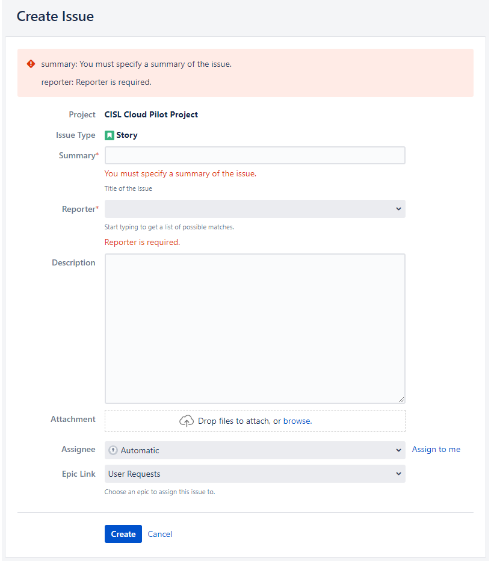
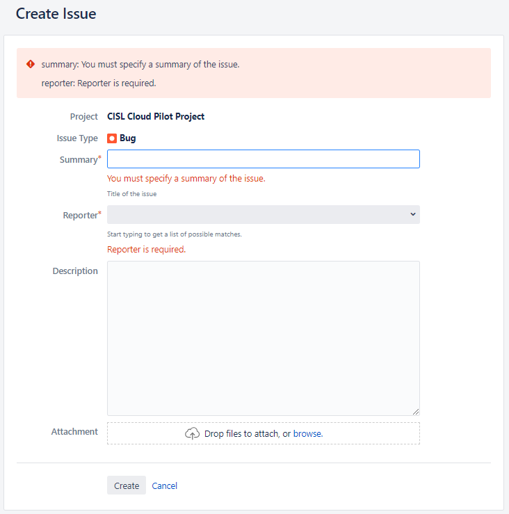

# Create Tickets in Jira

The CIRRUS team uses **Jira** to track and manage all requests, issues, and service deployments. Tickets created in Jira follow the team’s <strong>Kanban</strong> workflow, ensuring visibility and accountability throughout the lifecycle of your request.

---

## Jira Authentication

If you are not logged into Jira or lack the proper permissions, you may encounter an error when accessing the ticket-creation page.

**Solution:** Click the **Login** link and you’ll be automatically redirected back to the *Create Issue* screen.  
If access is denied, submit an [access-request ticket](https://ithelp.ucar.edu/servicedesk/customer/portal/2/create/17) and a Jira administrator will grant you permission to the CIRRUS project.

---

## Request New Services

If you need a new service or want to deploy a new application, use the **New Request** form below:

[New Service Request](https://jira.ucar.edu/secure/CreateIssueDetails!init.jspa?pid=18470&issuetype=10903&customfield_10281=CCPP-108)

### Ticket Field Information

<table markdown="1" style="border:1px solid #666; border-collapse:collapse; margin:0 0 0 0; border-radius:6px; overflow:hidden; font-size:0.9rem;">
  <thead>
    <tr>
      <th style="padding:10px 20px; text-align:center; background-color:var(--md-primary-fg-color); color:#fff; font-size:1.05rem;">Field</th>
      <th style="padding:10px 20px; text-align:center; background-color:var(--md-primary-fg-color); color:#fff; font-size:1.05rem;">Definition</th>
    </tr>
  </thead>
  <tbody>
    <tr>
      <td style="padding:6px 12px; border:1px solid #ccc; white-space:nowrap;"><strong>Summary</strong></td>
      <td style="padding:6px 12px; border:1px solid #ccc;">Short description of your request.</td>
    </tr>
    <tr>
      <td style="padding:6px 12px; border:1px solid #ccc; white-space:nowrap;"><strong>Reporter</strong></td>
      <td style="padding:6px 12px; border:1px solid #ccc;">Not filled automatically, search for and select your name.</td>
    </tr>
    <tr>
      <td style="padding:6px 12px; border:1px solid #ccc; white-space:nowrap;"><strong>Description</strong></td>
      <td style="padding:6px 12px; border:1px solid #ccc;">Details of your request, including any relevant information, context, or error messages.</td>
    </tr>
    <tr>
      <td style="padding:6px 12px; border:1px solid #ccc; white-space:nowrap;"><strong>Attachment</strong></td>
      <td style="padding:6px 12px; border:1px solid #ccc;">Upload supporting images or log files (instead of pasting long logs in <strong>Description</strong>).</td>
    </tr>
    <tr>
      <td style="padding:6px 12px; border:1px solid #ccc; white-space:nowrap;"><strong>Assignee</strong></td>
      <td style="padding:6px 12px; border:1px solid #ccc;">Leave at <strong>Automatic</strong>; the Product Owner (PO) will re-assign as needed.</td>
    </tr>
    <tr>
      <td style="padding:6px 12px; border:1px solid #ccc; white-space:nowrap;"><strong>Epic Link</strong></td>
      <td style="padding:6px 12px; border:1px solid #ccc;">Defaults to <strong>User Requests</strong>, leave unchanged.</td>
    </tr>
  </tbody>
</table>

After clicking **Create**, you’ll be taken to the *Issues* page where your ticket appears in the backlog. A confirmation email (also sent to the <strong>Product Owner</strong>) will include a link to the ticket and the details you submitted.

---

## Reporting an Issue

Use the **Report Issue** form to log bugs or incidents:

[Report an Issue](https://jira.ucar.edu/secure/CreateIssueDetails!init.jspa?pid=18470&issuetype=10905)

### Ticket Field Information

<table markdown="1" style="border:1px solid #666; border-collapse:collapse; margin:0 0 0 0; border-radius:6px; overflow:hidden; font-size:0.9rem;">
  <thead>
    <tr>
      <th style="padding:10px 20px; text-align:center; background-color:var(--md-primary-fg-color); color:#fff; font-size:1.05rem;">Field</th>
      <th style="padding:10px 20px; text-align:center; background-color:var(--md-primary-fg-color); color:#fff; font-size:1.05rem;">Definition</th>
    </tr>
  </thead>
  <tbody>
    <tr>
      <td style="padding:6px 12px; border:1px solid #ccc; white-space:nowrap;"><strong>Summary</strong></td>
      <td style="padding:6px 12px; border:1px solid #ccc;">Short description of the issue.</td>
    </tr>
    <tr>
      <td style="padding:6px 12px; border:1px solid #ccc; white-space:nowrap;"><strong>Reporter</strong></td>
      <td style="padding:6px 12px; border:1px solid #ccc;">Not filled automatically, search for and select your name.</td>
    </tr>
    <tr>
      <td style="padding:6px 12px; border:1px solid #ccc; white-space:nowrap;"><strong>Description</strong></td>
      <td style="padding:6px 12px; border:1px solid #ccc;">Detailed explanation of the problem, steps to reproduce, and any error messages.</td>
    </tr>
    <tr>
      <td style="padding:6px 12px; border:1px solid #ccc; white-space:nowrap;"><strong>Attachment</strong></td>
      <td style="padding:6px 12px; border:1px solid #ccc;">Upload screenshots or log files (instead of pasting long logs in <strong>Description</strong>).</td>
    </tr>
  </tbody>
</table>

Click **Create** to submit your issue. You’ll be redirected to the *Issues* page, where your ticket is listed in the backlog, and receive a confirmation email.

---

## What Happens After Submission?

1. Your ticket is added to the **Kanban backlog**.  
2. The **Product Owner** reviews, assigns, and prioritizes it.  
3. You receive updates via Jira and email as the ticket progresses through the workflow.

**Tip:** Keep your ticket clear and focused,concise detail helps the team respond faster and more accurately.

---

