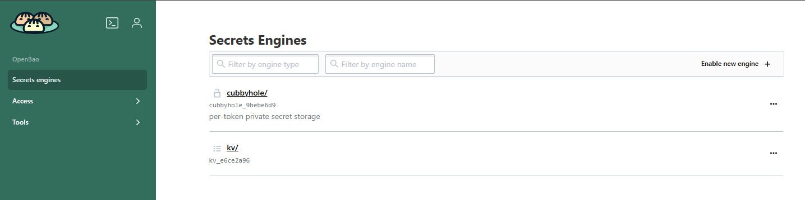
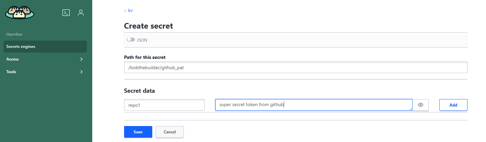

# GitHub Actions Runners

CIRRUS has the ability to connect to GitHub repositories and automatically provision and scale GitHub runners on demand. The GitHub runner scale sets require a Personal Access Token (PAT) to connect to the repository.

## Setup Process
### Create a Github PAT

See this Github documentation for in depth PAT details [Github PAT Documentation](https://docs.github.com/en/authentication/keeping-your-account-and-data-secure/managing-your-personal-access-tokens).

- Go to Github.com
- In the upper right click your profile icon and choose settings
- On the left menu choose `Developer Settings`, it should be the last item in the list
- Click `Personal Access Tokens`
- Click `Fine Grained Tokens`
- Click the `Generate new token` button 
- For the name use a name like `<repository name>-cirrus-runner`
- Enter a description if you'd like
- Resource owner is either your account or the NCAR Organization - this depends on who is the owner of the project
- Set expiration to 1 year
- Under repository access select `Only Select Repositories` then choose the repository from the dropdown. If the repo you want does not appear it is likely you need to go back and change the `Resource Owner` to your user or NCAR.
- Repository Permissions
  - Read access to metadata
  - Read and Write access to actions and administration
- Leave all account permissions as `No access`
- Click `Generate token`

Your token will be displayed and this is the only time you can view it without regenerating the token. Copy and paste the token into a secure password keeper. The next steps is adding your token to NCAR's implementation of OpenBao which is a secure programmatic data storage service.

### Adding a secret to NCAR OpenBao

- Navigate to https://bao.k8s.ucar.edu, change the authentication method to OIDC, and log in with your UCAR email address and password
- You will be brought to a screen that resembles this



- Choose `kv` (key/value)
- In the upper right choose the `Create Secret` button
- Path for secret: `<your ucar email address>/github_pat`
- You can store multiple key/value pairs under each secret. Our preference is one github repository per token so each repository can have it's own pair under this single `github_pat` secret
- Set the key to the repository name (not the full url) and set the value to the PAT you generated



- Save the secret

### Requesting a Runner Scale Set

Administrator assistance is required to connect GitHub Runner scale sets on CIRRUS once your PAT has been added to OpenBao. More details can be found at [create tickets](../02-interact-with-cirrus-team/create-tickets.md). Below is an example ticket description to add a new GitHub Runner scale set to a repository.

```
Hello,
I have an repository that I would like to connect a GitHub runner scale set to. I have added my PAT to OpenBao following the documentation instructions.

Link to GitHub repository: https://github.com/NCAR/<respository-name>

Thank you
```

A CIRRUS admin will add a scale set to the repository and will update the ticket with details once it's completed or if there are any issues.

### Alternative Setup for NCAR Organization Repositories

For repositories in the NCAR GitHub organization where adding your own PAT is not feasible, a CIRRUS admin can be added as a collaborator instead. Contact the CIRRUS team through the ticket system, and they will provide a GitHub username to add as an admin collaborator to your repository at:

```
https://github.com/NCAR/<respository-name>/settings/access
```

## Using the Scale Set

Once the CIRRUS admin has connected a scale set to your repository they will provide the name of the scale set to use in the Actions workflow. Use this name when defining the `runs-on:` line in the Action workflow yaml file like the following

```
jobs:
  testing:
    runs-on: gh-arc-myrepo-scale-set
```

### Running Container builds

The scale sets deployed do not have privileged access and as a result can not directly access a container daemon. There is a buildkit service for docker buildx that can be used to offload container builds. Before building a container with docker specify the buildx remote driver by using the following,

`docker buildx create --use --driver=remote tcp://buildkitd.arc-systems.svc:1234`

### Running Container tests

After a new container is built it can be run directly in a new GitHub Actions workflow job defined like this

```
jobs:
  test-container:
    runs-on: gh-arc-myrepo-scale-set
    container:
      image: hub.k8s.ucar.edu/myrepo/mynewimage:v1.2
    steps:
```

## Maintenance
### Updating an existing OpenBao secret

You may need to add a new token for a new repository or update an old token due to it expiring.

- Login to OpenBao as defined above
- Once in the `kv` screen list your secrets by entering `<email address>/` in the view secret box
- You should see a list of your secrets including the `github_pat` secret previously created
- Edit the secret and add a new key/value token as defined above