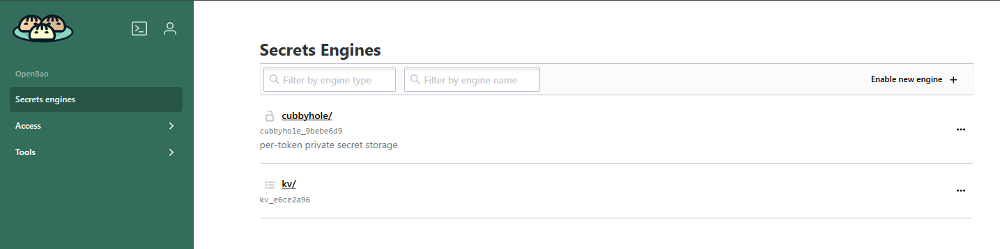
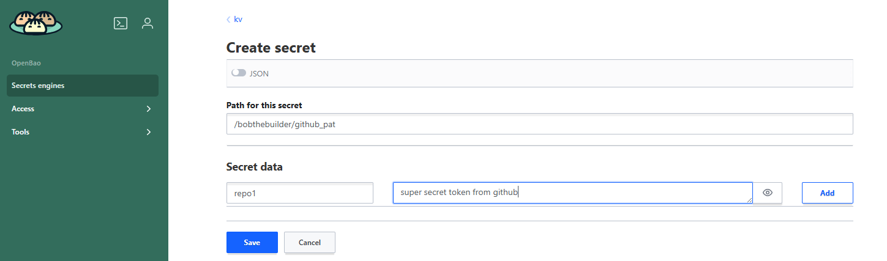
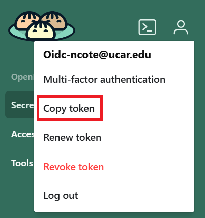

# Secret Manager

CIRRUS hosts a secrets management service called **OpenBao**, available to UCAR employees via a secure Web UI. It allows you to store sensitive data such as API tokens, credentials, and configuration variables in a central, encrypted location.

---

## Adding a Secret to NCAR OpenBao

1. **Navigate to:** https://bao.k8s.ucar.edu

2. In the **Authentication Method** dropdown, select **OIDC**.

3. **Log in** using your UCAR CIT credentials (username/password).

4. Once logged in, you'll be brought to a screen resembling the image below.



5. Select the **kv** (key/value) option.

6. Click the **Create Secret** button in the upper right.

7. For the **Path**, enter:  
   `<your ucar email address>/<new secret>`

8. Under that secret path, add key/value pairs:
   - **Key:** A short description (e.g., `GITHUB_TOKEN`)
   - **Value:** The actual secret



9. Click **Save** to store your secret securely.

!!! info
    You can store multiple key/value pairs under a single secret path.

---

## Updating an Existing OpenBao Secret

It's good practice to rotate secrets regularly. To update an existing secret:

1. **Log in** to OpenBao using the same method as above.

2. Once in the **kv** section, enter your secret path in the "View Secret" field (e.g., `your-email@ucar.edu/`).

3. A list of your stored secrets will appear.

4. **Select** the desired secret to edit it.

5. **Add or update** any key/value pairs as needed.

6. **Save** your changes.

---

## Shared Secrets

For secrets that need to be accessed by multiple team members or applications, CIRRUS supports shared secret paths. These are created and managed by the CIRRUS Admin team to ensure proper access control and security.

### Requesting a Shared Secret Path

To request a new shared secret path:

1. **Create a ticket** with the CIRRUS Admin team including the following information:

    - **Shared secret path name**: A descriptive name for the secret path (e.g., `team-alpha/database-credentials` or `project-weather/api-tokens`)
    - **Team member email addresses**: List all UCAR email addresses that need access to this shared secret path
    - **Purpose**: Brief description of what the shared secret will be used for

2. Once the CIRRUS Admin team creates the shared secret path, authorized team members can add secrets to the shared path.

### Adding Secrets to a Shared Path

After the shared secret path has been created:

1. Navigate to: https://bao.k8s.ucar.edu and log in using your UCAR CIT credentials

2. In the kv section, for the Path field, enter:
   ```
   <shared-secret-path-name>/<new-secret>
   ```
   For example: `team-alpha/database-credentials/prod-db`

3. Add your key/value pairs and save the secret

!!! info
    Only users explicitly granted access by the CIRRUS Admin team can view or modify secrets in shared paths. Team members can be added or removed from shared secret paths by submitting an updated ticket.

---

## Using Secrets in CIRRUS Applications

In order to use secrets stored in OpenBao as environment variables within CIRRUS-hosted applications:

1. **Copy your OpenBao token:** Click the person icon in the upper left corner of the OpenBao interface and select "Copy token". Store this token in OpenBao under your personal path at <your-email@ucar.edu>/bao with the key token and your copied token as the value.

    

2. A **[SecretStore](https://external-secrets.io/latest/api/secretstore/)** object must be created in Kubernetes by the CIRRUS Admin team. This defines how secrets are accessed.

3. Once the SecretStore exists, an **[ExternalSecret](https://external-secrets.io/latest/api/externalsecret/)** can be added to your Helm chart. This object maps a secret from OpenBao into a Kubernetes Secret.

4. The ExternalSecret can then be referenced inside your Kubernetes Deployment using `valueFrom`.

When submitting a request to host a new application (see [adding applications](../03-deploying-applications/additions.md)), please include:

- The names of the secrets you want to use
- The path and properties from OpenBao

For updating an existing app with secrets, please [create a ticket](../02-interact-with-cirrus-team/create-tickets.md) with the necessary details.

---

## ExternalSecret Example

This example configures Kubernetes to retrieve a secret from OpenBao using the `openbao-backend` SecretStore in your app's namespace. It looks up the secret stored at `ncote@ucar.edu/cirrus-secrets` and retrieves the property `my-secret-key`. The result is injected into your container as an environment variable.

```yaml
apiVersion: external-secrets.io/v1beta1
kind: ExternalSecret
metadata:
   name: myapp-esos
   namespace: {{ .Release.Namespace }}
spec:
   refreshInterval: 1h
   secretStoreRef:
       name: openbao-backend
       kind: SecretStore
   target:
       name: myapp-esos
   data:
       - secretKey: my-secret-value
         remoteRef:
           key: ncote@ucar.edu/cirrus-secrets
           property: my-secret-key
```

For an example Helm chart that uses ExternalSecrets, see [external-secret-helm](https://github.com/NCAR/cirrus-helm-examples/tree/main/external-secret-helm).