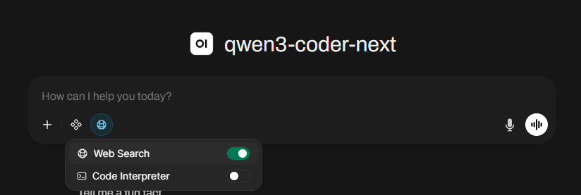
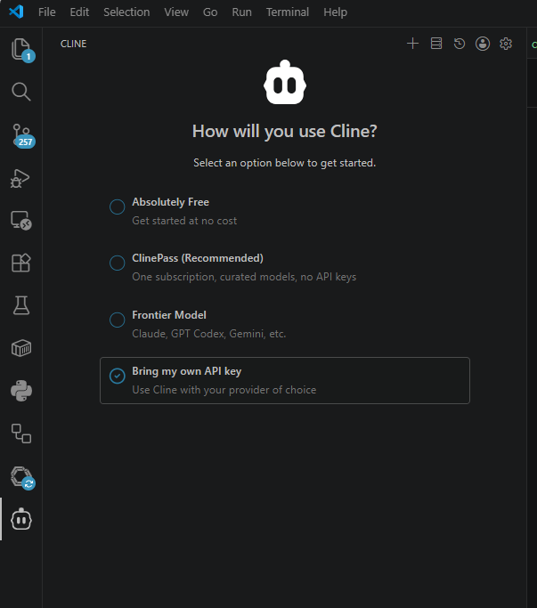
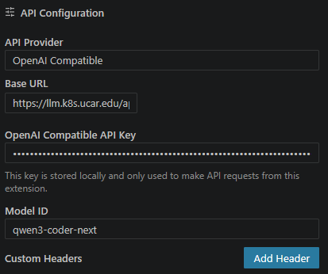

# Using LLM Services on Cirrus

This guide covers how to access and use Large Language Model (LLM) services on the Cirrus HPC system, including Open WebUI access and configuring local development tools.

## Table of Contents
- [Accessing LLMs via Open WebUI](#accessing-llms-via-open-webui)
- [Configuring VS Code Cline](#configuring-vs-code-cline)
- [Using Claude Code with Custom Endpoint](#using-claude-code-with-custom-endpoint)

---

## Accessing LLMs via Open WebUI

The LLM service is accessible while on the UCAR network or VPN through Open WebUI at [https://llm.k8s.ucar.edu](https://llm.k8s.ucar.edu).

### Step 1: Access the Web Interface

1. Open your web browser and navigate to [https://llm.k8s.ucar.edu](https://llm.k8s.ucar.edu)
2. You will be presented with the Open WebUI login page

### Step 2: Log In

Log in using the "Log in with microsoft" button.

### Step 3: Select the Model

Once logged in, you'll see a model selector in the top-left corner of the chat interface. Select **qwen3-coder-next** from the list of available models. This should be chose by default.

### Tips for New Users

- **Session Management**: Your chat sessions are saved between logins
- **Model Switching**: You can switch between different models at any time using the model selector
- **Chat History**: Older conversations are automatically archived after a period of inactivity
- **Web search context**: We currently have web search available but due to not having a paid api subscription you have to opt into it for a chat session.



### Available Models

- `qwen3-coder-next` - Qwen 3 Coder model optimized for code generation and programming tasks

---

## Configuring VS Code Cline

You can configure Cline in VS Code to connect to the local LLM hosted at `https://qwen.k8s.ucar.edu`. Cline provides planning and agentic use.

### Step 1: Install the Cline extension
 
 1. In VSCode go to the extensions manager on the left.
 2. Search Cline
 3. Install it

### Step 2: Open Cline Settings

1. Open VS Code
2. Open the Command Palette (`Ctrl+Shift+P` or `Cmd+Shift+P`)
3. Type "Cline" and select "Cline: Open Settings"
4. Or click the Cline icon in the Activity Bar and select "Settings"

### Step 3: Retrieve API key from Open WubUI

1. Log into Open WenUI with the Microsoft option
2. In the top right corner select the profile icon then Settings
3. On the left of the settings box choose "Account"
4. Click "API Keys" to display your key


### Step 4: Configure Custom Endpoint

Go to the cline extension on the left. It will ask you to log in but that is optional. Choose "Bring my own API key"



On the following screen setup it as follows, the API key needs to be the key retrieved in Step 3, and the base url is `https://llm.k8s.ucar.edu/api`



### Step 5: Test the Connection

1. Open the Cline chat interface
2. Send a simple message like "Hello"
3. Verify you receive a response from the model

!!! warning
    The use of LLM agents that have permissions to read, edit, and execute commands can be dangerous. Cline has two modes, "plan" and "act" which can be toggled on the bottom of the chat window. Use plan mode to start planning your changes and get a summary of what it will do before letting the model make any changes. On the bottom of the chat window is a eay to easily access permissions that cline has without prompting for your input. Cline can and will with the correct instruction run builds, makes, tests, edits, repeat...

    A few best practice items:
    
      1. Have your VSCode window only have the project files open that you need. Don't let it run on your whole home directory or other large areas.
      2. In your VSCode terminal do not let the session have privileged access. If your session is sudo'd to root then cline would run commands as root.
      3. If your CLI session has access to CIRRUS it could start executing helm commands (if that is something you are working on) and depending on your shell, kubectl, and helm config it could start running commands that affect a production deployment in CIRRUS.

### Troubleshooting

| Issue | Solution |
|-------|----------|
| Connection refused | Verify you are on the UCAR network or connected to VPN |
| 404 Not Found | Verify the endpoint URL is correct |
| Timeout errors | Check your internet connection and firewall settings |

---

## Using Claude Code with Custom Endpoint

Claude Code can be configured to use a custom LLM endpoint such as `https://qwen.k8s.ucar.edu`.

### Environment Variable Configuration

Set the following environment variables in your shell configuration file (`~/.bashrc`, `~/.zshrc`, etc.). The API key and auto token should literally be the value 'dummy', it does not matter what they are at this time:

```bash
# Claude Code with custom endpoint
export ANTHROPIC_BASE_URL=https://llm.k8s.ucar.edu/api
export ANTHROPIC_API_KEY=dummy 
export ANTHROPIC_AUTH_TOKEN=<openwebui-token-from-above>
export ANTHROPIC_DEFAULT_OPUS_MODEL=qwen3-coder-next 
export ANTHROPIC_DEFAULT_SONNET_MODEL=qwen3-coder-next 
export ANTHROPIC_DEFAULT_HAIKU_MODEL=qwen3-coder-next
```

### A Bash alias if you use claude models

```bash
claude-qwen() {
  ANTHROPIC_BASE_URL=https://llm.k8s.ucar.edu/api \
  ANTHROPIC_API_KEY=dummy \
  ANTHROPIC_AUTH_TOKEN=<openwebui-token-from-above> \
  ANTHROPIC_DEFAULT_OPUS_MODEL=qwen3-coder-next \
  ANTHROPIC_DEFAULT_SONNET_MODEL=qwen3-coder-next \
  ANTHROPIC_DEFAULT_HAIKU_MODEL=qwen3-coder-next \
  claude "$@"
}
```

### For Current Session Only

Alternatively, set them for your current session:

```bash
export ANTHROPIC_BASE_URL=https://llm.k8s.ucar.edu/api 
export ANTHROPIC_API_KEY=dummy 
export ANTHROPIC_AUTH_TOKEN=<openwebui-token-from-above>
export ANTHROPIC_DEFAULT_OPUS_MODEL=qwen3-coder-next 
export ANTHROPIC_DEFAULT_SONNET_MODEL=qwen3-coder-next 
export ANTHROPIC_DEFAULT_HAIKU_MODEL=qwen3-coder-next
```

### Testing Your Configuration

Run Claude Code and verify it can connect to your endpoint:

```bash
claude
> Type: "Hello, can you write a simple Python function to calculate factorial?"
```

You should receive a response from the qwen3-coder-next model.

---

## Getting Help

For issues or questions about the LLM service:

- Contact the CIRRUS team cirrus-admin@ucar.edu