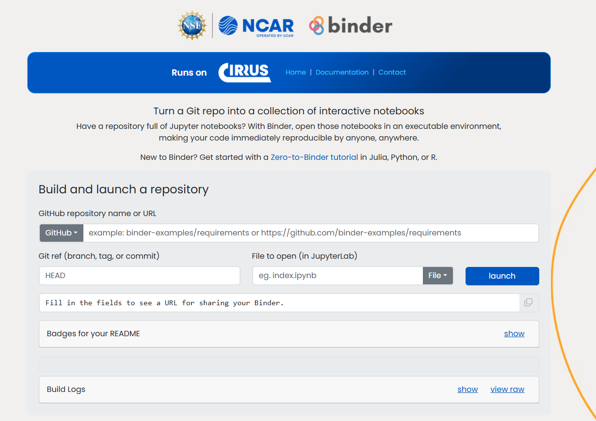

# Public Binder on CIRRUS

**Binder** is a tool that turns a Git repository into a collection of interactive, executable notebooks. If a repository contains Jupyter Notebooks along with an environment configuration file (e.g., `environment.yml` or `requirements.txt`), Binder builds a container image from the repository and launches it so anyone can run the notebooks in their browser without installing anything locally.

The public Binder instance documented here is hosted on **CIRRUS**, NCAR's on-prem cloud platform, and is publicly reachable at:
**[https://binder.k8s.ucar.edu/](https://binder.k8s.ucar.edu/)**

For general background on Binder, see the official **[Binder documentation](https://mybinder.readthedocs.io/en/latest/index.html)**.

## Who Should Use This

The public Binder is intended for quickly sharing lightweight, reproducible demos, tutorials, or example notebooks with anyone on the internet - no NCAR/UCAR account required. If you need more CPU, memory, GPUs, or longer-running sessions, use the [BinderHub integrated with the K8s JupyterHub](../06-jupyter-on-cirrus/binderhub.md) instead, which is restricted to UCAR CIT account holders.

## Resource Limits

Because this Binder deployment is open to the public, sessions are intentionally constrained to keep the service fair and available for everyone:

- **CPU**: limited to 1 core per session
- **Memory**: limited to 2 GB RAM per session
- **Session lifetime**: sessions are automatically terminated after a few hours of use
- **Concurrent sessions**: the number of simultaneous sessions served by the cluster is limited

!!! warning
    These limits mean the public Binder is not suitable for compute- or memory-intensive workloads. Repositories that require significant resources should use the UCAR-restricted BinderHub or another compute option instead.

## Web Interface

Access the public Binder directly - no login is required:
**https://binder.k8s.ucar.edu/**

You'll see a form like this:

1. **GitHub repository name or URL** - Enter the repository containing your notebooks and environment configuration files (e.g., `binder-examples/requirements` or a full `https://github.com/...` URL).

2. **Git ref (branch, tag, or commit)** - Optionally specify a branch, tag, or commit hash (defaults to `HEAD`).

3. **File to open (in JupyterLab)** - Optionally specify a notebook or file to open automatically once the session starts (e.g., `index.ipynb`).

4. Click **launch** to begin building a container image from the repository.

5. Once the build completes, Binder automatically opens a JupyterLab session running on CIRRUS with your repository's contents.

Build logs are available during the build process by clicking **show** or **view raw** in the Build Logs section, which is useful for debugging a failed build.

## Sharing a Binder Link

Once you've filled in the repository fields, the page generates a shareable URL for your Binder session. Anyone who opens that link will trigger the same build (or reuse a cached one) and land directly in a running session - no account needed.

The **show** link next to "Badges for your README" also generates Markdown and reStructuredText badges you can add to a repository's README so others can launch it with one click.
