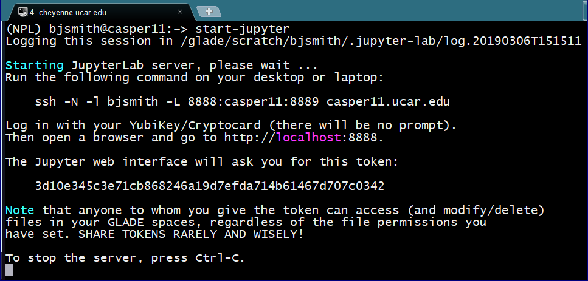
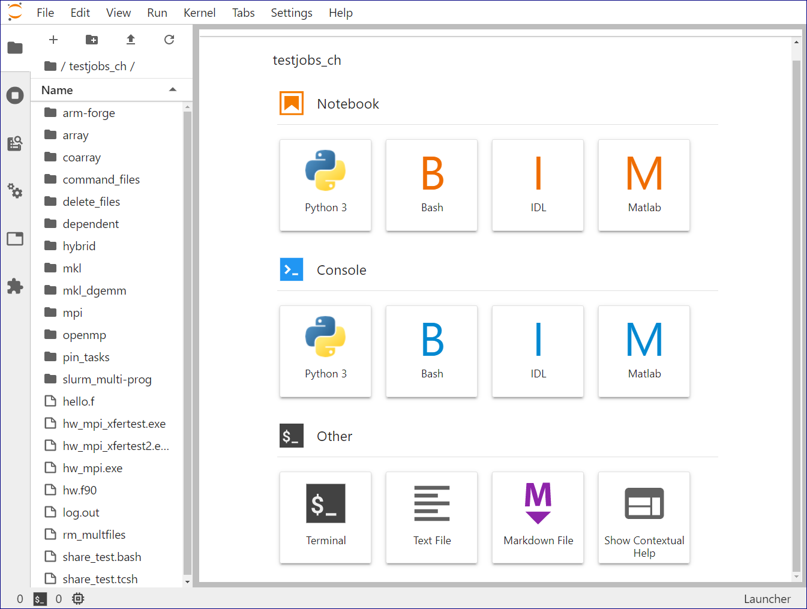
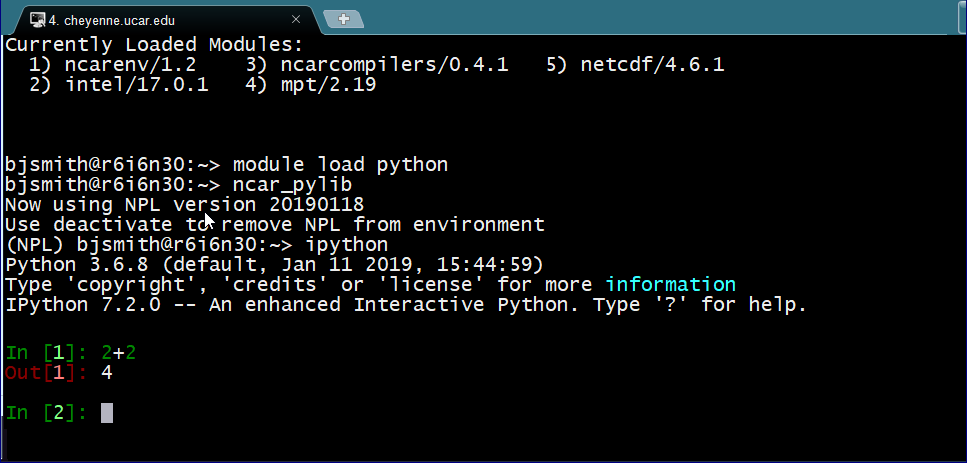
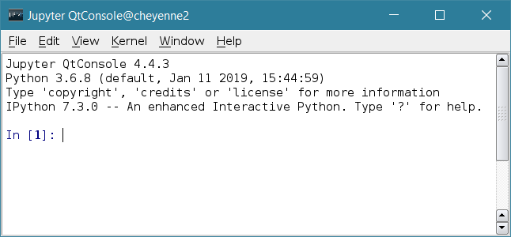

# Jupyter and IPython

!!! danger "Consider NCAR's [JupyterHub instance](./jupyterhub/index.md) first!!"
    This page describes an older, manual approach for launching Jupyter
    on NCAR resources, prior to the deployment of our hosted
    [JupyterHub instance](./jupyterhub/index.md).

    Still. this approach is valid and may be useful in circumstances
    where the hosted JupyterHub is under maintenane.

The Jupyter package is designed to facilitate interactive computing,
especially for code editing, mathematical expressions, plots, code/data
visualization, and parallel computing. The IPython kernel is included in
the package. Jupyter supports many alternative kernels, also known as
language interpreters. See details below.

The instructions below describe how to start the
browser-based **JupyterLab**, the **IPython shell**, and **Jupyter
QtConsole** on the NCAR HPC systems.

For additional information, see [Jupyter documentation](https://jupyter.readthedocs.io/en/latest/).

## Starting JupyterLab

- Start an interactive job using the `execcasper` command.
  (Alternative: Start the job on Derecho using `qinteractive`. Keep in mind that each CPU or GPU [Derecho node](docs/compute-systems/derecho/#derecho-hardware) has less memory than each CPU or GPU node [Casper node](docs/compute-systems/casper/#casper-hardware))

- Load the `ncarenv` and `conda` modules.

- Activate the NCAR Python Library via `conda activate npl` or any other
  environment with `jupyterlab` and `ipython` installed.

- Run the `start-jupyter` command.

The output includes instructions like those shown in the image just
below. Including the `-N` after the `ssh` command establishes the
tunneling that allows you to use JupyterLab in your local browser. It
also prevents you from actually opening a second ssh session. If you
prefer to have a second session open, omit the `-N`. When you close
that session, you will be closing your browser connection to JupyterLab.



On your local computer, run the `ssh` command as instructed.

The session will appear to hang after you log in. At that point,
start `http://localhost:nnnn` in your browser. The port numbers may
be different from those in the output example above.

JupyterLab will request a password or "token," which is a long string as
shown in the output above that you can copy and paste from your
terminal.


Your browser will open the JupyterLab web interface after you log in
with the token.



### Related links

- [Notebook: Extract NECOFS water levels using NetCDF4-Python and analyze/visualize with Pandas](https://nbviewer.jupyter.org/gist/rsignell-usgs/4740419)

- [Notebook: Access data from the NECOFS (New England Coastal Ocean Forecast System) via OPeNDAP](https://nbviewer.jupyter.org/gist/rsignell-usgs/5092905)

## Starting IPython shell

- Start an interactive job using the `qinteractive` command.
  (Alternative: Start the job on Casper using `execcasper` if it
  requires more memory than is available on Derecho)

- Load the `ncarenv` and `conda` modules.

- Activate the NCAR Python Library via `conda activate npl` or any other
  environment with `ipython` installed.

- Run the `ipython` command to start the shell.



## Starting Jupyter QtConsole

- Log in with X tunneling (using the ssh `-X` option).

- Start an interactive job using the `qinteractive` command.
  (Alternative: Start the job on Casper using `execcasper` if it
  requires more memory than is available on Derecho)

- Load the `ncarenv` and `conda` modules.

- Activate the NCAR Python Library via `conda activate npl` or any other
  environment with `jupyterlab` installed.

- Run the `jupyter qtconsole` command to start the console.



## Using alternative language kernels

Jupyter supports multiple language interpreters (known as "kernels").
The Python interpreter is loaded by default as the language kernel when
using Jupyter, but you can specify use of another kernel when invoking a
particular command. To see a list of installed language kernels, run
this command:
```bash
jupyter kernelspec list
```

To use a kernel, specify it by name when invoking a command. For
example, to use the R 4.3.0 interpreter on Casper in the Jupyter
QtConsole, enter the following:
```bash
jupyter qtconsole --kernel=r-4.3
```
The console will load with the R command line interpreter active.

If you need a language kernel that has not been installed, you can
install it yourself in your local directory or contact the
[NCAR Research Computing help desk](https://rchelp.ucar.edu/) to have it
added in the system library.
