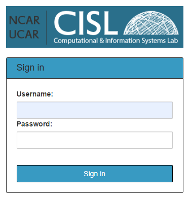
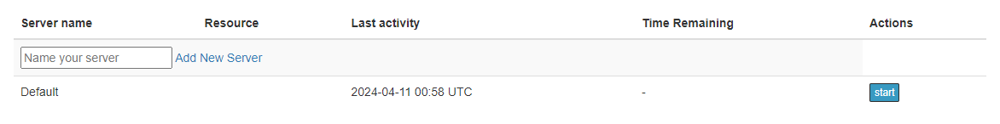
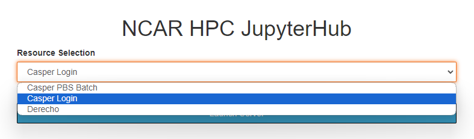
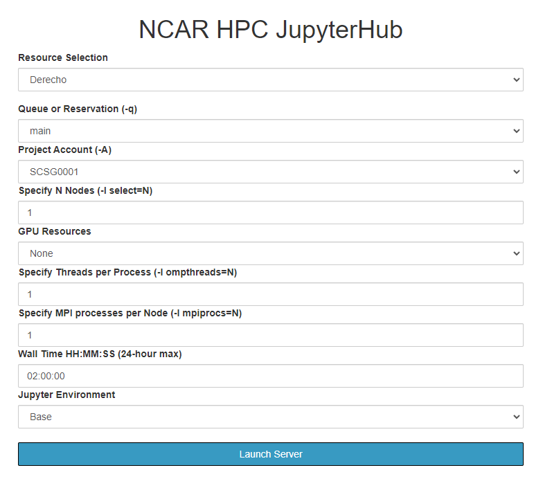
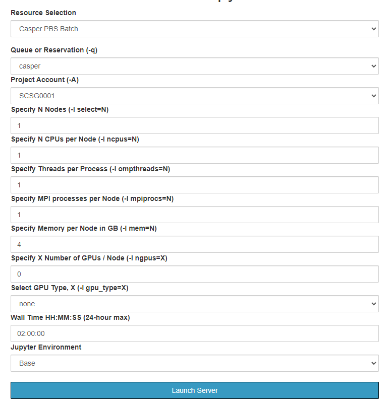
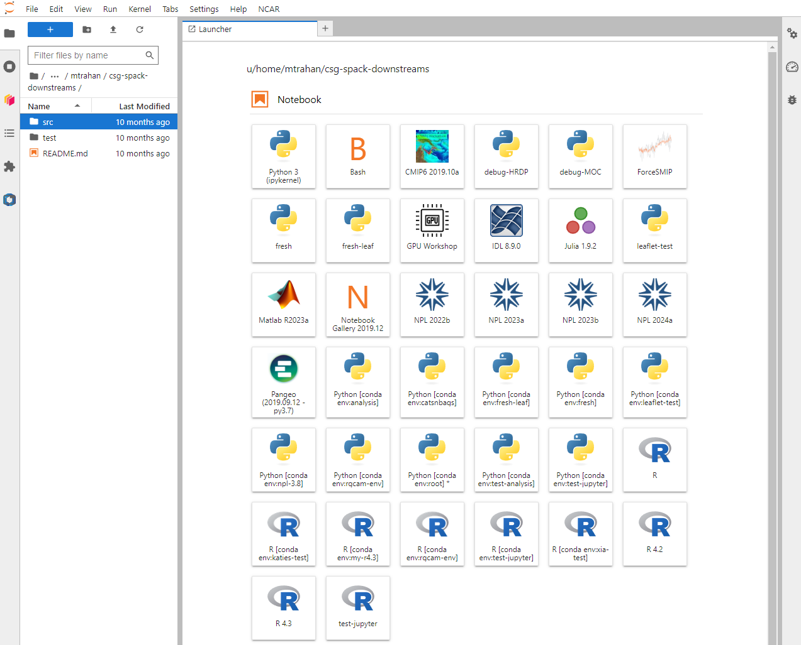

# JupyterHub at NCAR

The JupyterHub deployment that CISL manages allows "push-button" access
to NCAR's Derecho supercomputing resource and the Casper cluster of
nodes used for data analysis and visualization, machine learning, and
deep learning.

It gives users the ability to create, save, and share Jupyter
Notebooks through the JupyterLab interface and to run interactive,
web-based analysis, visualization and compute jobs on Derecho and
Casper. JupyterHub is an alternative to X11 access for interacting with
those resources to run jobs as well as for using web-based interactive
shell functionality without the need to install or use software such as
SSH or PuTTY.

## Getting started

Use your web browser to go to
[jupyterhub.hpc.ucar.edu](https://jupyterhub.hpc.ucar.edu/).
Chrome and Firefox are recommended for all users.

Select **Production**.

{width="450"}

Log in with your NCAR username and Duo two-factor authentication, just
as you would when logging directly in to either system.

{width="350"}

After you authenticate, you will be able to start a new default server
or create a named server. (See following image.) You can have up to four
named servers to use for accessing different compute resources.

!!! danger "Do not start a new server simply to run additional notebooks!"
    Do not start a new server simply to run additional notebooks; a single
    server can support multiple notebooks at once. However, executing the
    same notebook file in multiple servers concurrently can lead to kernel
    failures and other errors.

{width="450"}

After starting a server, select the cluster you want to use. You can
choose to work on a login node or a batch node on either Casper or
Derecho.
{width="450"}

If you choose a **login node**, launching the server will take you to
the web interface.

If you choose a **batch node**, use the form provided (images below) to
specify your project code, set the necessary PBS job options, and launch
the appropriate server. The name of your batch job will be `STDIN`.

For more information about the options, see: [Submitting jobs with PBS](../../pbs/job-scripts/index.md).

Launch your job when ready. This job only gives you access to the
JupyterLab instance. If you need more resources, you can launch another
job or jobs from within JupyterLab.

{width="350"} {width="350"}

After launching the job, you will have access to multiple kernels in the
web interface (image below) for working with various languages and
applications.

!!! note "Where are my files?"
    Note that the “File browser” icon (upper-left of following image) allows
    you to explore your home directory *only*. To change to your scratch or
    work space, create soft links in your home directory to those locations.

## Python environments and kernels

The JupyterLab dashboard provides access to Notebook and Console
kernels, which are programming language interpreters. Available kernels,
which change periodically as new releases are installed, include:

- Multiple Python 3 interpreters with varying package support including
  a basic install (Python 3), the Pangeo stack installed with conda
  (Pangeo), and the [NCAR Python Library](../../environment-and-software/user-environment/conda.md) (NPL) that is
  also provided at the command-line by the `conda` environment module.

- R

- MATLAB

- Julia

- A Bash interpreter that provides a shell environment

## Related documentation

See these related CISL documentation pages for additional support:

- [Using Conda and Python](../../environment-and-software/user-environment/conda.md)
