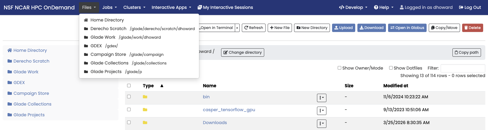
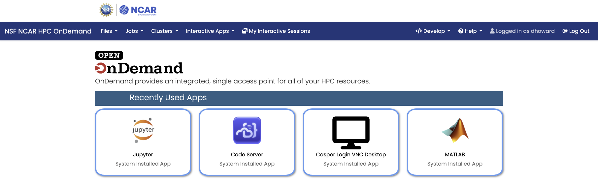

# Open OnDemand
Open OnDemand is a web-based HPC portal that provides access to NSF NCAR's computing resources through an intuitive graphical interface.

!!! warning
    The Open OnDemand service was released for general users in May 2026 and additional features and services will be developed over time. Any issues or bugs should be reported to the [NSF NCAR Research Computing Help Desk](https://rchelp.ucar.edu).

## Portal Access

Access the Open OnDemand portal at: [ondemand.hpc.ucar.edu](https://ondemand.hpc.ucar.edu)

NSF NCAR Open OnDemand portal is only available to users who have an active CIT account and credentials. Upon visiting the NSF NCAR Open OnDemand web portal, a Microsoft enterprise login form including NSF NCAR branding will be presented in order to authenticate with your CIT credentials. Please refer to [authentication and security](../../getting-started/accounts/index.md#authentication-and-security) for more information.

## File Explorer

The file explorer allows you to browse, upload, and manage files on HPC systems. For larger and more complex file manipulation tasks, see [Globus file transfers](../../storage-systems/data-transfer/index.md). The Open OnDemand file browser includes a direct link for accessing the Globus web portal.

### Features
- Browse directories across compute systems
- Upload and download files
- Create and manage folders
- Edit files directly in the browser

## Interactive Applications

Launch interactive applications including Jupyter notebooks, VS Code, and GUI visualization tools directly or through a remote desktop session without SSH access in the browser. Recently used apps will display on the home page or you can select apps through the drop down menu at the top of the page.

### Available Applications
- JupyterLab Environment
- VS Code Server
- MATLAB
- VNC Desktop (Casper Only)

Additional applications will be provided through Open OnDemand over time and depending on community interest. Examples of applications built across the HPC community can be found at the [Open OnDemand Community Hub Appverse](https://openondemand.connectci.org/appverse).

To learn how to develop an OOD application, please see [Interactive Apps for Open OnDemand and Appverse](sandbox-apps-and-appverse.md).

## Getting Help

For general user for using Open OnDemand at NSF NCAR, reach out to the [Consulting Services Group User Support Team](../../user-support/index.md) or contact the [CISL Support Team](mailto:cislhelp@ucar.edu).
