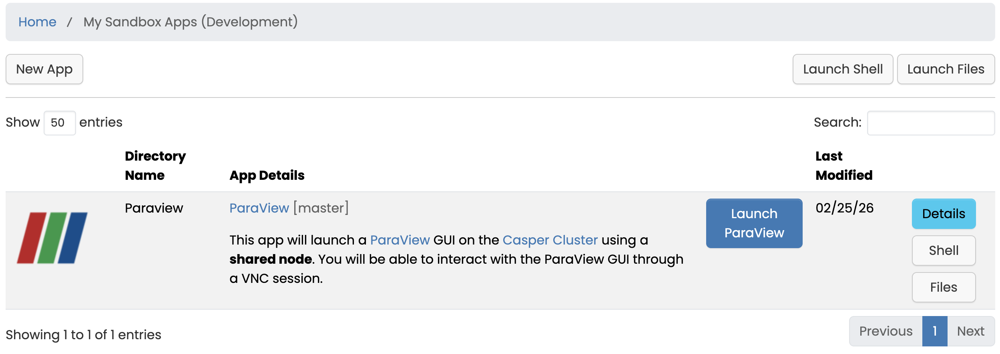

# Interactive Apps for Open OnDemand and Appverse

This page describes how to develop interactive applications for Open OnDemand (OOD) and the Appverse ecosystem. [Appverse](https://openondemand.connectci.org/appverse) is a  community-driven catalog of software, interactive apps, dashboards, and widgets.

!!! tip
    NSF NCAR CISL staff would highly value suggestions or feedback for specific applications that should be priortitized to be made available via OOD. Please reach out to the [NSF NCAR Research Computing Help Desk](https://rchelp.ucar.edu) to submit a request.

## Overview

Open OnDemand provides a web-based interface for launching and managing interactive sessions on HPC systems. Appverse is the framework used to build and expose custom, interactive apps within OOD.

Interactive apps can include:
- web-based notebooks
- bespoke GUI applications
- visualization tools
- custom dashboards
- data portals

## Appverse Concepts

- **Appverse app**: A custom application built to run inside the OOD environment.
- **Interactive session**: A job launched on a compute cluster that provides persistent web access.
- **Developer interface**: The app builder and configuration tools used to register and manage Appverse apps, primarily via a linked GitHub repository.

## Developing Interactive Applications for Open OnDemand

1. Review the [NSF NCAR OOD documentation](index.md) and the [Appverser Contributor's Guide](https://openondemand.connectci.org/appverse-contributor-documentation).
2. Consult the [Batch Connect](https://osc.github.io/ood-documentation/release-2.0/reference/files/submit-yml/basic-bc-options.html) and app manifest format for OOD.
3. [Request developer access](#developer-access) for NSF NCAR OOD.
3. Build the app, ideally in a publicly accessible git repository.
4. Test in OOD developer interface then notify [NSF NCAR Research Computing Help Desk](https://rchelp.ucar.edu) when the app should be deployed.

An example batch connect application deployed for NSF NCAR OOD may be found at the github repository for the [VS codeserver application](https://github.com/NCAR/bc_ncar_codeserver).

## Developer Access

To develop and test apps in NSF NCAR OOD environment, you must have access to the developer interface.

- Contact the [NSF NCAR Research Computing Help Desk](https://rchelp.ucar.edu)
- Request developer access for the Open OnDemand interactive application interface
- Additional support or recommendations for applications CISL staff may also be requested when contacting the help desk.

## Recommended Resources

Applications developed for NSF NCAR OOD are welcome to be presented to and seek feedback from the monthly NCAR HPC User Group (NHUG) meetings. Please reach out if you would like to present.

Open OnDemand devopers and power users are recommended to review the comprehensive [Open OnDemand documentation](https://osc.github.io/ood-documentation/latest/) maintained by the [Ohio Supercomputing Center](https://www.osc.edu/) and broader OOD community. You may also consider attending the annual Global Open OnDemand (GOOD) conference. Specific recommendations on how to get involved with the OOD community may be found at [https://www.openondemand.org/get-involved](https://www.openondemand.org/get-involved).
