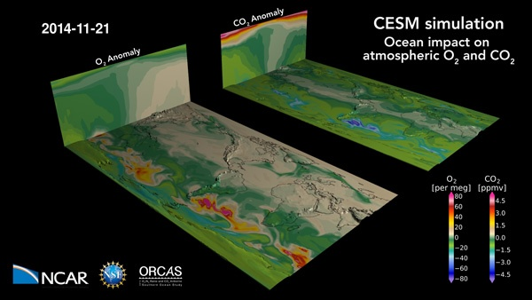

# Community models

The models described below are available for use on NCAR computers that
CISL manages.

Please contact the [NCAR Research Computing help
desk](https://rchelp.ucar.edu/) if you need assistance.

- [Community Earth System Model (CESM)](http://www.cesm.ucar.edu/) – A
  fully coupled, global climate model developed at NCAR. CESM (formerly
  CCSM) provides state-of-the-art computer simulations of the Earth's
  past, present, and future climate states. The CESM simulation image
  above is from the CISL Visualization Gallery.

- [Weather Research & Forecasting (WRF) model](https://www.mmm.ucar.edu/weather-research-and-forecasting-model) –
  A next-generation mesoscale, numerical weather-prediction system
  designed to serve both operational forecasting and atmospheric
  research needs.

- [Whole Atmosphere Community Climate Model (WACCM)](https://www2.acom.ucar.edu/gcm/waccm) –
  A comprehensive numerical model spanning the range of altitude from
  the Earth's surface to the thermosphere, developed by a
  collaboration of NCAR’s High Altitude Observatory, Atmospheric
  Chemistry Observations & Modeling, and Climate and Global Dynamics
  division.

- [Atmospheric chemistry models](https://www2.acom.ucar.edu/sections/acom-community-models) –
  NCAR’s Atmospheric Chemistry Observations & Modeling builds,
  critically evaluates, and applies process, regional- and global-scale
  models that address atmospheric chemistry research questions, with a
  focus on couplings between different components of the Earth system.

- [Thermospheric General Circulation Models (TGCMs)](http://www.hao.ucar.edu/modeling/tgcm/index.php) –
  The High Altitude Observatory (HAO) at NCAR has developed a series
  of numeric simulation models – such as TIEGCM and TIME-GCM – of the
  Earth's upper atmosphere, including the upper stratosphere,
  mesosphere, and thermosphere.

- [Data Assimilation Research Testbed (DART)](https://dart.ucar.edu/) –
  A community facility for ensemble data assimilation developed and
  maintained by NCAR’s Data Assimilation Research Section
  ([DAReS](https://dart.ucar.edu/pages/About_Us.html)).
