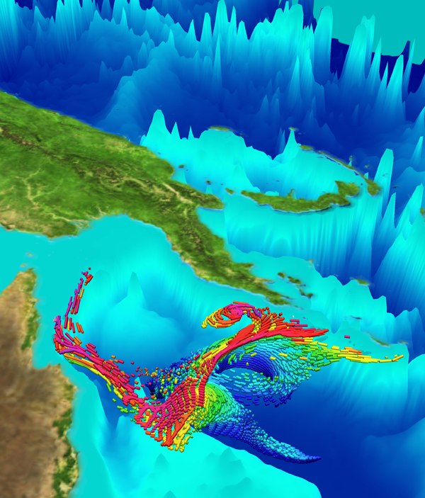

# Software for HPC users

NCAR and CISL have developed and support a number of freely available
software packages for visualization, data analysis, weather prediction,
and high-performance computation. These include models that help
researchers understand the impact of regional and global climate change,
and tools and libraries for analyzing and visualizing data.

Software available on the HPC and data analysis systems that CISL
operates also includes open-source and commercial third-party products
used for programming, analysis, and file management tasks.

To determine which software modules are available on an individual
computing resource, and for information about a system's unique user
environment, consult the documentation for that resource at these links:

- [Derecho](../../compute-systems/derecho/index.md) and its [user software](../../compute-systems/derecho/derecho-modules.md)

- [Casper](../../compute-systems/casper/index.md) and its [user software](../../compute-systems/casper/casper-modules.md)

Also, see these pages for information regarding software packages and
tools that are available for use on our systems:

- [Community models](../community-models.md)

- [Data analysis and visualization](../data-analysis-and-visualization.md)

- [Environment modules](../user-environment/modules.md)

- [Tools for debugging, profiling, and optimizing code](./profiling-and-debuggers/running-ddt-map-and-pr-jobs.md)

- [Utilities](../user-environment/utilities.md )

*Image from the CISL Visualization Gallery*
