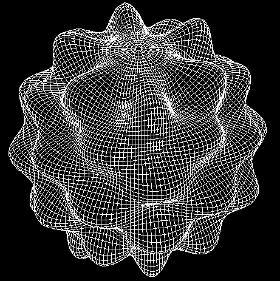

# NCAR Classic Libraries for Geophysics

Several mathematical libraries developed in the years 1970-1990 remain
popular in the geophysics community. These libraries, listed below, are
available for downloading here on GitHub: [NCAR Classic Libraries for Geophysics](https://github.com/NCAR/NCAR-Classic-Libraries-for-Geophysics).

Image - *Deformed 3D Sphere Scalar Harmonic Produced by a SPHEREPACK Subroutine*

- [`FFTPACK`](https://github.com/NCAR/NCAR-Classic-Libraries-for-Geophysics/tree/main/FFTPack): A library of fast Fourier transforms

- [`FISHPACK`](https://github.com/NCAR/NCAR-Classic-Libraries-for-Geophysics/tree/main/FishPack): Fortran subprograms for solving separable elliptic
  partial differential equations (PDEs)

- [`FISHPACK 90`](https://github.com/NCAR/NCAR-Classic-Libraries-for-Geophysics/tree/main/FishPack_90): FISHPACK subprograms with a Fortran 90 interface

- [`MUDPACK`](https://github.com/NCAR/NCAR-Classic-Libraries-for-Geophysics/tree/main/MudPack): Multigrid Fortran subprograms for solving separable and
  non-separable elliptic PDEs

- [`SPHEREPACK`](https://github.com/NCAR/NCAR-Classic-Libraries-for-Geophysics/tree/main/SpherePack): A Fortran library for modeling geophysical processes

All of these library routines are written primarily in Fortran 77. Their
internal implementation does not always conform to the Fortran Standard.
FISHPACK90 provides a Fortran 90 interface to the FISHPACK routines.
Only MUDPACK is written with parallelism in mind; it uses OpenMP
directives for shared-memory parallelism. The other libraries were
designed to run on a single processor.

These libraries represent many person-years of development, and though
they are no longer under development, NCAR continues to make them
available to the public at no cost under a software licensing agreement.
The libraries are best suited to Linux and UNIX environments and require
a directory structure, `tar`, and `gmake` commands.

## Modern Refactoring Efforts

Some libraries have been incorporated into more modern distributions thanks
to open source contributions from the scientific community. This includes the below:

- FFTPACK included in
  - [Fortran-lang](https://fortran-lang.github.io/fftpack/)
  - [Netlib](https://www.netlib.org/fftpack/)
  - [SciPy](https://docs.scipy.org/doc/scipy/reference/fftpack.html)
- Refactorizations for
  - [Fortran 2008+ FFTPACK](https://github.com/jlokimlin/modern_fftpack)
  - [Fortran 2008+ FISHPACK](https://github.com/jlokimlin/fishpack)
  - [Fortran90 MUDPACK](https://github.com/trifwn/mudpack_SP)
  - [Fortran 2008+ SPHERPACK](https://github.com/jlokimlin/spherepack)

Feel free to open a pull request to these documentation pages if you would like any
modernization efforts recognized here.
