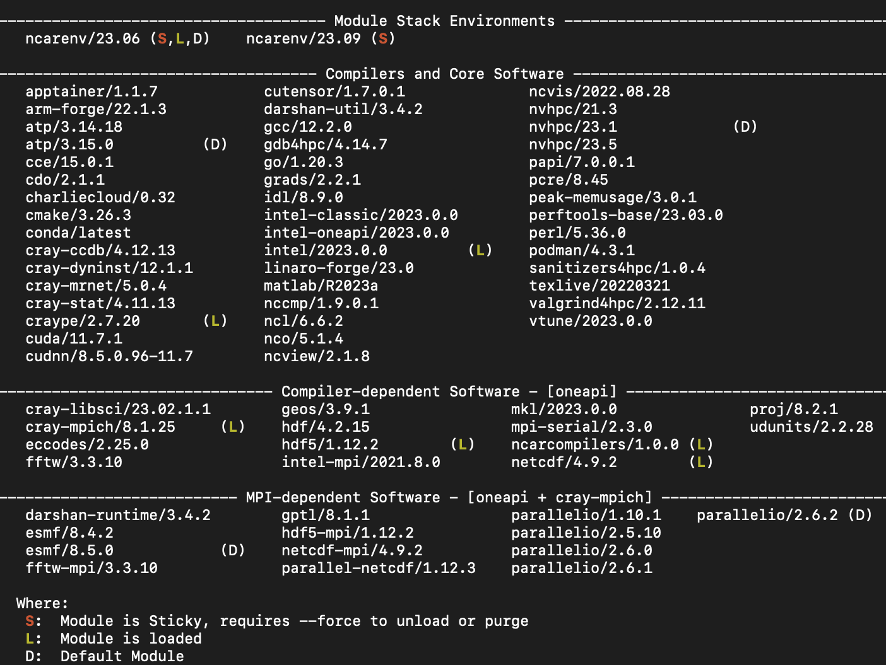

# Modules

## Overview
The `module` utility helps you identify software that is available on the system and then load compatible packages. It manages complex combinations of paths, variables, and dependencies so you can compile and run jobs efficiently and make the most of your allocation.

Some modules are loaded by default. To see which modules those are, run `module list` when you log in. Depending on the work you need to do, you can load additional modules or different modules, or you can create and save multiple customized environments as described below.

!!! warning
    Do not use personalized start files to load *environment modules*; it can cause conflicts.
    Instead, set up any unique environments that you need as described in the customized environments section below. Use that approach to create and save different environments for various aspects of your work – one for model runs and another for data analysis, for example.


## Essential module commands

Following are descriptions of commonly used module commands.

- `module av` – Show which modules are available for use with the currently loaded compiler.  Typical output:

In the example above, (`L`) indicates which modules are currently
loaded.  The modules deployed at NCAR are *hierarchical*, with a base
of common Compilers and Core Software.  The remainder of the output is dependent
on what core software (namely, compilers) are chosen.

- `module help` – List options and subcommands for the module utility; or specify a modulefile by name for help with an individual module.
```
module help
module help netcdf
```

- `module list` – List the modules that are loaded.

- `module load` – Load the default version of a software package, or load a specified version.
```
module load modulefile_name
module load modulefile_name/n.n.n
```


- `module purge` – Unload all modules. Some users include this command in a batch script, followed by a sequence of `module load` commands to establish a customized environment for the job being submitted.

- `module reset` - Reset the system default modules.

- `module spider` – List all modules that exist on the system. This does not give you information on module dependencies or tell you which modules can be loaded without conflicts at that point.

- `module spider modulefile_name/n.n.n` – List all occurrences of `modulefile_name/n.n.n` on the system, including its module dependences. For example, to determine which compiler/MPI combinations provide `netcdf-mpi/4.9.2`:
```pre
module spider netcdf-mpi/4.9.2

------------------------------------------------------------------------------------------------------
  netcdf-mpi: netcdf-mpi/4.9.2
------------------------------------------------------------------------------------------------------

    You will need to load all module(s) on any one of the lines below before the "netcdf-mpi/4.9.2"
    module is available to load.

      ncarenv/23.09  gcc/12.2.0  cray-mpich/8.1.25
      ncarenv/23.09  gcc/12.2.0  mvapich/3.0b
      ncarenv/23.09  intel-classic/2023.2.1  cray-mpich/8.1.25
      ncarenv/23.09  intel-classic/2023.2.1  intel-mpi/2021.10.0
      ncarenv/23.09  intel-oneapi/2023.2.1  cray-mpich/8.1.25
      ncarenv/23.09  intel-oneapi/2023.2.1  intel-mpi/2021.10.0
      ncarenv/23.09  intel/2023.2.1  cray-mpich/8.1.25
      ncarenv/23.09  intel/2023.2.1  intel-mpi/2021.10.0
      ncarenv/23.09  nvhpc/23.7      cray-mpich/8.1.25
      ...
```
Each output line is a consistent set of modules that when loaded will provide access to the requested `netcdf-mpi` package.

- `module swap` – Unload one module and load a different one. Example:
```
module swap netcdf pnetcdf

```

- `module unload` – Unload the specified software package.
```
module unload modulefile_name

```

- `module whatis` – Get a short description of a module.

## Customized environments

If you have created your own environment or want to have multiple collections of modules for various tasks, you can save those customized environments for easy re-use.

To save a customized environment as your default environment, load the modules that you want to use, then simply run `module save` or `module s`.

```
module save

```


The cluster you are using will append a suffix to the name you provide. For example, on Casper your example will include `.dav` as a suffix.

If you plan to set up additional custom environments for other needs, give each collection of modules a unique name.


```
module save environment_name

```


To use one of the custom environments from that list, use `module restore`, or `module r`, followed by the name.

```
module restore environment_name

```
To see a list of your customized, saved environments, use `module savelist`.
```
module savelist

```

To see which modules you've saved in a custom environment, use `module describe` as shown.

```
module describe environment_name.xyz

```

### Remove a customized environment
To remove a customized environment that you have saved:

1. Change to your `.lmod.d` directory.
2. List the files.
3. Use `rm` to delete what you no longer need.

```
cd /glade/u/home/username/.lmod.d
ls -l
rm environment_name.xyz
```

### Revise a customized environment

To revise a customized environment:

1. Restore (change to) that environment.
2. Unload, load, or swap modules as needed.
3. Save the environment as a default environment again with the same name.

```
module restore myenvironment
module load additional_module
module save myenvironment
```

The previously saved environment will be renamed automatically with the addition of a tilde (~). In the example just above, the previously saved environment would be renamed to `myenvironment~`.


!!! tip "Troubleshooting tips"

    **Situation:** You load a custom default module collection (for example, `module restore myenvironment`).
    You receive a warning similar to this:
    ```
    Lmod Warning: The following modules have changed: pgi
    Lmod Warning: Please re-save this collection
    ```

    **What to do**: “Re-save” the customized module collection by running `module save` and using the same environment name, as follows.

    ```
    module save myenvironment
    ```
