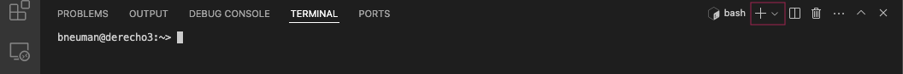
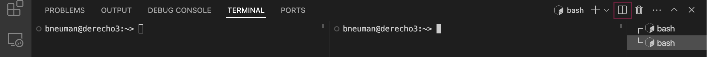
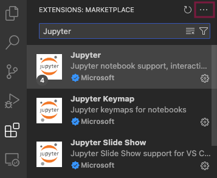
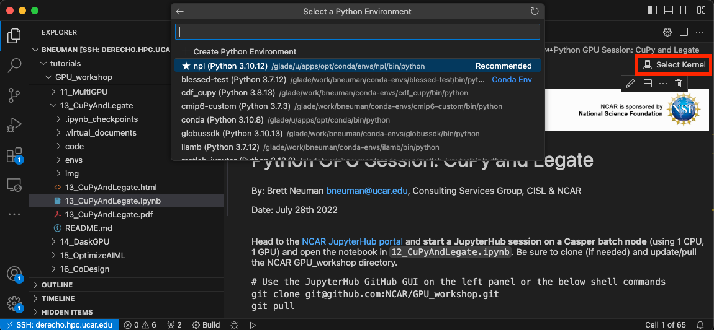
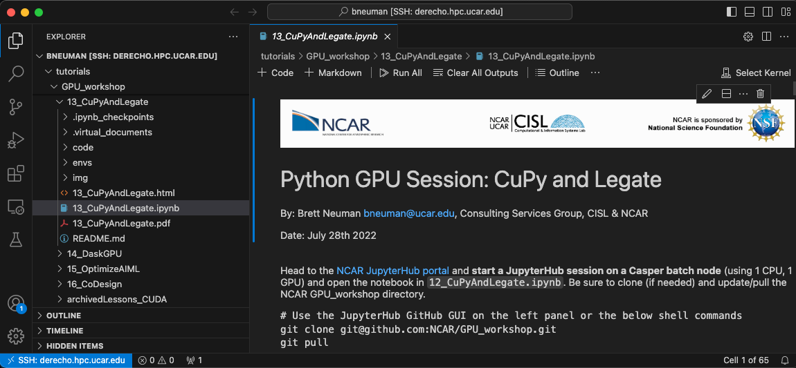

# Visual Studio Code

Visual Studio Code, also commonly referred to as VS Code, is a source-code editor developed by Microsoft for Windows, Linux, macOS and web browsers. Features include support for debugging, syntax highlighting, intelligent code completion, snippets, code refactoring, and embedded version control with Git.

The Visual Studio Code Remote - SSH extension allows you to open a remote folder on any remote machine, virtual machine, or container with a running SSH server and take full advantage of VS Code's feature set. Once connected to a server, you can interact with files and folders anywhere on the remote filesystem.

VSCode is available for NCAR issued laptops in the *Self Service* application or can be [downloaded](https://code.visualstudio.com/download) directly from the Microsoft VS Code website.

## Connecting to Derecho or Casper Login Nodes

The Visual Studio Code Remote SSH extension allows you to connect to Derecho, Casper, and the GLADE filesystem. Once connected to a server, you can interact with files and folders anywhere on GLADE.  You can connect to the Derecho or Casper login nodes by following these steps:

!!! example "Connecting to NCAR system login nodes" 
    === "Derecho"

        1. Press F1 and run the *Remote-SSH: Open SSH Host* command.
        2. Enter your NCAR CIT username in the following format in the input box that appears and press enter: user@derecho.hpc.ucar.edu
        3. Enter your NCAR CIT password when prompted.
        4. Accept the DUO Push request.

    === "Casper"

        1. Press F1 and run the *Remote-SSH: Open SSH Host* command.
        2. Enter your NCAR CIT username in the following format in the input box that appears and press enter: user@casper.hpc.ucar.edu.
        3. Enter your NCAR CIT password when prompted.
        4. Accept the DUO Push request.


!!! tip 
    You can connect to recently used remote paths by creating a new window, tab, or the *File > Open Recent* dropdown and selecting it from the *Recent* list.

!!! tip 
    The *Open a Remote Window* button in the bottom left corner is an alternative to opening a remote server and shows the available remote connection options.  *Connect Current Window to Host* is a useful command to reload the session if you have been disconnected.


It may be necessary to first add Derecho or Casper if you have never connected to Derecho or Casper using SSH. You can add a host to connect to using SSH as a new host in the Remote-SSH extension.

1. Press F1 and run the *Remote-SSH: Add a New Host* command.
2. When you are prompted to connect to a host you can enter the full SSH path like you would when connecting via the terminal:

```
ssh -Y <user>@derecho.hpc.ucar.edu
```

!!! danger 
    Connecting to Derecho or Casper using VS Code Remote-SSH will place you on a login node.  Be respectful of users on this shared resource and do not launch computationally or memory intensive tasks while connected to the login nodes.  VS Code uses more memory than most processes running on the login nodes and you can easily be flagged for login node abuse by our automated systems.  If you are interested in using VS Code for more computationally or memory intensive applications then view the [Connecting to Compute Nodes](#connecting-to-compute-nodes) section to run on the compute nodes.

## Connecting to Compute Nodes

### Casper

There are two methods to connect to Casper compute nodes from the login nodes.  The first is using the [qvscode](#qvscode) script to automate the process of requesting a compute node. The second is manual job submission and connecting directly to the job's allocated compute node.  Both methods require that you first connect to the login nodes.

#### qvscode

The *qvscode* script starts a new VSCode session on a Casper compute node.  The script handles job resource assembly, compute node identification, and launching a new VSCode window onto the compute node allocated by the job. 

!!! info
    The qvscode script must be launched from a VSCode terminal that is connected to a Casper login node.

The script can either take user input via terminal prompts or source a settings file to allocate resources for a compute node job.  The two modes available are:
- [Prompt mode](#prompt-mode): user inputs job resources manually via the terminal
- [Settings mode](#settings-mode): qvscode pulls job resource information from a settings file with a specific format

```
Usage: qvscode [options]
  options:
    -b | --bypass      # Use prompt mode to enter job arguments and bypass any user settings files
    -p | --path path   # Provide the full path to a qvscode settings file to use in settings mode
    -h | --help        # Display this help message
```

##### Procedure

1. Open VSCode on your local machine
2. In VSCode, connect to a Casper login node using RemoteSSH as described [here](#connecting-to-derecho-or-casper-login-nodes)
3. Once connected to the login node, open up a new terminal window (Ctrl+Shift+\`)
4. Load the latest ncarenv module, currently at ncarenv/24.12 using `module load ncarenv/24.12` in the terminal
5. Call `qvscode`
6. Enter a valid project code and follow the prompts to launch a PBS job
7. A new VSCode window will open and connect to the compute node when your PBS job has started

A new VSCode window will launch on the compute node after user input or reading from the settings file.  You will need to enter your NCAR CIT password and provide DUO authentication when connecting to the compute node. The above procedure can be simplified by using a settings file as described in the [Settings Mode](#settings-mode) section.

!!! info
    Step 6 will not prompt you for a project code if you have PBS_ACCOUNT defined.

!!! warning 
    You *must* have a running VSCode Casper login session to launch the *qvscode* script. [Connect to a login node](#connecting-to-derecho-or-casper-login-nodes) and then launch the *qvscode* script from VSCode's built-in terminal.  This script will not work if you are connected to your local machine or launch it from outside of VSCode.

##### Operating Modes

[Prompt Mode]($prompt-mode) will prompt the user for the values needed to launch the PBS job.  It contains default values to make launching a job faster.

[Settings Mode]($settings-mode) reads in variables from a user defined settings file and quickly launches a compute node with these settings.  It requires a specific path and format.

###### Prompt Mode

This mode will be used when the script does not find the file `.qvscode_settings` in your home directory or you use the bypass argument.  You will be prompted for the PBS select statement arguments. 

```
bneuman@casper-login2:~> qvscode
Submitting job to Casper
Enter Project []: 
```

If you do not have a variable `PBS_ACCOUNT` setup then you will always be prompted to enter a valid project.  After the project prompt you will be asked if you would like to use the default values for the PBS select statements.  Answering 'N' to the default values prompts the user to enter variables for each of these basic job settings.  Note that the bracketed values are the default values and will be used if you do not enter any value when prompted.  

The defaults for the basic settings are for a serial CPU session with values of:

```
Account:  $PBS_ACCOUNT
Nodes:    1         
CPUs:     1         
Memory:   10GB         
GPUs:     0         
Walltime: 02:00:00         
Path:     $(pwd)
```

After finishing the basic settings you will be prompted to enter advanced options.  The advanced options and defaults are:

```
CPU Type:    
GPU Type:    
MPI Procs:   1   
OMP Threads: 1
```

###### Settings Mode

If the `qvscode` script finds a `.qvscode_settings` file in `$HOME` (/glade/u/home/$USER) then it will import the variables into the script. The template requires specific keywords to pull values in.  It is *highly* recommended to copy the repository's `qvscode_settings_template` to your `$HOME` directory, rename it to `.qvscode_settings`, and then modify the values for each argument instead of manually creating the settings file.  You can use this command to copy the existing template into your home directory:

`cp /glade/work/csgteam/qvscode/qvscode_settings_template $HOME/.qvscode_settings`

!!! example "Example .qvscode_settings template files"
    Modify the `project=<project_code>` to your desired project code.

    === "Serial CPU"
        ```
        system=casper
        project=<project_code>
        nodes=1
        num_cpus=1
        cpu_type=
        memory=4GB
        mpi_procs=1
        ompthreads=1
        num_gpus=
        gpu_type=
        walltime=01:00:00
        path=$(pwd)
        ```

    === "Parallel CPU"
        ```
        system=casper
        project=<project_code>
        nodes=1
        num_cpus=4
        cpu_type=
        memory=30GB
        mpi_procs=4
        ompthreads=1
        num_gpus=
        gpu_type=
        walltime=01:00:00
        path=$(pwd)
        ```

    === "Single GPU"
        ```
        system=casper
        project=<project_code>
        nodes=1
        num_cpus=1
        cpu_type=
        memory=64GB
        mpi_procs=1
        ompthreads=1
        num_gpus=1
        gpu_type=
        walltime=01:00:00
        path=$(pwd)
        ```

    === "Multiple A100 GPUs"
        ```
        system=casper
        project=<project_code>
        nodes=1
        num_cpus=4
        cpu_type=milan
        memory=200GB
        mpi_procs=4
        ompthreads=1
        num_gpus=4
        gpu_type=a100
        walltime=01:00:00
        path=$(pwd)
        ```

The `qvscode` script will use the default values for any variable that is not set.  If the path variable is empty then you will create a VSCode session that does not connect to GLADE and you won't be able to use the File Explorer but can still navigate the filesystem from the terminal.

##### Bypass and Custom Settings File Path Modes

You can bypass any existing `$HOME/.qvscode_settings` file by adding the `-b` or `--bypass` argument when calling `qvscode`.  You will then enter Prompt Mode.

You can use a custom settings file by providing the full path to the file with the `-p` or `--path` argument when calling `qvscode`.  Your custom .qvscode_settings file must use the same template format to set the values correctly.

##### The New VSCode Compute Node Job

If the qsub arguments are valid then a new VSCode window will launch and connect to the compute node hostname.  You will be required to enter your NCAR two-factor authentication and may be asked to verify the SSH connection if you have not connected to the node previously.  You can close the new window and reconnect using the command provided by the script at job launch from the login node.  The format will be:

```code --remote ssh-remote+$USER@<computenode_hostname>.hpc.ucar.edu```

Pressing `Ctrl+C` from the login node terminal will kill the PBS job and end your compute node session.

##### Log Files and Other Considerations

Log files are stored in `$SCRATCH/.qvscode_logs` and show the user arguments with job submission details. 

#### Manual Job Submission and Connection

You can connect to Casper compute node by launching your PBS job and then SSH directly into the compute node.  Derecho does not allow external connections to the compute nodes.  For connecting to Casper compute nodes, follow these steps:

!!! example "Connecting to Casper compute nodes"
    Please follow these steps to connect to a Casper compute nodes:  
    1. Connect to a Casper login node using Remote-SSH.  
    2. From the Terminal, launch an interactive job using `qsub -I` or use the [`qinteractive` command](../pbs/index.md#qinteractive).  
    3. Identify the assigned compute node name.  
    4. Launch a new window and connect directly to the Casper compute node using Remote-SSH.

### Derecho

Derecho VSCode compute node access is unavailable due to security guidelines set for Derecho's compute nodes. We're investigating ways to connect to Derecho compute nodes using VSCode but there is no timeline.

### Remote System

Once connected to a node, you can interact with the GLADE filesystem using either the built-in Terminal or the File Explorer.

#### Terminal

Open a terminal using either of these methods:

1. From the menu, use the *Terminal > New Terminal* or *View > Terminal* menu commands.
2. From the Command Palette (⇧⌘P), use the *View: Toggle Terminal* command.

The terminal has Shell Integration options and the default will be selected based on your SAM shell settings for each system.  You can modify the shell with the terminal shell dropdown.  Clicking the `+` will create a new terminal window with the current shell.



Create multiple terminal windows in a split pane.



!!! tip
    To toggle the between the terminal pane and code pane, use the ``` (Ctrl`) ``` *(Control+Backtick)* keyboard shortcut.  To create a new terminal, use the (Ctrl⇧\`) *(Control+Shift+Backtick)* keyboard shortcut.

#### File Explorer

After connecting to a Remote SSH NCAR login node, you can bring up the File Explorer view by clicking on the File Explorer icon in the Activity Bar on the side of VS Code or the *View: Explorer* command (⇧⌘E)


The Explorer tab allows a graphical file structure for the path that you provide.  If you are already connected to a Derecho or Casper login node then you will see the GLADE file structure populated.

!!! warning 
    VS Code will be able to view all subdirectories of your path when connecting the Explorer. Be mindful that a higher total number of files in the Explorer space will increase your memory and CPU utilization on the login nodes by default.  We recommend only selecting the path for your current project and the files that you need to directly interact with during that session.  Instead of connecting to `/glade/work/$USER`, connect to your project folder of `/glade/work/$USER/myproject/code`.  Smaller Explorer spaces also help with performance for addons that use code completion like Intellisense.

!!! tip
    Reduce the number of files that VS Code scans periodically to lower CPU utilization, memory, and Intellisense scanning time on the login nodes.  Add these paths to your Settings file found in *Code > Preferences > Settings*, search for the strings below, and add the wildcard items to each file exclude type:

    ```
    "files.watcherExclude": {
        "**/.git/objects/**": true,
        "**/.git/subtree-cache/**": true,
        "**/node_modules/**": true,
        "**/dist/**": true,
        "**/conda-envs/**": true
        "**/env/**": true,
    },
    "files.exclude": {
        "**/.git/objects/**": true,
        "**/node_modules/**": true,
    },
    "search.exclude": {
        "**/node_modules/**": true,
        "**/dist/**": true,
        "**/tmp/**": true,
        "**/.git/objects/**": true,
        "**/.git/subtree-cache/**": true,
        "**/.DS_Store": true,
        "**/.vscode": true,
        "**/__pycache__": true,
        "**/.pytest_cache": true,
    },
    ```

#### Source Control

VS Code has integrated source control management (SCM) and includes Git support natively. Access the Source Control view by clicking on the Source Control icon in the Activity Bar on the side of VS Code or the *View: Source Control* command (⇧⌘G)


#### Extensions

Browse and install extensions from within VS Code. Bring up the Extensions view by clicking on the Extensions icon in the Activity Bar on the side of VS Code or the *View: Extensions* command (⇧⌘X).


Search for extensions within the Extensions tab and click the extension to install, disable, or view details about it.  The `...` button will provide additional options to enable or disable all extensions, update current extensions, or view all running extensions.



!!! danger 
    Extensions are a powerful tool within the VS Code environment but not all extensions are sponsored by reputable sources.  Extension problems can manifest in errors, poor memory management, and excessive CPU utilization.  We are unable to support all possible extensions that exist so we recommend disabling all but the core extensions before reporting a problem to the NCAR HPC support team.

## Conda and Python Environments

### Terminal mode

Terminal mode ignores the VS Code environment and uses the NCAR system module stack.  This is identical to the behavior of running within the Mac Terminal over SSH.  You can perform module loads and activate Conda environments directly from the terminal.

!!! tip 
    Interacting with a file that was opened with the `code` command will require the Interactive method for running the code.

### Interactive mode

VS Code can use the Python Interactive mode to launch Jupyter notebooks, Python scripts, or debug code with the proper extensions.  

The *Python Interpreter* is used to set the environment for interactive mode.  To select an environment, use the *Python: Select Interpreter* command from the Command Palette (⇧⌘P).  A valid environment is required to properly run Jupyter notebooks within VS Code and is a common use case for NCAR users.

If you are connected to Derecho or Casper and have a Jupyter notebook or Python file preview open, you can click *Select Kernel* to view your available Python environments.  The list includes NCAR conda environments like `npl` and your own custom environments.



Open a Jupyter notebook or Python file using either the terminal command `code` or with the File Explorer.  This will put you in the default kernel.  Like Jupyterhub, you will need to specify which kernel to use when executing cells in the notebook.  Not specifying a kernel will use your default kernel and could lead to import failures or unexpected behavior.

!!! info 
    Adding your conda-envs folder to the list of *Trusted* kernels will allow you to run notebooks with these kernels without being prompted to trust the kernel each time you run select a new kernel.

## Jupyter Notebooks
You can run cells similarly to Jupyterhub with the 'Run All' or an individual cell by hitting *Shift+Enter*.  Jupyter notebooks will use the VS Code kernel as your Python environment.



Be mindful of the location of launching your notebooks.  If you use the File Explorer tab then you will be running on the login nodes.  
Executing the command *code* from an interactive job will execute on the compute node.

## Additional Resources
Microsoft provides [comprehensive documentation](https://code.visualstudio.com/docs) on how to modify the GUI, add shortcuts, integrate external technologies into VS Code, and more.

