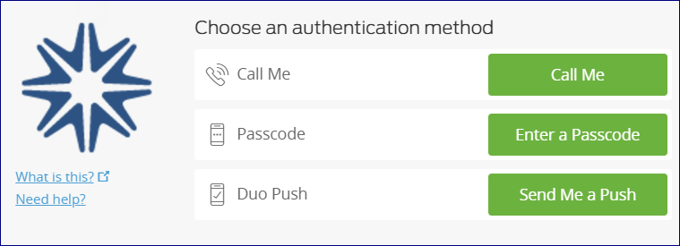

# Authenticating with Duo

**Caution**

NCAR Duo Authentication is export-controlled. Taking the app on your
phone to Cuba, Iran, Syria, North Korea, or Sudan is strictly
prohibited.

#### Page contents

- [Overview](#AuthenticatingwithDuo-Overview)

- [Getting started with Duo](#AuthenticatingwithDuo-requestGettingsta)

- [Logging in with Duo](#AuthenticatingwithDuo-LogginginwithDuo)

- [Duo Device Portal](#AuthenticatingwithDuo-DuoDevicePortal)

- [User guides and related
  links](#AuthenticatingwithDuo-Userguidesandrela)

## Overview

Logging in with Duo two-factor authentication (2FA) requires you to
enter a CIT password and then use a Duo-configured device to confirm
your identity.

**Best practice recommendation:** Use a screen lock on your mobile
device to increase security.

Four ways of logging in with Duo:

1.  **Push notification (preferred)**
    The app sends a request (a "push" notification) to your phone or
    tablet, asking you to approve or deny the login request.

2.  **Rolling passcode**
    When you can't receive a push notification, enter both your CIT
    password and a numerical passcode from the Duo app, separated by a
    comma. Example: **password,passcode**

3.  **Phone callback**
    Enter your CIT password and the word "phone," separated by a comma,
    then follow instructions you receive in a phone call. Example:
    **password,phone**

4.  **Duo/YubiKey 4**
    Some NCAR/UCAR staff use Duo authentication with a YubiKey 4 token.
    After inserting the token in your USB port, enter your CIT password
    and a comma, then lightly touch the gold button on your token.
    Example: **password,\[touch button\]**

The examples below use the **push notification** method of
authentication. See [<u>How to Use Append
Mode</u>](https://guide.duo.com/append-mode) for more information on
other methods.

#### Other YubiKey users

Individuals who use YubiKey tokens can contact the [<u>NCAR Research
Computing help desk</u>](https://rchelp.ucar.edu/) to ask to be enrolled
to use Duo 2FA instead.

When a Duo account is activated for someone who has a YubiKey token, the
token is disabled immediately and [must be
returned](file:////display/RC/Authentication+and+security).

## Getting started with Duo

To get started, contact the [<u>NCAR Research Computing help
desk</u>](https://rchelp.ucar.edu/) to request enrollment (and to get a
CIT password if you don't already have one).

CISL will send you a link for setting up a Duo account.

During setup, Duo asks some questions about the device you want to use.
Smartphone and tablet users are asked to download [<u>this free **Duo
Mobile**
app</u>](https://duo.com/product/trusted-users/two-factor-authentication/duo-mobile).

When your setup is complete, follow the instructions below to log in to
the system, such as Cheyenne, the NCAR virtual private network, or
others that accept Duo 2FA.

## Logging in with Duo

#### HPC and SSH logins

To log in to a system like Cheyenne:

- Enter [your ssh command](file:////display/RC/Quick+start+on+Cheyenne).

- Enter your **CIT password** where a token response is requested.

The Duo App will send a "push" notification to your phone or tablet,
asking you to approve or deny the login request.

When you approve the request, you will be logged in.

#### Other application logins

Duo authentication with other systems is somewhat different. Logging on
to the NCAR virtual private network
([VPN](file:////display/RC/VPN+access)) is one example.

You will:

- Enter your username.

- Enter your CIT password.

- You may get an automatic Duo Push, or select **Send Me a Push** from
  the Duo screen.

The Duo App will send a push notification to your phone or tablet,
asking you to approve or deny the login request.

When you approve the request, you will be logged in.

## Duo Device Portal

The [<u>Duo Device Portal</u>](https://duodeviceportal.ucar.edu/) is
where you can change device settings, add new devices (a new smartphone,
tablet or landline), or update your preferred contact methods.

You can also choose to have Duo send you a push automatically after you
enter your CIT password. Look for "When I log in" after you sign in to
the portal.

#### Changing smartphone

When you replace your smartphone and need to use it to authenticate, use
one of the following methods to get your new phone up and running with
Duo Mobile:

**Recommended:** [Duo Instant
Restore](https://guide.duo.com/duo-restore), a feature for recovering
Duo-protected accounts.

**Alternative **

- Go to the [Duo Device Portal](https://duodeviceportal.ucar.edu/).

- Choose **Call Me**. Even if your phone number hasn't changed, Duo
  needs to call your new phone to complete the setup process.

## User guides and related links

For additional information, see the following links
or contact the [<u>NCAR Research Computing help
desk</u>](https://rchelp.ucar.edu/) for assistance:

- [<u>Common issues</u>](https://guide.duo.com/common-issues)

- [<u>Duo Guide to Two-Factor
  Authentication</u>](https://guide.duo.com/)

- [<u>Duo Travel
  Guide</u>](https://duo.com/assets/pdf/Duo_Travel_Guide.pdf)

- [<u>Duo Quick
  Sheet</u>](https://docs.google.com/document/d/1odzRo5hDpQa9EzYv7e_vSJ2HsG_wBo1HV9kLlJ_A6ZQ/edit?usp=sharing)
