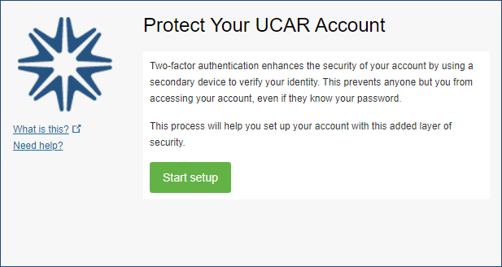
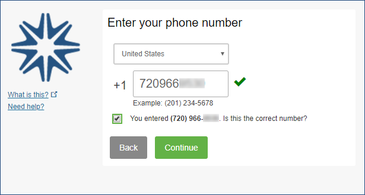
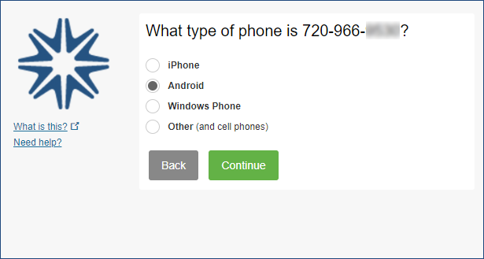
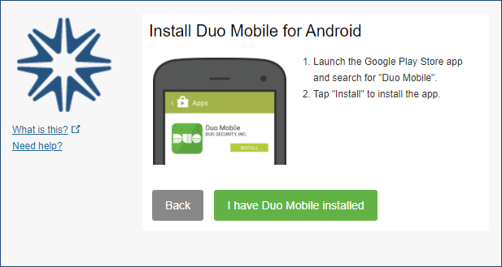
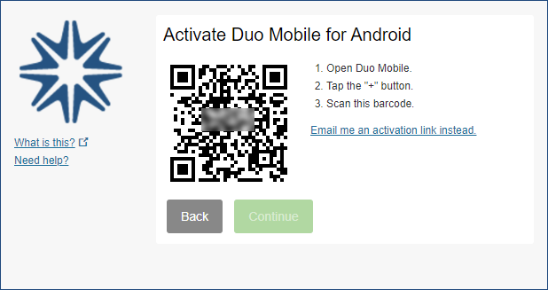
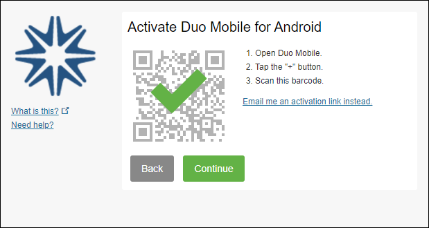
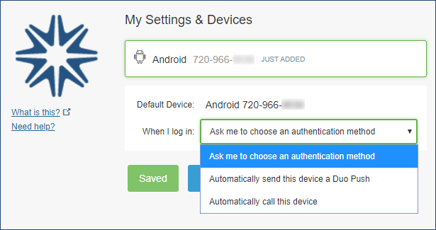
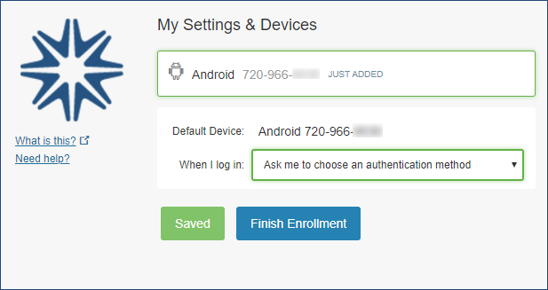
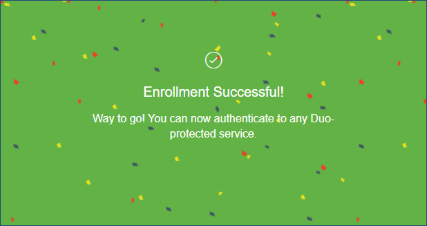

# Enrolling your phone or tablet for Duo 2FA

Duo Mobile is an app that runs on your smartphone and helps you
authenticate quickly and easily with [Duo two-factor authentication](./index.md) (2FA). You
will still be able to log in using a phone call or text message without
the app, but for the best experience, we recommend using Duo Mobile with
a smartphone.

You can also enroll a landline telephone or iOS/Android tablets.

After you [request enrollment](./index.md#getting-started-with-duo) and receive an
email from Duo Security, follow these steps to enroll your device.

### Step 1: Click Start setup

Click the personalized enrollment link in your email from Duo Security,
then click **Start setup**.

### Step 2: Enter your phone number

Select your country from the drop-down list and enter your phone number.
Use the number of the smartphone or cell phone that you'll have with you
when you're logging in to a Duo-protected service. You can enter your
desk phone number if you don’t have a cell phone.

Double-check the phone number to make sure you entered it correctly,
check the box to confirm that the number is correct, and
click **Continue**. (If you are enrolling a tablet, you aren't prompted
to enter a phone number.)

### Step 3: Choose your platform

Choose the type of phone you have and click **Continue**.

### Step 4: Install the Duo Mobile app

Follow the platform-specific instructions on the screen to install Duo
Mobile. After installing the app, return to the enrollment window and
click **I have Duo Mobile installed**.

### Step 5: Activate Duo Mobile

Activating the app links it to your account so you can use it for
authentication.

To activate Duo Mobile on an iPhone, Android, or Windows Phone, scan the
barcode with the app's built-in barcode scanner. Follow the
platform-specific instructions for your device.

The "Continue" button is clickable after you scan the barcode.

If you can’t scan the barcode, click **Email me an activation link
instead** and follow the instructions.

### Step 6: Configure device options (optional)

By default Duo will ask you to choose how you want to authenticate each
time you log in – with a push, phone call, or passcode, for example. The
default is recommended, but you can change the setting so you
automatically receive a push or a call instead of being asked every
time. To do that, make your selection from the dropdown menu and
click **Saved**.

### Step 7: Finish

Choose an optional authentication method from the “When I log in”
dropdown menu, then click **Finish Enrollment**.

Duo automatically sends an authentication request via a push
notification to the Duo Mobile app on your smartphone or a phone call to
your device (depending on your selection).

### Congratulations!

Your device is ready to approve Duo push authentication requests.
Click **Send me a Push** to give it a try. All you need to do is
tap **Approve** on the Duo login request you get on your phone.

