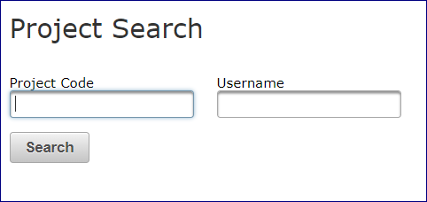

# Systems Accounting Manager

The **Systems Accounting Manager** ([SAM](https://sam.ucar.edu/app/home)) enables users to manage their
system preferences and get reports on charges for using the
computational and storage resources that CISL manages.

## User preferences

Log in at [sam.ucar.edu](https://sam.ucar.edu/app/home) and
select **User**, then **Preferences**.

From there, you can:

- Change your **primary group** if you belong to more than one UNIX
  group for using NCAR supercomputing resources.

- Specify your **default login shell** for the systems to which you have
  access.

- See what your **home directory** is on each system.

## SAM reports

Log in to [sam.ucar.edu](https://sam.ucar.edu/app/home) and you will see
the following choices on the **Reports** menu:

- My Account Statements
- My 30/90 Day Use
- Project Search

If you are authorized to charge usage to multiple projects, you will see
them listed when you select either of the first two report types. Select
one of the projects listed to get information.

NCAR divisional users often have access to numerous projects, while
individual university users most often have just one or a few.

In either case, use **Project Search** to:

- go directly to a report on a specified project, or
- search by username to see all projects with which you are associated.

### My Account Statements

Your **Account Statement** includes an overall report on the status of
your project’s computing and storage allocation and the usage associated
with it. If you are authorized to charge usage to more than one project,
you will have an Account Statement for each project.

The overall usage report on project activity shows your allocations’
start and end dates, amounts allocated, and remaining balances.

The "Activity" link at the end of each line reveals more details: the
project’s allocation history, a monthly summary of job charges, and
other activity, such as refunds. You can select a month and then view or
download the individual job records.

Another table includes additional information regarding your project’s
status in relation to any 30- and 90-day usage thresholds that apply and
to any related projects. This is most common for NCAR users on
divisional projects. Your own statement may show lines for multiple
projects or subprojects, as is often the case for NCAR divisional
allocations.

### My 30/90 Day Use

This selection lets you focus on your usage in relation to any 30- and
90-day usage thresholds that apply. Again, this is most common for NCAR
divisional projects.

### Project Search

You can search by individual project code and get an Account Statement
as described above.

If you search by your username, you will see a list of any projects you
are associated with and you can select any of them to get an Account
Statement.

{width="300"}
