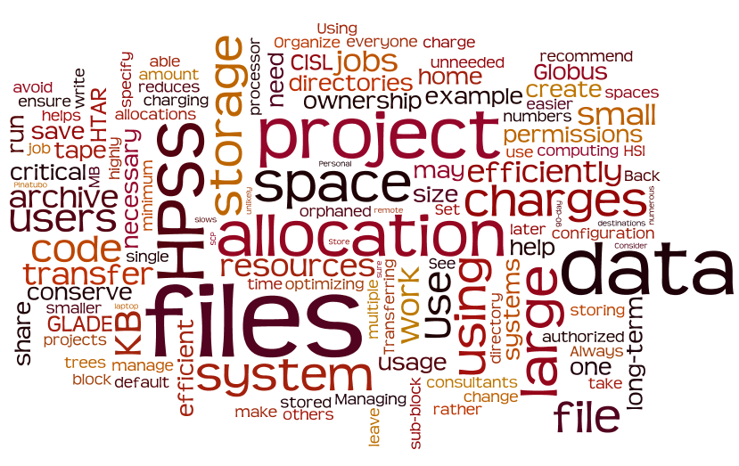

# Best practices for supercomputer users

The practices described below will help you make the most of your
computing and storage allocations.

{width="450"}

## Using shared resources

Be considerate of others in the user community when you work with these
shared computing and storage resources. Here are a few key issues to
keep in mind.

#### Use login nodes only for their intended purposes

You can run short, non-memory-intensive processes on the login nodes.
These include tasks such as text editing or running small serial scripts
or programs. Memory-intensive processes that slow login node performance
for all users are killed automatically and the responsible parties are
notified by email. See
[Appropriate use of login nodes](../compute-systems/derecho/derecho-use-policies.md#appropriate-use-of-login-nodes) for more
information.

#### Use the Derecho and Casper nodes that best meet your needs

The Derecho system and Casper nodes are configured for distinct
purposes. Derecho is best used for running climate and weather models
and simulations while the Casper cluster of nodes is for other
specialized work. Most Casper nodes are used for analyzing and
visualizing data while others feature large-memory, dense GPU
configurations that support explorations in machine learning and deep
learning.

This documentation explains how to get jobs running on the most
appropriate system for your work and on the individual types of nodes
that will best meet your needs:

-  [Derecho Overview](../compute-systems/derecho/index.md)
-  [Casper Overview](../compute-systems/casper/index.md)
-  [Submitting jobs with PBS](../pbs/index.md)
    -  [Sample Derecho PBS job scripts](../pbs/job-scripts/derecho-job-script-examples.md)
    -  [Sample Casper PBS job scripts](../pbs/job-scripts/casper-job-script-examples.md)

For expert assistance or guidance in using these resources, contact
the [NSF NCAR Research Computing help desk](https://rchelp.ucar.edu/).

#### Don't monopolize compute resources

Consider what impact you might have on the work of others and schedule
jobs accordingly. For example, avoid writing job submission scripts that
rapidly fill the scheduler with potentially concurrent compute resource
requests. Contact the Consulting Services Group for guidance if your
workload requires you to submit numerous jobs in a short time frame.
CISL monitors the use of these resources and will kill jobs when
necessary to ensure fair access for all users.

#### Limit your use of shared licenses

Users share a limited number of licenses for running IDL, MATLAB,
Mathematica, and some other applications. Be familiar with and follow
the established
[license-use guidelines](../environment-and-software/data-analysis-and-visualization.md) to
ensure fair access for all users. CISL reserves the right to kill
jobs/tasks of users who monopolize these licenses.

## Managing allocations

#### Monitor usage charges

Check your usage charges frequently to help ensure that you are using
CISL resources as efficiently as possible. Also make sure that others
who are authorized to charge against your allocation understand how to
use them efficiently. Understand how your choice of queues affects
charges against your computing allocation and be aware of other
allocation-related policies. See
[Managing your allocation](../allocations/index.md).

If you are authorized to charge your work against multiple projects,
check your usage charges and storage holdings for each project on a
regular basis. This will help ensure that you are charging jobs
correctly and help you avoid overspending your allocations.

#### Optimize on a single processor

Minimize your use of computing resources and conserve your allocation by
optimizing your code on a single processor before running larger jobs in
production. Use optimizing libraries if your code lends itself to that.

#### Remove unneeded data

Periodically examine your GLADE and NSF NCAR Campaign Storage holdings and
remove unwanted, unneeded files. This reduces charges against your
storage allocation and makes these systems more efficient for everyone.

#### Contact CISL consultants

Before you run a set of jobs that will consume a large portion of your
allocation – a long experiment, for example – contact the
[NSF NCAR Research Computing help desk](https://rchelp.ucar.edu/) to request a review of
your job configuration. One of the consultants may be able to suggest an
economical workflow that will help you conserve computing resources.
This is especially important if you are unfamiliar with job
configuration or with how to manage your allocation efficiently.

## Writing job scripts

#### Avoid hardcoding in your job scripts

Use relative paths and environment variables instead of hardcoding
directory names in your job scripts. Hardcoding in scripts and elsewhere
can make debugging your code more difficult and also complicate
situations in which others need to copy your directories to build and
run your code as themselves.

Here’s one simple example of what not to do in your script:
```bash
cd /glade/derecho/scratch/joe/code/running_directory
```

Instead, replace your hardcoded username with `$USER`:
```bash
cd /glade/derecho/scratch/$USER/code/running_directory
```

Better yet, assume that you will launch the job from your working
directory so you don’t need to include the path in your script at all.

#### Use comments in job scripts

When setting a variable in your job scripts or startup files, include
the date and a brief description of the variable's purpose. This
practice may help prevent propagation of variables that are possibly
inappropriate in carrying jobs and environments forward. One example is
noting the use of a variable that is not set or appropriate in most
other scripts.

```bash
# yyyy-mm-dd Context: Cheyenne MPT peak_memusage job.
# Variable MPI_SHEPHERD is set in this job in order to
# enable peak_memusage. Do not propagate it to other MPT
# jobs as it may cause significant slowdown or timeout.

export MPI_SHEPHERD="true"
```

#### Prepare for debugging and troubleshooting

Arrange the script, source code, and data used in your job in a few
directories to make it easy for others to copy and debug if necessary.
Also: Include a README file that details the environment needed to
configure, build and run, and that identifies the required modules and
environment variables. Ask a colleague or CISL Consulting Services Group
consultant to copy and run the code themselves.

## Managing files

#### Set permissions when you create files

Set [permissions](../storage-systems/glade/setting-file-directory-permissions.md) when
you create a file. While you can change file ownership and permissions
after the fact, establishing them when you create the file will simplify
your life and save you time and effort later.

#### Configure jobs to avoid massive directories

Ensemble runs, data assimilation runs, and other jobs generate tens or
hundreds of thousands of output files, log files, and others over time.
Such large numbers of files can be difficult to manage and remove from
GLADE file spaces when they are no longer needed. Configuring jobs to
place no more than 2,000 to 3,000 files in a single directory will make
them easier to manage.

See [Removing large numbers of files](../storage-systems/glade/removing-large-number-of-files.md) for how
to remove massive accumulations of files.

#### Use scratch space for temporary files

The [GLADE scratch](../storage-systems/glade/index.md) file
space is a **temporary** space for data that will be analyzed and
removed within a short amount of time. It is also the recommended space
for **temporary files** that would otherwise reside in small /tmp or
/var/tmp directories that many users share.
See [Storing temporary files with TMPDIR](../pbs/storing-temporary-files.md) for
more information.

#### Use the most appropriate storage system

Review and understand the intended uses of the [GLADE file spaces](../storage-systems/glade/index.md)
and the [NSF NCAR Campaign Storage](../storage-systems/glade/campaign.md) file
system. For example, use your `/glade/work` space to work with data
sets over time periods greater than what is permitted in the scratch
space. Individual NSF NCAR labs and project leads for universities that have
Campaign Storage allocations establish their own workflows and storage
policies.

#### Store large files

Storing large files, such as tar files, is more efficient than storing
numerous small files. In the case of GLADE disk storage, this is because
the system allocates a minimum amount of space for each file, no matter
how small. That amount varies depending on which of several file spaces
holds the file. See [this GLADE documentation](../storage-systems/glade/index.md) for details.

#### Avoid sharing home spaces

If you have an account for using the supercomputers, analysis, and
visualization systems that CISL manages, you have your own `/glade/u/home`
directory. Other users have their own home directories, too, so there is
no need to share by giving others write permission. Sharing often leads
to unnecessary confusion over file ownership as your work progresses.

If you and your colleagues need to write files to a common space,
consider using a work space or project space.

#### Organize for efficiency

Organize your files and keep them that way. Arrange them in same-purpose
trees, for example. Say you have 20 TB of Mount Pinatubo volcanic
aerosols data. Keep the files in a subdirectory such as
`/glade/u/home/$USER/pinatubo` rather than scattered among unrelated
files or in multiple directories. Specialized trees are easier to share
with other users and to transfer to other users or projects as
necessary.

#### Back up critical files

With the exception of users' `/glade/u/home` spaces, the GLADE and NSF NCAR
Campaign Storage file systems are not backed up. You are responsible for
replicating any data that you feel should be stored at an additional
location.

#### Don't abandon files

Don't leave orphaned files behind. Before your involvement in a project
ends, transfer your files or arrange for someone else to take ownership
of them.

## Transferring data

#### Use Globus to transfer files

CISL recommends
using [Globus](../storage-systems/data-transfer/globus/index.md) to
transfer large files or data sets between the GLADE centralized file
service, the [NSF NCAR Campaign Storage](../storage-systems/glade/campaign.md) file
system, and remote destinations such as university facilities. In
addition to web and command line interfaces, Globus offers a feature
called Globus Connect Personal that enables users to move files easily
to and from laptop or desktop computers and other systems.

Secure Copy Protocol ([SCP](../storage-systems/data-transfer/scp-and-sftp.md))
works well for transferring a few relatively small files between most
systems.
