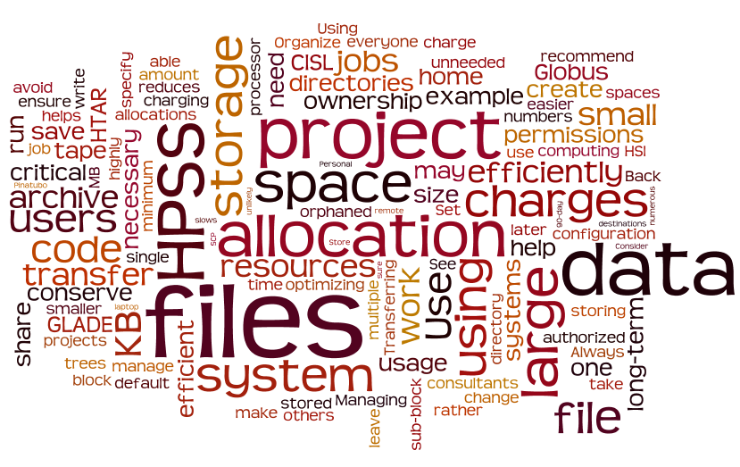

# Best practices for supercomputer users

The practices described below will help you make the most of your
computing and storage allocations.

{width="450"}

## Using shared resources

Be considerate of others in the user community when you work with these
shared computing and storage resources. Here are a few key issues to
keep in mind.

#### Use login nodes only for their intended purposes

You can run short, non-memory-intensive processes on the login nodes.
These include tasks such as text editing or running small serial scripts
or programs. Memory-intensive processes that slow login node performance
for all users are killed automatically and the responsible parties are
notified by email. See
[Appropriate use of login nodes](../compute-systems/derecho/derecho-use-policies.md#appropriate-use-of-login-nodes) for more
information.

#### Use the Derecho and Casper nodes that best meet your needs

The Derecho system and Casper nodes are configured for distinct
purposes. Derecho is best used for running climate and weather models
and simulations while the Casper cluster of nodes is for other
specialized work. Most Casper nodes are used for analyzing and
visualizing data while others feature large-memory, dense GPU
configurations that support explorations in machine learning and deep
learning.

This documentation explains how to get jobs running on the most
appropriate system for your work and on the individual types of nodes
that will best meet your needs:

-  [Derecho Overview](../compute-systems/derecho/index.md)
-  [Casper Overview](../compute-systems/casper/index.md)
-  [Submitting jobs with PBS](../pbs/index.md)
    -  [Sample Derecho PBS job scripts](../pbs/job-scripts/derecho-job-script-examples.md)
    -  [Sample Casper PBS job scripts](../pbs/job-scripts/casper-job-script-examples.md)

For expert assistance or guidance in using these resources, contact
the [NSF NCAR Research Computing help desk](https://rchelp.ucar.edu/).

#### Don't monopolize compute resources

Consider what impact you might have on the work of others and schedule
jobs accordingly. For example, avoid writing job submission scripts that
rapidly fill the scheduler with potentially concurrent compute resource
requests. Contact the Consulting Services Group for guidance if your
workload requires you to submit numerous jobs in a short time frame.
CISL monitors the use of these resources and will kill jobs when
necessary to ensure fair access for all users.

#### Limit your use of shared licenses

Users share a limited number of licenses for running IDL, MATLAB,
Mathematica, and some other applications. Be familiar with and follow
the established
[license-use guidelines](../environment-and-software/data-analysis-and-visualization.md) to
ensure fair access for all users. CISL reserves the right to kill
jobs/tasks of users who monopolize these licenses.

## Managing allocations

#### Monitor usage charges

Check your usage charges frequently to help ensure that you are using
CISL resources as efficiently as possible. Also make sure that others
who are authorized to charge against your allocation understand how to
use them efficiently. Understand how your choice of queues affects
charges against your computing allocation and be aware of other
allocation-related policies. See
[Managing your allocation](../allocations/index.md).

If you are authorized to charge your work against multiple projects,
check your usage charges and storage holdings for each project on a
regular basis. This will help ensure that you are charging jobs
correctly and help you avoid overspending your allocations.

#### Optimize on a single processor

Minimize your use of computing resources and conserve your allocation by
optimizing your code on a single processor before running larger jobs in
production. Use optimizing libraries if your code lends itself to that.

#### Remove unneeded data

Periodically examine your GLADE and NSF NCAR Campaign Storage holdings and
remove unwanted, unneeded files. This reduces charges against your
storage allocation and makes these systems more efficient for everyone.

#### Contact CISL consultants

Before you run a set of jobs that will consume a large portion of your
allocation – a long experiment, for example – contact the
[NSF NCAR Research Computing help desk](https://rchelp.ucar.edu/) to request a review of
your job configuration. One of the consultants may be able to suggest an
economical workflow that will help you conserve computing resources.
This is especially important if you are unfamiliar with job
configuration or with how to manage your allocation efficiently.

## Writing job scripts

#### Avoid hardcoding in your job scripts

Use relative paths and environment variables instead of hardcoding
directory names in your job scripts. Hardcoding in scripts and elsewhere
can make debugging your code more difficult and also complicate
situations in which others need to copy your directories to build and
run your code as themselves.

Here’s one simple example of what not to do in your script:
```bash
cd /glade/derecho/scratch/joe/code/running_directory
```

Instead, replace your hardcoded username with `$USER`:
```bash
cd /glade/derecho/scratch/$USER/code/running_directory
```

Better yet, assume that you will launch the job from your working
directory so you don’t need to include the path in your script at all.

#### Use comments in job scripts

When setting a variable in your job scripts or startup files, include
the date and a brief description of the variable's purpose. This
practice may help prevent propagation of variables that are possibly
inappropriate in carrying jobs and environments forward. One example is
noting the use of a variable that is not set or appropriate in most
other scripts.

```bash
# yyyy-mm-dd Context: Cheyenne MPT peak_memusage job.
# Variable MPI_SHEPHERD is set in this job in order to
# enable peak_memusage. Do not propagate it to other MPT
# jobs as it may cause significant slowdown or timeout.

export MPI_SHEPHERD="true"
```

#### Prepare for debugging and troubleshooting

Arrange the script, source code, and data used in your job in a few
directories to make it easy for others to copy and debug if necessary.
Also: Include a README file that details the environment needed to
configure, build and run, and that identifies the required modules and
environment variables. Ask a colleague or CISL Consulting Services Group
consultant to copy and run the code themselves.

## Managing files

#### Set permissions when you create files

Set [permissions](../storage-systems/glade/setting-file-directory-permissions.md) when
you create a file. While you can change file ownership and permissions
after the fact, establishing them when you create the file will simplify
your life and save you time and effort later.

#### Configure jobs to avoid massive directories

Ensemble runs, data assimilation runs, and other jobs generate tens or
hundreds of thousands of output files, log files, and others over time.
Such large numbers of files can be difficult to manage and remove from
GLADE file spaces when they are no longer needed. Configuring jobs to
place no more than 2,000 to 3,000 files in a single directory will make
them easier to manage.

See [Removing large numbers of files](../storage-systems/glade/removing-large-number-of-files.md) for how
to remove massive accumulations of files.

#### Use scratch space for temporary files

The [GLADE scratch](../storage-systems/glade/index.md) file
space is a **temporary** space for data that will be analyzed and
removed within a short amount of time. It is also the recommended space
for **temporary files** that would otherwise reside in small /tmp or
/var/tmp directories that many users share.
See [Storing temporary files with TMPDIR](../pbs/storing-temporary-files.md) for
more information.

#### Use the most appropriate storage system

Review and understand the intended uses of the [GLADE file spaces](../storage-systems/glade/index.md)
and the [NSF NCAR Campaign Storage](../storage-systems/glade/campaign.md) file
system. For example, use your `/glade/work` space to work with data
sets over time periods greater than what is permitted in the scratch
space. Individual NSF NCAR labs and project leads for universities that have
Campaign Storage allocations establish their own workflows and storage
policies.

#### Store large files

Storing large files, such as tar files, is more efficient than storing
numerous small files. In the case of GLADE disk storage, this is because
the system allocates a minimum amount of space for each file, no matter
how small. That amount varies depending on which of several file spaces
holds the file. See [this GLADE documentation](../storage-systems/glade/index.md) for details.

#### Avoid sharing home spaces

If you have an account for using the supercomputers, analysis, and
visualization systems that CISL manages, you have your own `/glade/u/home`
directory. Other users have their own home directories, too, so there is
no need to share by giving others write permission. Sharing often leads
to unnecessary confusion over file ownership as your work progresses.

If you and your colleagues need to write files to a common space,
consider using a work space or project space.

#### Organize for efficiency

Organize your files and keep them that way. Arrange them in same-purpose
trees, for example. Say you have 20 TB of Mount Pinatubo volcanic
aerosols data. Keep the files in a subdirectory such as
`/glade/u/home/$USER/pinatubo` rather than scattered among unrelated
files or in multiple directories. Specialized trees are easier to share
with other users and to transfer to other users or projects as
necessary.

#### Back up critical files

With the exception of users' `/glade/u/home` spaces, the GLADE and NSF NCAR
Campaign Storage file systems are not backed up. You are responsible for
replicating any data that you feel should be stored at an additional
location.

#### Don't abandon files

Don't leave orphaned files behind. Before your involvement in a project
ends, transfer your files or arrange for someone else to take ownership
of them.

## Transferring data

#### Use Globus to transfer files

CISL recommends
using [Globus](../storage-systems/data-transfer/globus/index.md) to
transfer large files or data sets between the GLADE centralized file
service, the [NSF NCAR Campaign Storage](../storage-systems/glade/campaign.md) file
system, and remote destinations such as university facilities. In
addition to web and command line interfaces, Globus offers a feature
called Globus Connect Personal that enables users to move files easily

## Using agentic coding assistants

Agentic coding assistants — tools such as Claude Code, OpenAI Codex,
Gemini CLI, and GitHub Copilot — can read and edit files, run shell
commands, install software, and submit jobs on your behalf. That
autonomy is useful, but on a shared system it can cause problems
quickly: an assistant does not know NSF NCAR policy unless you tell it,
and everything it does runs under your account and against your
allocation. You remain fully responsible for the assistant's actions.
The practices below help you use these tools without disrupting other
users.

#### Schedule heavy commands rather than running them on a login node

Light use of an assistant on a login node is fine — editing files,
inspecting code, small serial scripts, and short builds are all
appropriate, just as they are for any login-node work. The problem is
that assistants readily reach for heavier operations: long compilations,
test suites, data downloads, and analysis or model runs. These are the
memory- and CPU-intensive processes that should run on a batch node, not
a login node (see
[Use login nodes only for their intended purposes](#use-login-nodes-only-for-their-intended-purposes)
above).

Instruct the assistant to schedule heavy commands instead of running
them directly. The NCAR-provided `qcmd` command is well suited to this:
it submits a single command as a batch job and waits for it to finish,
so an assistant can use it as a drop-in wrapper for an expensive step.

```bash
# Run a heavy build on a batch node instead of the login node
qcmd -A <PROJECT> -- make -j 4
```

By default `qcmd` requests one node on the `develop` queue and waits for
completion; supply your project code with `-A` or the `PBS_ACCOUNT`
environment variable. For interactive development on a compute node, the
assistant can instead work inside a `qinteractive` session. See
[Submitting your first job](../pbs/index.md#submitting-your-first-job)
for `qcmd`, `qinteractive`, and `qsub`. The example configuration file
below encodes this rule.

#### Require approval before the assistant runs commands

Most assistants offer an automatic or "auto-accept" mode that runs
commands without asking. Do not use it on shared systems. Keeping a
human in the loop for shell commands lets you catch a runaway `qsub`
loop, a recursive delete, or a job that would consume a large portion of
your allocation before it executes. Review proposed commands — and
especially proposed job scripts — before approving them.

#### Protect shared file spaces and permissions

An assistant creates, edits, moves, and deletes files. Make sure it does
so in the right place and with the right permissions:

-  Confine the assistant to a project directory rather than pointing it
   at your whole `/glade/u/home` space or a space you share with
   colleagues.
-  Have it use [GLADE scratch](../storage-systems/glade/index.md) for
   temporary and intermediate files, and reserve `work` and project
   spaces for durable output, following
   [Use the most appropriate storage system](#use-the-most-appropriate-storage-system)
   above.
-  Set [file and directory permissions](../storage-systems/glade/setting-file-directory-permissions.md)
   when files are created, and watch for an assistant loosening
   permissions (for example, `chmod 777`) to "make something work."
-  Watch for assistants generating tens of thousands of files; the
   [2,000–3,000 files per directory](#configure-jobs-to-avoid-massive-directories)
   guidance applies to agent-generated output too.

#### Don't let the assistant search or traverse from high-level paths

To orient itself, an assistant will often search the file tree —
`find`, `grep -r`, `ripgrep`, `du`, `ls -R`, `tree`, and similar. On
GLADE these commands query shared metadata servers, and a recursive walk
of a large tree creates a metadata "storm" that slows the file system for
everyone. The same command that is trivial on a laptop can be
disruptive here.

Instruct the assistant never to traverse or search at or above shared
roots such as `/glade`, `/glade/u/home`, `/glade/work`, or
`/glade/derecho/scratch`. It should only walk inside a specific
directory you own — for example `/glade/derecho/scratch/$USER/...` — and
always bound the search with a depth limit (`-maxdepth`) and an exact
subpath rather than a broad wildcard. Where a search is unavoidable
inside your own Lustre scratch space, `lfs find` queries Lustre metadata
more efficiently than plain `find`; on the GPFS spaces (`home`, `work`,
`campaign`) use a tightly scoped `find` instead. The example
configuration file below spells these rules out.

#### Mind your allocation

Because an assistant can submit jobs and start processes, it can charge
core-hours and consume storage without your noticing. Review any job
script or `qsub` command it proposes, confirm the queue and resource
request, and check your usage afterward. See
[Managing allocations](#managing-allocations) above. Before letting an
assistant drive a large experiment, contact the
[NSF NCAR Research Computing help desk](https://rchelp.ucar.edu/) as you
would for any large run.

#### Keep credentials and sensitive data out of reach

Assistants read files in their working directory and may transmit that
content to a cloud model. Do not run an assistant in a directory that
contains SSH private keys, API tokens, passwords, or restricted or
embargoed data. Keep secrets in environment variables or a secrets
store rather than in tracked files, and tell the assistant which paths
to ignore.

#### Give the assistant project context with an AGENTS.md file

Most assistants look for a Markdown instructions file in your project
and load it automatically before doing any work. `AGENTS.md` is an open,
cross-tool convention read by Codex, Gemini CLI, GitHub Copilot, Cursor,
and many others; Claude Code reads `CLAUDE.md` (and can also import
`AGENTS.md`). Placing one of these at the root of your project is the
most reliable way to make an assistant follow the practices above — keep
it short and specific.

The example below is a starting point you can copy into a `CLAUDE.md` or
`AGENTS.md` file at the root of your project and adapt to your work. (To
support both tools from a single source, keep the content in `AGENTS.md`
and make `CLAUDE.md` a symlink to it, or have `CLAUDE.md` contain a
single line importing it.)

```markdown
# Working on NSF NCAR HPC shared systems

This assistant runs on **shared login nodes** (Derecho/Casper) and operates on
**GLADE**, a multi-petabyte shared parallel filesystem. Commands that are cheap on a
laptop can degrade the system for every other user here. Follow these rules in
addition to anything I ask.

## Filesystem traversal — never recurse/search from high-level paths

GLADE metadata servers are shared. A recursive walk or search of a large tree (find,
lfs find, du, ls -R, tree, grep -r, ripgrep/rg, wc -l over many files) hammers the
metadata servers and slows the filesystem for every user.

- NEVER run `find`, `lfs find`, `du`, `ls -R`, `tree`, `grep -r`, `rg`, or any
  recursive / globbing traversal or search at or above these levels:
  `/`, `/glade`, `/glade/u`, `/glade/u/home`, `/glade/work`, `/glade/campaign`,
  `/glade/derecho`, `/glade/derecho/scratch`, or any other shared root.
- Only traverse inside a specific user or project subdirectory you own or were pointed
  at — e.g. `/glade/derecho/scratch/$USER/...`, `/glade/work/$USER/...`,
  `/glade/u/home/$USER/...`. Never one level up from there.
- Always bound traversals: add `-maxdepth`, target an exact subpath, and avoid wildcard
  globs that expand to thousands of entries.
- Prefer locating files via a known path or a project index over searching the tree.

## Match the tool to the filesystem type

GLADE is a mix of filesystem technologies, and the right traversal tool differs:

- **Lustre** — `/glade/derecho/scratch` is Lustre. When you must search within your own
  scratch subdirectory, prefer `lfs find` over plain `find`: it queries Lustre metadata
  more efficiently and avoids per-file stat storms on the MDS. Still scope it to
  `/glade/derecho/scratch/$USER/...` and bound the depth.
- **GPFS** — `/glade/u/home`, `/glade/work`, and `/glade/campaign` are GPFS. `lfs`
  commands do not apply here. Use a tightly scoped `find` with `-maxdepth` against an
  exact subpath, never a broad GPFS tree.

## Compute — schedule heavy work, don't run it on a login node

Light use of a login node is fine: editing, inspecting code, small serial scripts,
and short builds. Heavy work should be scheduled on a batch node.

- Do NOT run CPU/GPU/memory-intensive work directly on a login node: long
  compilations, test suites, large data processing/downloads, model inference, or
  model runs.
- Schedule a single heavy command with `qcmd`, which submits it as a batch job and
  waits for completion: `qcmd -A <PROJECT> -- <command>` (e.g.
  `qcmd -A <PROJECT> -- make -j 4`). For multi-step or interactive work, use a
  `qinteractive` session or a `qsub` job script.
- Show me any `qcmd`/`qsub` command or job script and wait for approval before
  submitting — jobs cost core-hours against my allocation (project/account code:
  <PROJECT>).
- Cap build parallelism — never `make -j` unbounded; use a small fixed `-j` (e.g. 2–4).
- Don't load large files wholly into memory (`cat`/reading multi-GB files). Use
  `head`/`tail`/streaming, and read only the byte ranges you need.

## Processes & I/O

- Don't spawn many parallel processes or long-running background jobs. Prefer one
  foreground command at a time; clean up anything you background.
- Avoid tight polling loops (`tail -f`, repeated `ls`/`stat` in a loop).
- Write large or numerous outputs to scratch/work, never to `$HOME` (small, backed-up
  quota). Avoid creating huge numbers of tiny files — it's expensive on a parallel FS
  (keep under ~2,000–3,000 per directory).
- Use relative paths and `$USER`; never hardcode usernames or absolute home paths.

## Files, permissions, and secrets

- Set sensible permissions on new files; never use `chmod 777`. Ask before deleting
  files, changing permissions, or running anything recursive (`rm -rf`, `chmod -R`).
- Never read, print, or copy SSH keys, API tokens, passwords, or any
  restricted/embargoed data. Keep secrets in environment variables, not tracked files.

## Software environment

- Software is provided through Lmod. Use `module load <name>`; do not install system
  packages. Use a conda/virtualenv or `pip install --user` for Python packages.

## Code conventions (fill in for your project)

- <language/framework and versions, e.g. Fortran 2008, NetCDF-Fortran>
- Build command: <e.g. the job script that wraps `make`>
- Test command: <e.g. the qsub script that runs the test suite>
- <Any style rules that differ from defaults>

## When unsure

If a command might touch a large tree or use significant CPU/memory, stop and scope it
down (narrower path, depth limit, batch job) or ask before running it.
```

to and from laptop or desktop computers and other systems.

Secure Copy Protocol ([SCP](../storage-systems/data-transfer/scp-and-sftp.md))
works well for transferring a few relatively small files between most
systems.
