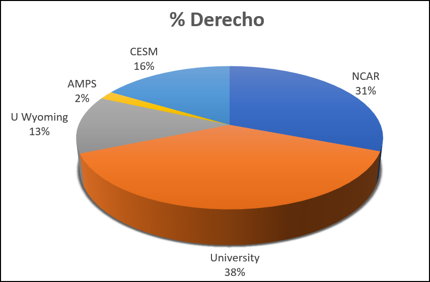

# System use policies

## Appropriate use of login nodes
Users may run short, non-memory-intensive processes interactively on the
Derecho system's login nodes. These include tasks such as text editing
or running small serial scripts or programs.

However, the login nodes **may not** be used to run processes that
consume excessive resources. This is to ensure an appropriate balance
between user convenience and login node performance.

This applies to individual processes that consume excessive amounts of
CPU time, more than a few GB of memory, or excessive I/O resources. It
also applies collectively to multiple concurrent tasks that an
individual user runs.

Processes that use excessive resources on the login nodes are terminated
automatically. Affected users are informed by email that their sessions
were terminated. They are also advised to run such processes in batch or
interactive jobs on the Casper cluster.

## Fair share policy

CISL manages scheduling priorities to ensure fair access to the system
by all of these stakeholder groups: the university community, the NCAR
community, the Community Earth System Model (CESM) community,
the Antarctic Mesoscale Prediction System (AMPS), and the Wyoming
community.

The **fair-share policy** takes the community-wide usage balance into
account along with several additional factors. These include the
submitting users' currently running jobs and recently completed jobs.
The scheduling system uses a dynamic-priority formula to weigh these
factors, calculate each job's priority, and make scheduling decisions.

{width="350"}

## Job scheduling priorities

The PBS Pro workload management system scheduling policy for running
jobs in the Derecho environment requires balancing several factors. Jobs
generally are sorted based on the following:

1.  Job priority (user selectable)

2.  Fair share factor

3.  Eligible time in queue

4.  Job size

Job sorting is adjusted frequently in response to varying demands and
workloads. PBS examines the jobs in sorted order in each scheduling
cycle and starts those that it can. Jobs that cannot be started
immediately are either scheduled to run at a future time or bypassed for
the current cycle. Under typical system usage, multiple scheduling
cycles are initiated every minute.

The scheduler may not start a job for a number of reasons, including:

- The necessary resources are not yet available.

- The system has been reserved for a scheduled outage.

- The job has been placed on hold.

- You have reached your concurrent core-usage limit when using the
  *develop* queue.

A high-priority job might be delayed by one of the limits on the list,
while a lower-priority job from a different user or a job requesting
fewer resources might not be blocked.

If your job is waiting in the queue, you can run the `qstat` command
as shown to obtain information that can indicate why it has not started
running. (Use this command sparingly.)
```pre
qstat -s jobID
```
!!! note
    To prevent jobs from languishing in the queues indefinitely,
    PBS reserves resources for the top-priority jobs and doesn't allow
    lower-priority jobs to start if they would delay the start time of a
    higher-priority job.

### PBS sorting factors

##### Stakeholder shares and fair-share factor

CISL manages scheduling priorities to ensure fair access to the system
by these stakeholder groups: the university community, the NCAR
community, the CESM community, and the Wyoming community.

Each stakeholder group is allocated a certain percentage of the
available processors. A job cannot start if that action would cause the
group to exceed its share, unless another group is using less than its
share and has no jobs waiting. In such a case, the high-use group can
"borrow" processors from the lower-use stakeholder group for a short
time.

When jobs are sorted, jobs from groups that are using less of their
share are picked before jobs from groups using more of their shares.
Shares are evaluated based on usage over the past week with usage the
prior week being decayed by half.

#### Job priority

Users can set job priority to one of three values. Jobs with higher
priority are charged against the user's allocation at higher rates than
others.

| **Job priority** | **Priority order** | **Priority factor** | **Description**                                                |
|------------------|--------------------|---------------------|----------------------------------------------------------------|
| premium          | 1                  | 1.5                 | Jobs are charged at 150% of the regular rate.                  |
| regular          | 2                  | 1                   | All production jobs default to this priority.                  |
| economy          | 3                  | 0.7                 | Production batch jobs are charged at 70% of regular rate.      |
| preempt          | 4                  | 0                   | Automatically selected when job is submitted to preempt queue. |

#### Job size

Jobs asking for more nodes are favored over jobs asking for fewer. The
reasoning is that while it is easier for small jobs to fill gaps in the
schedule, larger jobs need help collecting enough CPUs or GPUs to start.

#### GPU usage

In order to submit jobs that will use GPUs, you must be associated with
a project that has an allocation of GPU hours. If you submit a job with
a project code that does not have an allocation of GPU hours, your job
will be rejected.

#### Backfilling

When a job cannot start immediately, PBS sets aside resources for it
before examining other jobs to see if any of them can run as backfill.
That is, PBS looks at running jobs to determine when they will finish
based on wall-time requested. From those finish times, PBS decides when
enough resources (such as CPUs, memory, and job limits) will become
available to run the top job. PBS then reserves the resources that the
job requests at that identified time.

When PBS looks at other jobs to see if they can start immediately, it
also checks whether starting any of them would collide with one of these
resource reservations. Only if there are no collisions will PBS start
the lower-priority jobs.

#### Preemption

Derecho has a preemption routing queue that can be used to submit jobs
that will run when the required resources are not in use for
higher-priority work in the *main* or *develop* execution queues. In
order to take advantage of preemption, submit your job to the *preempt*
routing queue and it job will run when the necessary resources are
available.

When resources for any *preempt* jobs are needed by higher-priority
work, the scheduler sends a `SIGTERM` signal that can be detected by your
job. After the `SIGTERM` signal is sent to the job, there is a five-minute
window in which the job has a chance to checkpoint or save any work that
was accomplished. After the five-minute window, the job will be killed
by the scheduler and deleted.
