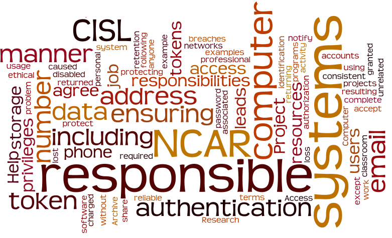

# User responsibilities

{width="500"}

When you are granted access to use NCAR resources, you accept the
responsibilities listed below.

- You will use these computer and information systems in an ethical and
  legal manner.

- You agree not to duplicate or use copyrighted or proprietary software
  without proper authorization.

- You may not use NCAR computer and information systems in any manner
  for any business, professional, or other activity that is unrelated to
  the purpose of your allocation or terms of employment except as
  otherwise stated in [Access to and Use of Information Systems and
  Technology
  Infrastructure](https://sundog.ucar.edu/Interact/Pages/Content/Document.aspx?id=5141)
  (staff login required).

- You are required to acknowledge the use of NCAR resources, including
  the CMIP Analysis Platform and Research Data Archive, in any resulting
  publications, in a manner consistent with the [examples provided here](acknowledging-ncar-and-cisl.md).

- You are responsible for protecting your personal identification
  number, authentication token, and/or passwords.

- You may not share your account privileges with anyone or knowingly
  permit any unauthorized access to a computer, computer privileges,
  systems, networks, or programs. The accounts of those involved will be
  disabled if sharing is detected.

- While NCAR storage systems are highly reliable, you are responsible
  for backing up critical data to protect it against loss or corruption.
  You also are responsible for understanding the usage and data
  retention policies for the file system and data archive resources
  used.

- You agree to report potential security breaches as soon as possible by
  calling the Research Computing Help Desk at 303-497-2400.

- You are responsible for ensuring that NCAR has your current contact
  information, including your phone number, email address, and mailing
  address. If your name, phone number, email address, or other
  information changes, notify CISL
  through [support.ucar.edu](https://support.ucar.edu/). If CISL
  personnel can’t reach you when they need to – about a problem caused
  by a job you are running, for example – the job may be killed and you
  will be locked out of the system.

- Project leads (including instructors associated with classroom
  allocations) are responsible for ensuring that users on their projects
  are aware of these responsibilities and for ensuring that
  authentication tokens are returned when users complete their work or
  students finish their classes. Project leads are responsible for any
  token replacement fees.

Please contact the [NCAR Research Computing help
desk](https://rchelp.ucar.edu/) if you have questions.
