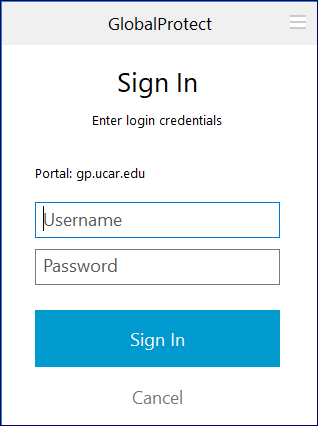
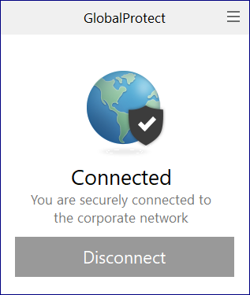

# VPN access

NCAR and UCAR employees who are working remotely, and some other
individuals who work closely with NCAR, may need to use the virtual
private network (VPN) to connect with internal resources.

If you need VPN access, see your lab's system administrator about
downloading the necessary client software.

**When you have the client software and the required authentication
token or app, you can connect to the VPN as described below.**

## Connecting with GlobalProtect

Start by clicking the **GlobalProtect** icon on your desktop or taskbar.

Enter your username. (Remove `CIT\` if it appears in the password
field. Enter only your username.)

Follow the documented procedures for using your [authentication token or app](./accounts/duo/index.md) (for example, CIT
password and Duo push). Use `gp.ucar.edu` as the portal name if it
doesn't appear already.

A box like the one below will confirm that you are connected to the VPN.

Click **Disconnect** when you are finished.
