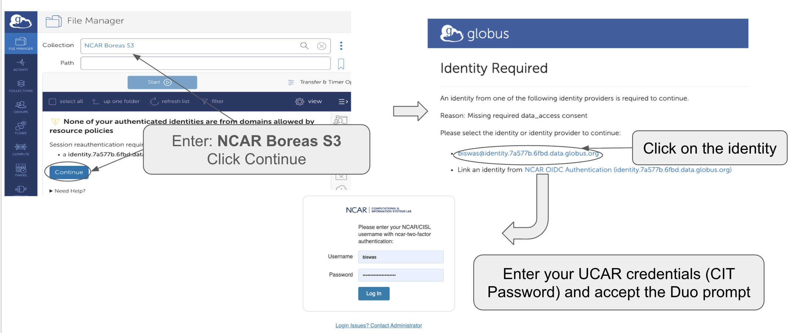

# Boreas object storage system

Boreas is an object storage service that provides S3-compatible access 
backed by an IBM Storage Scale (GPFS) filesystem. It is designed to
support high-throughput data access for users and integrates 
tightly with existing HPC infrastructure.

Boreas, the CISL object storage disk system described here, is for
long-term data storage. Boreas is not available for university projects.

## System overview

### Architecture

Boreas uses IBM Cluster Export Services (CES) to provide S3 access to data 
stored on an IBM Storage Scale (GPFS) filesystem, with NooBaa providing the S3 service layer.

### Core Components

Cluster Export Services (CES)
 - CES provides the S3 protocol interface and connects directly to the underlying GPFS storage system.

NooBaa S3 Services
 - NooBaa services run on the CES nodes and process all S3 API requests.

Clients and Applications
 - Users and applications access Boreas using standard S3 APIs. Client requests are distributed across CES nodes using DNS round-robin.
 
## Data sharing
Boreas supports multiple access models for sharing S3 data, depending on security requirements and collaboration needs.

Anonymous Object Access (Signed URLs)

 - Signed URLs allow users to grant temporary access to individual objects without requiring authentication.
 - Users may upload or download objects using a time-limited signed URL.
 - Access can be restricted by specifying an expiration date and time when the URL is created.
 - No S3 account or Access/Secret key credentials are required to use a signed URL.
 - Access is restricted to the UCAR VPN, with approved exceptions.

This method is appropriate for short-term sharing of individual files with external collaborators or automated workflows.

Identity-Based Bucket Policies

 - Identity-based policies allow controlled sharing of buckets with authenticated users.
 - Users may grant read and/or write access to specific S3 users or to all authenticated users.
 - All users accessing the bucket must have a valid S3 account.
 - Access and Secret key credentials are required to authenticate and access shared data.
 - Access is restricted to the UCAR VPN, with approved exceptions.

This model is recommended for collaborative projects where persistent authenticated access is required.

Resource-Based Bucket Policies (Anonymous Bucket Access)

 - Resource-based policies allow anonymous access to entire buckets when approved.
 - Users may request that anonymous access be enabled for a bucket.
 - No S3 account is required to access an anonymous bucket.
 - Access and Secret key credentials are not required for read and list operations on anonymous buckets.
 - Access is restricted to the UCAR VPN, with approved exceptions.

This option is intended for controlled public distribution or broad internal sharing of datasets.

## Choosing an Access Model 

### Anonymous Object Access (Signed URLs)

Use this option when:

 - You need to share individual files temporarily with collaborators who do not have S3 accounts.
 - Access should automatically expire after a defined time window.
 - The data should not remain publicly accessible long term.
 - You want minimal setup and no account provisioning.

Typical use cases:

 - Sharing a single dataset or result file with an external collaborator.
 - Automated workflows that require short-lived download or upload access.
 - One-time data delivery.

Not recommended for:

 - Long-term sharing.
 - Large collections of files.
 - Ongoing collaborative workflows.

### Identity-Based Bucket Policies

Use this option when:

 - Multiple users need persistent read and/or write access to the same bucket.
 - Users already have (or can request) S3 accounts and credentials.
 - Access needs to be auditable and managed per user or group.

Typical use cases:

 - Research teams sharing active project data.
 - Collaborative model output generation and analysis.
 - Controlled internal data distribution.

Not recommended for:

 - External users without S3 accounts.
 - Public or anonymous access requirements.

## Additional information to access Boreas

- Data and metadata can be accessed either via a library (such as
  Python's `boto3`) or a web browser (e.g. Globus)
- Accounts are identified by a key pair: access key and secret key, as
  in these examples:
    - **Access key:** `AK0IYXKCCIA63BMNCOUN`
    - **Secret key:** `Joeke2uHHebQdKJBgTVUzp+j7uRDthPdIBl5YaLE`
- Accounts are associated with email, and each email address can have
  only a single account with a single role. A person who needs two roles
  must use two separate emails.
- Two roles exist:
    - **Admin** – An admin can create buckets and users, set up read/write
      access control for users, and do everything a user can do; owns data
      created by users.
    - **Users** – Users may access buckets and read or write data inside
      buckets if the admin granted access. Users **cannot** create
      buckets.

## Logging into Globus

{width="350"}

## Policies

- The system is not backed up.
- Support will be provided during business hours on business days.
- CISL will create only one admin account per lab. The admin will be
  able to create accounts for other users. Because the secret key-based
  logins do not expire, the admin will also delete accounts as
  appropriate – for example, when a user leaves NSF NCAR.

## Requesting account

Contact CISL to request an account. You will be asked to:
- Specify how much disk space you need.
- Give a brief description (one sentence) of your intended use case.
- Acknowledge that you will be the admin and will manage buckets and
  users.

## Documentation and additional information

- Additional documentation is attached below.
- The system is accessible only via the NSF NCAR VPN.
- The access and secret credentials will be sent via email.
