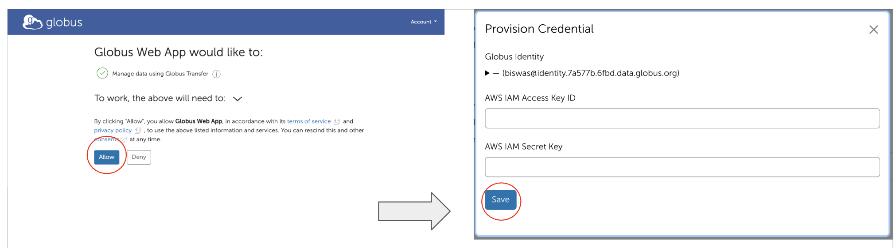

# Boreas object storage system

!!!info "About this page" This document describes the Boreas S3-compatible object storage platform, including its underlying architecture, performance capabilities, networking, and access control models. It explains supported access methods using S3 APIs and Globus, as well as operational policies and account provisioning. Boreas is operated by CISL and restricted to approved use cases.

## System overview

Boreas is an S3-compatible object storage service backed by IBM Storage Scale (GPFS). It provides scalable, high-throughput access to long-term data and integrates with NCAR’s HPC environment. Boreas is operated by CISL and is not available for university projects.

### Architecture

Boreas uses IBM Cluster Export Services (CES) to provide a Storage Scale (GPFS) filesystem through an S3-compatible interface. NooBaa provides the S3 service layer and handles API request processing.

### Core Components

Cluster Export Services (CES)
 - CES provides the S3 protocol interface and connects directly to the underlying GPFS storage system.

NooBaa S3 Services
 - NooBaa services run on the CES nodes and process all S3 API requests.

Clients and Applications
 - Users and applications access Boreas using standard S3 APIs. Client requests are distributed across CES nodes using DNS round-robin.
 
### Performance and capacity

 - Single-client throughput: ~1–4 GB/s, depending on workload.

 - Total usable capacity: ~6.9 PB.

 - Maximum objects per bucket: Up to 100 million.

 - Request distribution: DNS round-robin across CES nodes.

 - Hardware platform: Uses the same as Campaign Storage.

### Network Connectivity

 - Protocol (CES) nodes are connected to other HPC resources via 100 Gb/s networking over Bifrost, enabling high-throughput data transfers between compute systems and storage.

## Data Sharing and Access Controls
Boreas supports multiple access models based on security and collaboration requirements. All access is restricted to the UCAR VPN unless explicitly approved.

Anonymous Object Access (Signed URLs)

 - Allow users to grant temporary access to individual objects without requiring authentication.
 - URLs may include an expiration time.
 - No S3 account or Access/Secret key credentials are required.
 - Intended for short-term or ad hoc sharing.

Identity-Based Bucket Policies

 - Identity-based policies allow controlled sharing of buckets with authenticated users.
 - Requires S3 accounts and Access/Secret key credentials.
 - Users may grant read and/or write access to specific S3 users or to all authenticated users.
 - Recommended for collaborative project workflows.

Resource-Based Bucket Policies (Anonymous Bucket Access)

 - Resource-based policies allow anonymous access to entire buckets when approved.
 - Users may request that anonymous access be enabled for a bucket.
 - No S3 account is required to access an anonymous bucket.
 - Intended for controlled public distribution or broad internal sharing of datasets.

## Choosing an Access Model 

| Access Model | Authentication Required | Scope of Access | Typical Use | Not Recommended For |
|--------------|---------------------------|------------------|--------------|----------------------|
| Signed URLs (Anonymous Object Access) | No | Individual objects only | Temporary sharing of single files with external collaborators or automated workflows | Long-term sharing, large datasets, ongoing collaboration |
| Identity-Based Bucket Policies | Yes (S3 account + access/secret keys) | Bucket-level read/write access | Team-based collaboration with persistent authenticated access | External users without S3 accounts, public distribution |
| Resource-Based Bucket Policies (Anonymous Bucket Access) | No | Entire bucket (read/list) | Controlled public or broad internal dataset distribution | Sensitive data, write access, fine-grained access control |

## Access Methods

 - Programmatic access using standard S3 libraries and tools.
 - Web-based access and transfers via the “NCAR Boreas S3” Globus collection.

## Logging into Globus

Boreas is available through the Globus collection “NCAR Boreas S3.”
Users authenticate using their S3 credentials and NCAR identity.
For users logging into Boreas using Globus, you need to follow the prompts to enter the Secret and Access Keys and authenticate with your CIT username and password. Below are the screenshots and steps to log into Boreas on Globus. 

Refer to the NSF NCAR [Globus documentation](https://ncar-hpc-docs.readthedocs.io/en/latest/storage-systems/data-transfer/globus/) for data transfer instructions.

## Policies

- The system is not backed up.
- Support will be provided during business hours on business days.
- CISL will create only one admin account per lab. The admin will be
  able to create accounts for other users. Because the secret key-based
  logins do not expire, the admin will also delete accounts as
  appropriate – for example, when a user leaves NSF NCAR.

## Requesting account

Contact CISL to request an account. You will be asked to:
- Specify how much disk space you need.
- Give a brief description (one sentence) of your intended use case.
- Acknowledge that you will be the admin and will manage buckets and
  users.
