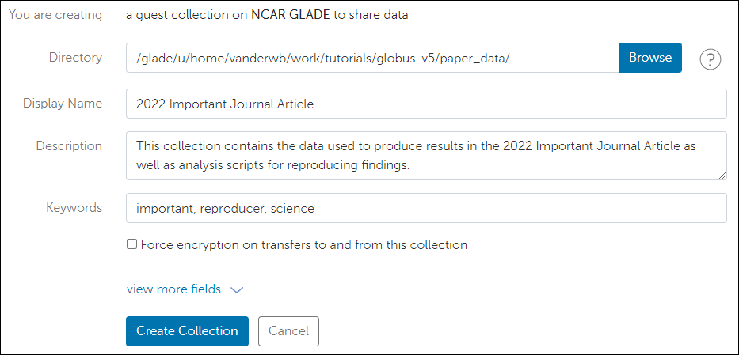
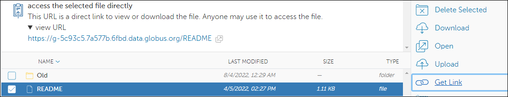

# Sharing data and making unattended transfers with Globus

Some users need unauthenticated access of data from NCAR storage systems
to share that data or to accommodate their workflows. Common use cases
include:

- Easily share specified subsets of their data with external colleagues.
- Access their own data without authentication in order to make
  unattended transfers.

*Guest collections* enable unauthenticated data access by pointing to a
specified subset of data stored in a mapped collection like *NCAR
GLADE*. They can be created by anyone with authenticated access to NCAR
storage systems.

Once a guest collection is created, it can be used in place of a mapped
collection as a transfer endpoint in the web interface, Globus CLI, or
Globus Python API. Users can also bypass the Globus transfer interface
entirely by creating a URL to an individual file contained within a
guest collection. The URL will give specified individuals download
access to the data from a browser or terminal utility like `wget` or `curl`.

!!! note "New Collections must be created through Globus web interface"
    While the Globus CLI supports the use of guest collections as transfer
    endpoints ([see this note](https://docs.globus.org/cli/collections_vs_endpoints/#globus_cli_handling_of_endpoint_vs_collection_confusion)
    for more on endpoint vs collection nomenclature), it does not provide
    commands to create new guest collections or file URLs. Those actions
    must be done in the web interface.

!!! danger "Do not allow file deletion!"
    Be sure to review and follow the recommendations below to avoid
    inadvertently sharing your data with unknown users or allowing
    unauthorized deletions of your data. Guest collections make data sharing
    easy, but they also bypass the traditional data safeguards (two-factor
    authentication) that users and administrators rely on to protect data.

## Creating a guest collection

To create a guest collection using the Globus web interface, log in and
navigate to a mapped collections like *NCAR GLADE*. Then:

1.  Use the **File Manager** to navigate to the directory you want to
    designate as your guest collection.

2.  Select the directory and click the **Share** button in the toolbar.

3.  From the next screen, click **Add a Guest Collection**. This option
    will take you to the following page (sometimes after a one-time
    consent page), which allows you to name and customize your
    collection's metadata.

Once your collection is created, it will be assigned an ID you can use
for both web and CLI transfers. You can modify collection properties by
selecting **Collections** on the left toolbar, then following these
steps:

1.  Select **Administered by you** to see your collections, including
    your newly created guest collection.

2.  Select your guest collection, then the **Permissions** tab.

3.  Finally, click **Add Permissions - Share With**. At this point, you
    can add read permissions for other users, groups, all Globus users,
    or any individual to access data contained within your collection.

You can also now add read-write permission for yourself to enable
unattended workflows via this guest collection (using the Globus CLI or
Python API).

## Providing URL access to files

Globus allows you to create a sharable URL (web link) to any file in
your guest collection or a mapped collection. This means that you can
share files from supported file systems without the other user needing
to interact at all with Globus itself. The individual can simply use a
browser and your URL to download the files.

The web links will be subject to the permissions model of the collection
being used. If you create a link using a mapped collection like *NCAR
GLADE*, the recipients will need to be able to authenticate to the
collection as well. If you obtain a link using a guest collection that
permits the recipient read-access, they will be able to open the link
regardless of their ability to access the rest of the original mapped
collection.

To create a URL:

1.  Navigate to the desired file in the web interface's File Manager.

2.  Click on the file, then select **Get Link** from the toolbar.

## Recommendations for creating guest collections

The features described above make data sharing easy, but they also
bypass the traditional data safeguards (two-factor authentication) that
users and administrators rely on to protect data. Using guest
collections, it is quite possible to grant access to data
unintentionally or even allow unknown users to delete your data. To
avoid these situations, consider the following recommendations:

1.  **Properly scope your collections.** It may be tempting to set a
    collection to a top-level directory (e.g., `/glade/derecho/scratch/${USER}`),
    but this will grant access to **all** of your data on scratch.
    Instead, create collections with a narrow scope and move or copy
    files around to selectively grant access to data.

2.  **Avoid write permissions.** Generally speaking, Globus is most
    useful as a tool to access/read data. Write permissions within
    Globus are only useful for data collection curation, so avoid
    granting it on your data. It may be useful to grant write
    permissions on a directory to allow collaborators to "push" data to
    you, but remember that the space will still be subject to storage
    quotas and your collaborators will not have visibility into those
    limits!

It is also wise to avoid changes to guest collection metadata –
especially the collection name – once it has been shared with others.
The text name is useful in both the web and command-line interfaces for
collection discoverability, so changing it and other metadata may break
workflows or result in a loss of reproducibility (e.g., when providing
data for publication requirements).

## How to use your guest collections

Users of your guest collections will access data in one of the following
two ways, depending on how you have configured your collections.

### Accessible to Globus users or groups

If you have set up your collection to provide access to individual users
or groups, or all Globus users, they will be able to find and open your
collection using the Globus website, CLI, or Python API.

If they do not already have a Globus account, they will need to create
one to log into the Globus service itself. NCAR/UCAR staff should use
their Google login credentials. Universities may have their own guidance
about which type of account to use.

Once a user is logged in, no further authentication will be required to
see data that you have made accessible in your collection.
Alternatively, you can create web URLs to specific files that will allow
permitted users to access the files either in the Globus web interface
or via direct download, depending on how you have configured the URL.

### Accessible to anyone

If you have configured your collection to be accessible to public
(anonymous) users, you can create direct-download URLs as described
above, but those users will not need to have a Globus account to open
them.

This method is the easiest for end users but has some limitations. For
example, instead of having a file browser view with metadata, users will
simply download the file as if it were hosted on a web server.
