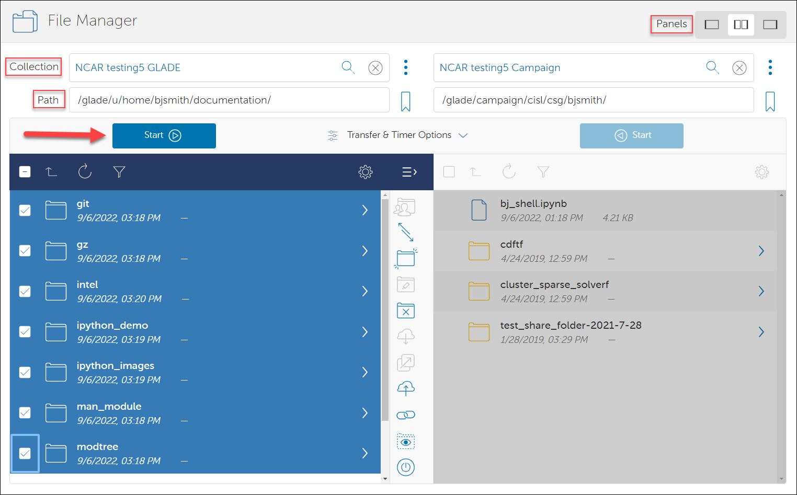

# Globus file transfers

Globus is the most efficient way to transfer files – large files, in
particular – between NSF NCAR file systems such as Campaign Storage, GLADE,
and non-NSF NCAR resources and storage systems. NSF NCAR and UCAR researchers
can also use the *Globus for Google Drive* connector service to transfer
files to the *NSF NCAR Google Drive* collection on Globus for sharing and
storage purposes as described below.

Globus has both a [web interface](https://www.globus.org/) and a command
line interface (CLI), which are described below. To use either
interface, the first step is to create a free **personal account** and
log in using a [Globus ID](https://www.globusid.org/) or a Google
account. (UCAR and NSF NCAR staff: **Do not** use the NSF NCAR RDA
*organizational login*.)

{ width="450" }

Several *mapped collections*, which provide access to different file
system locations on a public endpoint, are set up on the Globus system
for transferring files to and from NSF NCAR storage systems. These include:

- **NSF NCAR GLADE**

- **NSF NCAR Campaign Storage**

- **NSF NCAR Data Sharing Service**

Users can also create their own *guest collections* [as described here](Sharing+data+and+making+unattended+transfers.md)
in order to facilitate data sharing with colleagues and to accommodate
unattended workflows.

Globus also offers a feature called [Globus Connect
Personal](https://www.globus.org/globus-connect-personal) for moving
files to and from a laptop or desktop computer and other endpoints.

#### Cautions
!!! warning "Globus Usage Cautions"
    - The Globus interface for transferring data does not handle symbolic
      links and does not create symbolic links on a destination endpoint.
    - It is possible to corrupt data when performing a transfer if you
      accidentally specify the same files as both source and destination. To
      avoid inadvertently deleting data when using the web interface,
      activate the `sync` option in the *Transfer & Sync Options* menu.
      Sync can be set to allow a file transfer only if the file does not
      exist on the destination, if there’s a difference in checksum or file
      size, or if the source copy is newer than the destination copy.
    - Transferred files assume the user's `umask` permissions on the
      destination system regardless of permissions on the source system.

## Transferring files with the web interface

When transferring files between systems, keep in mind that your username
might not be the same on each system.

Follow these steps to transfer files. See the image below for reference.

1.  Go to the main Globus page ([globus.org](https://www.globus.org/))
    and log in using your personal **Globus ID**.

2.  Go to **File Manager**.

3.  Use the **Panels** button to display two endpoint panels side by
    side.

4.  Enter the name of your source endpoint in the **Collection** field
    on one panel.

5.  Specify the path where your source files are located.

6.  Enter your username
    and [authenticate](../../../getting-started/accounts/duo/index.md#logging-in-with-duo) as
    you do when logging in to NSF NCAR systems. You will not need to
    authenticate to access the collection for the next 30 days.

7.  Identify your target endpoint in the other panel.

8.  Specify a destination path.

9.  Select the files you want to copy.

10. Click the **Start** button to initiate the transfer.

You can check the status of your transfers any time through the web
interface and will be notified when they are complete.



## Using mapped collections for CLI transfers

The Globus CLI application, an installable Python package, can be used
to make both manual and [unattended file transfers](Sharing+data+and+making+unattended+transfers.md).

The application is:

- available within the NSF NCAR Python Library conda environment.

- can be added to a personal conda environment using **conda install
  globus-cli**.

To begin, log in Casper or Derecho as shown in this example, replacing
*username* with your username on NCAR systems.

```pre
ssh username@casper.hpc.ucar.edu
```

After logging in, load the conda module and activate the `npl` environment
(or a personal environment with globus installed)
```pre
casper-login1:~> module load conda/latest
casper-login1:~> conda activate npl
```

Next, run **globus login** and follow the on-screen instructions.

```pre
globus login
```

Output example (if you are not already logged in):
```pre
Please authenticate with Globus here:

------------------------------------

URL to copy and paste into your browser.

------------------------------------

Enter the resulting Authorization Code here:
```

Copy the lengthy URL and paste it into your browser. It will ask you to
choose an identity – as above, use either a Globus ID or Google account
– and then it will take you to a consent form that looks like this:

{ width="400" }

Click **Allow** to give the CLI app the necessary access and you will
receive an authorization code.

After entering the code at the terminal prompt, you will be logged in to
the Globus CLI and in your `/glade/u/home` directory. You can use this
authentication credential for 30 days before you will need to reactivate
a *mapped* collection. Workflows that need longer collection access – to
facilitate unattended file transfers, for example – can instead use
[guest collections](Sharing+data+and+making+unattended+transfers.md).

Using the CLI, it is possible to query your current mapped collection
activation and also force Globus to reactivate it (thus extending your
activation lifetime):
```pre
gc_glade=$(globus endpoint search "ncar@globusid.org NCAR GLADE" --jq "DATA[0].id" --format UNIX)

globus endpoint activate $gc_glade
Endpoint is already activated. Activation expires at 2022-11-22 20:47:46+00:00

globus endpoint activate --force $gc_glade
Autoactivation succeeded with message: Endpoint activated successfully using Globus Online credentials.
```

#### **Executing CLI transfers**

For details regarding how to make batch transfers and single-item
transfers, manage endpoints, and more, see these resources:

- [CLI Examples](https://docs.globus.org/cli/examples/)

- [CLI QuickStart Guide](https://docs.globus.org/cli/quickstart)

- [Globus CLI Reference](https://docs.globus.org/cli/reference/)

## Globus for Google Drive
!!! info
    CISL has enabled the *Globus for Google Drive
    connector service to facilitate file transfers to NSF NCAR's Google Drive by
    NCAR and UCAR staff. University users and others who are interested in
    using the connector service are advised to consult with their own
    institutional IT experts.

NSF NCAR and UCAR researchers can use the *Globus for Google
Drive* connector service to transfer files to the *NSF NCAR Google
Drive* collection on Globus for sharing and storage purposes by
following the instructions below.

The Globus Google Drive connector *is not designed to transfer Google
apps products* – such as Google Docs, Sheets, or Slides – between Google
accounts or beyond Google Drive. While such files might appear to be
visible in your Google Drive as *.gsheet* or *.gdoc* files, those are
just pointers and downloading them will not download the data stored in
the files.

It also is *not intended* for backing up your scratch space or other
GLADE files. It is intended for sharing smaller files such as plots. If
you need to transfer many small files, compress or archive them into a
smaller number of files.

To make a transfer, follow these steps after logging in to your personal
Globus account:

1.  Go to **File Manager** and search for the collection named *NSF NCAR
    Google Drive*.

2.  Select the drive and authenticate as required. You will be directed
    to the NSF NCAR/UCAR authentication page to give Globus access to the
    Google Drive by using Duo and your CIT credentials. (You are only
    required to do this once.)

3.  Select your target collection (endpoint) in the other File Manager
    panel.

4.  Execute the transfer.

Your Google Drive endpoint will originate in your */My Drive/* path by
default. To access other Google Drive folders such as *Shared with
me* or *Starred*, simply navigate up one level.

!!! warning
    Avoid giving the same name to multiple files when using Globus
    integration. While Google Drive can support multiple files with the same
    name, they cannot be mapped into a POSIX file system.

### Storage limits and limitations

Keep these storage and file size limitations in mind when using Globus
to transfer data to the NSF NCAR Google Drive:
- [Google imposes a *<u>maximum file size limit</u>* of 5 TB](https://support.google.com/a/answer/172541?hl=en).
- The *daily upload limit* is 750 GB per user. However, Google allows uploading of a single file larger than 750 GB.
- Each user is limited to having a maximum of 5 million files and
  folders within their Google Drive, which includes all Google products
  such as Google Docs.

### Example use case

The Globus Google Drive connector can streamline data sharing and
collaboration *with team members who don't have access to Globus*.

For example, a meteorologist who performs daily operational simulations
on an NSF NCAR system as part of a multi-organizational field campaign and
generates plots for flight planning can share them with the operational
team and collaborators via a shared drive.

Instead of manually transferring the plots to a personal device and then
uploading them to the shared drive, the meteorologist can leverage the
connector to automate the workflow and move the plots directly from
GLADE to Google Drive.

## Globus Connect Personal

To set up your laptop or desktop computer to use Globus Connect
Personal:

- Go to [Globus Connect
  Personal](https://www.globus.org/globus-connect-personal) and follow
  the instructions to download and install it on your local system.

- Add your local system as an endpoint by following the instructions on
  the Globus Connect website.

- Start Globus Connect, and then sign in
  to [globus.org](https://www.globus.org/).

Your local system should now appear as an endpoint that can be used for
transferring files.

## Using Globus to sharing data and making unattended transfers

Some users need unauthenticated access of data from NSF NCAR storage systems to share that data or to accommodate their workflows.  *Guest collections* enable unauthenticated data access by pointing to a
specified subset of data stored in a mapped collection like *NSF NCAR
GLADE*. They can be created by anyone with authenticated access to NSF NCAR
storage systems.

[Usage of Globus Guest Collection for data sharing is described here](Sharing+data+and+making+unattended+transfers.md).
