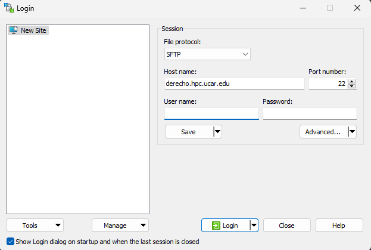
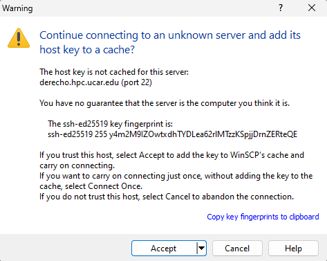
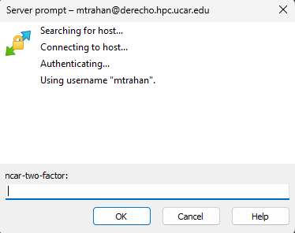
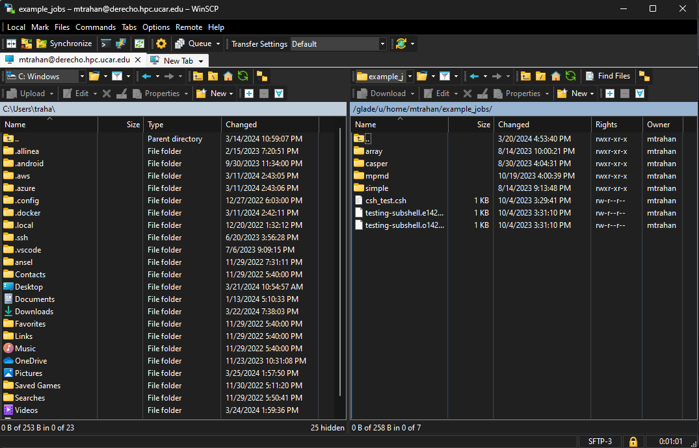

# SSH-based data transfer tools

## SCP and SFTP

Secure Copy Protocol (SCP) and Secure FTP (SFTP) are two utilities for
transferring files between remote systems and the NSF NCAR systems that CISL
manages.

They are best suited for transferring small numbers of small files (for
example, fewer than 1,000 files totaling less than 200 MB). For
larger-scale transfers, we recommend using [Globus](./globus/index.md)

You can make SCP and SFTP transfers between the GLADE storage system and
a remote machine if the remote machine accepts incoming SSH sessions. If
it doesn't, the transfer will hang or you will receive a message such as
"connection refused," depending on the system's firewall settings.

### From an NCAR system

To make SCP and SFTP transfers from your GLADE file space to a remote
system, log in to a Derecho or Casper login node and execute the
commands shown below.

Use SCP if you need to transfer a single file or if you want to transfer
multiple files with a single command by using a wildcard or recursive
option.

#### SCP transfer

To transfer multiple files with similar names or extensions, follow this
example, in which `supersystem.univ.edu` is a fictitious remote
system.
```pre
scp /glade/u/home/pparker/mydata/*.dat
pparker@supersystem.univ.edu:/home/pparker
```

#### SFTP transfer

If you need to transfer many files from multiple directories to a remote
machine, doing so in an SFTP session is likely to be more efficient for
you than SCP.

Log in to `casper.hpc.ucar.edu` or `derecho.hpc.ucar.edu`, then start your 
transfer session with the `sftp` command followed by your login information
for the remote system.
```pre
sftp pparker@supersystem.univ.edu
```

You will be asked to authenticate at this point.

Then, within the session, you can change between directories as needed
and execute `put` commands to copy files to the remote machine.
Use `lcd` to change local directories, and use `cd` to change
directories on the remote system, as shown in this example.
```pre
sftp> lcd /glade/u/home/pparker/mydata
sftp> put filename1
sftp> lcd /glade/scratch/pparker
sftp> cd /home/mydata
sftp> put filename2
sftp> quit
```

You can also transfer files from batch jobs running on an NCAR machine.

### To an NCAR system

To transfer files from a remote system to your GLADE file space, log in
to the remote system and reverse the procedures shown above. You can use
either the Casper or Derecho login nodes. 

For example:
```pre
scp /remotedir/*.dat pparker@casper.hpc.ucar.edu:/glade/u/home/pparker/mydata
```

You will be asked to authenticate for each individual SCP command that
you execute to transfer files to the NCAR system.

---

## PSCP and PSFTP
!!! note
    PSCP and PSFTP are PuTTY's implementation of SCP and SFTP,
    and may be useful for users on a Windows computer.

PuTTY Secure Copy (PSCP) and PuTTY SFTP (PSFTP) enable you to transfer
files to another system after opening a command window on a Windows
computer. Both applications are available as free downloads.

Usage is very similar to SCP and SFTP as described above.  Expand the example box below
for a full description of PSCP and PSFTP.

??? example "Using PSCP and PSFTP"
    Go to [the download site](https://www.chiark.greenend.org.uk/~sgtatham/putty/latest.html) and
    find the latest release version of
    the `pscp.exe` and `psftp.exe` files.

    Click on each and save them to your hard drive—for example, in
    your `C:\Users\username\Downloads` folder or in `C:\Program Files`.

    To run either program, first open a command window:

    - Enter `cmd.exe` in the search field of your Start menu.

    - Press **Enter**.

    Then follow the applicable instructions below.

    **PSCP transfer**

    To copy a file or files using PSCP, open a command window and change to
    the directory in which you saved `pscp.exe`.
    ```pre
    C:\Users\jbsmith>cd C:\Program Files
    ```

    Then type `pscp`, followed by the path that identifies the files to
    copy and the target directory, as in this example.
    ```pre
    pscp C:\Users\jbsmith\directory\*.txt jbsmith@cheyenne.ucar.edu:/glade/u/home/username
    ```

    Press **Enter**, then follow your usual authentication procedures to
    execute the transfer.
    ```pre
    Token_Response:
    file1.txt               | 0 kB |   0.5 kB/s | ETA: 00:00:00 | 100%
    file1.txt               | 0 kB |   0.5 kB/s | ETA: 00:00:00 | 100%
    file1.txt               | 0 kB |   0.5 kB/s | ETA: 00:00:00 | 100%
    C:\Users\jbsmith\Downloads>
    ```

    When the transfer is complete, type **exit**, then press **Enter** to
    close the command window.

    **PSFTP transfer**

    Open your command window, then change to the directory in which you
    saved `psftp.exe`.
    ```pre
    C:\Users\jbsmith>cd C:\Program Files
    ```

    To start a session, type `psftp` followed by your login for the target
    computer.
    ```pre
    psftp jbsmith@cheyenne.ucar.edu
    ```

    Press **Enter**, then follow your usual authentication procedures to log
    in to the remote machine.
    ```pre
    Token_Response: Remote working directory is /glade/u/home/jbsmith psftp>
    ```

    Within the session that you just started, you can copy a file or files
    from your computer to the remote system by changing between directories
    as needed and executing multiple `put` commands.

    Use `lcd` to change local directories, and `cd` to change
    directories on the remote system, as in this example:
    ```pre
    psftp> lcd ..\documents
    psftp> lcd documents
    New local directory is C:\Users\jbsmith\documents
    psftp> put file1.txt
    local:file1.txt => remote:/glade/u/home/jbsmith/file1.txt
    psftp> cd /glade/scratch/jbsmith
    Remote directory is now /glade/scratch/jbsmith
    psftp> mput file*.txt
    local:file1.txt => remote:/glade/scratch/jbsmith/file1.txt
    local:file2.txt => remote:/glade/scratch/jbsmith/file2.txt
    local:file3.txt => remote:/glade/scratch/jbsmith/file3.txt
    psftp>
    ```

    To end the psftp session, type **exit**, then press **Enter**.

    To close the command window, type **exit** again, then press **Enter**.

    To copy multiple files, you can use a wildcard and
    an `mput` or `mget` command rather than `put` or `get`.

---

## WinSCP

For Windows users, WinSCP offers a choice of GUI interfaces for managing files. It is easy
to download and install
from [winscp.net](https://winscp.net/eng/index.php).

Starting the application will bring you to a login screen like the one
shown here. (Highlights added.)



To start a session, input the **host name** and your **username** for
that system.

Leave the password field blank, and click **Login**.

The first time you log in to a system, you may get a dialog box like
this:



Click **Yes** to continue.

Next, you will be asked for your **Token_Response**. Follow your
regular [authentication procedures]().



If you’re using the “Commander” interface (shown below), WinSCP will
display the contents of your local system on the left side of your
screen and the contents of your remote system home directory on the
right. You can manage files using typical Windows commands and tools.



The alternative “Explorer” interface displays only the remote folder,
and you can transfer files by dragging and dropping from Windows File
Explorer. On the WinSCP menu, go
to **Options/Preferences/Environment/Interface** to use it.

---

## Rsync 

The rsync command is a standard tool for copying and synchronizing files
or directories within a system, or between local and remote systems. It 
can preserve file permissions and timestamps, and can transfer only differences
between files to save bandwidth. It supports SSH connections for secure 
remote transfers.

### Transfer example using rsync

To transfer a directory from a local system to GLADE using rsync, follow
this example. Replace *example_dir* and *username* in the example below
with the name of the directory you want to transfer and your NCAR username.
```pre
rsync -avz --progress example_dir username@casper.hpc.ucar.edu:/glade/work/username
```
This will transfer *example_dir* from your local system to */glade/work/username/example_dir*
on GLADE using a casper login node. The `-a` flag enables archive mode, which preserves
file attributes and structure (recursive copy, symbolic links, permissions, modification
times). The `-v` flags prints more verbose information about what rsync is doing (e.g. 
file names being copied). The `-z` flag compresses files during transfer. The `--progress`
flags gives details on the amount of data transferred and an estimate of time remaining. 

See the rsync man page for more details

---

## Rclone

The rclone command is a feature rich command-line program for managing files on cloud 
storage or other remote storage systems. It supports the SFTP protocol and can be used to
copy data to and from GLADE. Rclone supports transfers using multiple parallel streams
and is more suitable for larger transfers than the simpler SSH based tools detailed above. 
Rclone is available to 
[download and install from rclone.org](https://rclone.org/downloads/)

### Rclone configuration

Before using rclone to transfer files to GLADE some simple configuration is required 
for the host that will handle the transfer (Casper or Derecho). You can use the
`rclone config` command to set up a new host by answering a series of questions.
Alternatively, you can edit the rclone configuration file directly. The typical location
of the rclone configuration file is   
```pre
%USERPROFILE%\.config\rclone\rclone.conf           (Windows)
~/.config/rclone/rclone.conf                       (Linux / Mac)
```
Minimal entries in the rclone configuration file required to enable Casper and Derecho
for use with rclone are shown below. Remember to replace *username* with your NCAR username.
```pre
[derecho]
type = sftp
host = derecho.hpc.ucar.edu
user = username
ask_password = true

[casper]
type = sftp
host = casper.hpc.ucar.edu
user = username
ask_password = true
```

### Transfer example using rclone

Once rclone has been configured you can follow the example below to copy a directory
from a local system to GLADE. Replace *example_dir* and *username* in the example with
the name of the directory you want to transfer and your NCAR username.
```pre
rclone copy example_dir casper:/glade/work/username/example_dir --progress --transfers=4
```
This will initiate a transfer of the *example_dir* directory and all contents, and will 
show progress until the transfer is complete. For better performance, this example uses
four independent transfer streams. Note that each transfer stream uses an independent SFTP
connection, and hence this will require responding to four Duo pushes, although you should
only need to enter your password once.

For more information on using rclone, refer to the [documentation on rclone.org](https://rclone.org)
