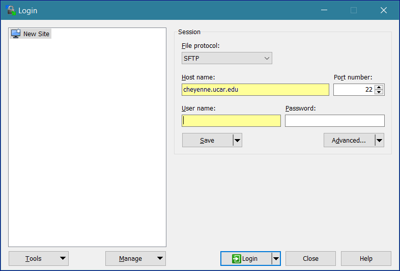
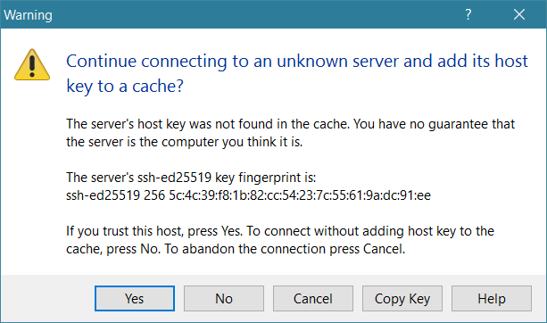
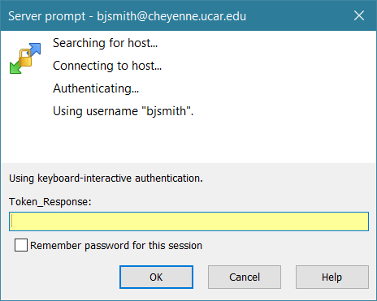
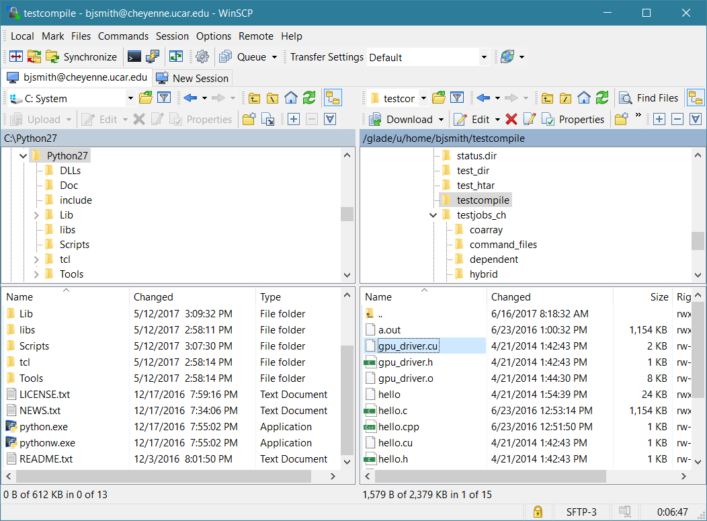

# SSH-based command line tools for file transfer

## SCP and j;LKDJDS;LKFAJSD;LKFJ

Secure Copy Protocol (SCP) and Secure FTP (SFTP) are two utilities for
transferring files between remote systems and the NCAR systems that CISL
manages.

They are best suited for transferring small numbers of small files (for
example, fewer than 1,000 files totaling less than 200 MB). For
larger-scale transfers, we recommend using [Globus](./globus/index.md)

You can make SCP and SFTP transfers between the GLADE storage system and
a remote machine if the remote machine accepts incoming SSH sessions. If
it doesn't, the transfer will hang or you will receive a message such as
"connection refused," depending on the system's firewall settings.

### From an NCAR system

To make SCP and SFTP transfers from your GLADE file space to a remote
system, log in to the [data access nodes](../data-access-nodes.md) at
`data-access.ucar.edu` and execute the
commands shown below.

Use SCP if you need to transfer a single file or if you want to transfer
multiple files with a single command by using a wildcard or recursive
option.

#### SCP transfer

To transfer multiple files with similar names or extensions, follow this
example, in which `supersystem.univ.edu` is a fictitious remote
system.
```pre
scp /glade/u/home/pparker/mydata/*.dat
pparker@supersystem.univ.edu:/home/pparker
```

#### SFTP transfer

If you need to transfer many files from multiple directories to a remote
machine, doing so in an SFTP session is likely to be more efficient for
you than SCP.

Log in to `data-access.ucar.edu`, then start your transfer session
with the `sftp` command followed by your login information for the
remote system.
```pre
sftp pparker@supersystem.univ.edu
```

You will be asked to authenticate at this point.

Then, within the session, you can change between directories as needed
and execute `put` commands to copy files to the remote machine.
Use `lcd` to change local directories, and use `cd` to change
directories on the remote system, as shown in this example.
```pre
sftp> lcd /glade/u/home/pparker/mydata
sftp> put filename1
sftp> lcd /glade/scratch/pparker
sftp> cd /home/mydata
sftp> put filename2
sftp> quit
```

You can also transfer files from batch jobs running on an NCAR machine.

### To an NCAR system

To transfer files from a remote system to your GLADE file space, log in
to the remote system and reverse the procedures shown above.

For example:
```pre
scp /remotedir/*.dat pparker@data-access.ucar.edu:/glade/u/home/pparker/mydata
```

You will be asked to authenticate for each individual SCP command that
you execute to transfer files to the NCAR system.

---

## PSCP and PSFTP
!!! note
    PSCP and PSFTP are PuTTY's implementation of SCP and SFTP,
    and may be useful for users on a Windows computer.

PuTTY Secure Copy (PSCP) and PuTTY SFTP (PSFTP) enable you to transfer
files to another system after opening a command window on a Windows
computer. Both applications are available as free downloads.

Usage is very similar to SCP and SFTP as described above.  Expand the example box below
for a full description of PSCP and PSFTP.

??? example "Using PSCP and PSFTP"
    Go to [the download site](https://www.chiark.greenend.org.uk/~sgtatham/putty/latest.html) and
    find the latest release version of
    the `pscp.exe` and `psftp.exe` files.

    Click on each and save them to your hard drive—for example, in
    your `C:\Users\username\Downloads` folder or in `C:\Program Files`.

    To run either program, first open a command window:

    - Enter `cmd.exe` in the search field of your Start menu.

    - Press **Enter**.

    Then follow the applicable instructions below.

    **PSCP transfer**

    To copy a file or files using PSCP, open a command window and change to
    the directory in which you saved `pscp.exe`.
    ```pre
    C:\Users\jbsmith>cd C:\Program Files
    ```

    Then type `pscp`, followed by the path that identifies the files to
    copy and the target directory, as in this example.
    ```pre
    pscp C:\Users\jbsmith\directory\*.txt jbsmith@cheyenne.ucar.edu:/glade/u/home/username
    ```

    Press **Enter**, then follow your usual authentication procedures to
    execute the transfer.
    ```pre
    Token_Response:
    file1.txt               | 0 kB |   0.5 kB/s | ETA: 00:00:00 | 100%
    file1.txt               | 0 kB |   0.5 kB/s | ETA: 00:00:00 | 100%
    file1.txt               | 0 kB |   0.5 kB/s | ETA: 00:00:00 | 100%
    C:\Users\jbsmith\Downloads>
    ```

    When the transfer is complete, type **exit**, then press **Enter** to
    close the command window.

    **PSFTP transfer**

    Open your command window, then change to the directory in which you
    saved `psftp.exe`.
    ```pre
    C:\Users\jbsmith>cd C:\Program Files
    ```

    To start a session, type `psftp` followed by your login for the target
    computer.
    ```pre
    psftp jbsmith@cheyenne.ucar.edu
    ```

    Press **Enter**, then follow your usual authentication procedures to log
    in to the remote machine.
    ```pre
    Token_Response: Remote working directory is /glade/u/home/jbsmith psftp>
    ```

    Within the session that you just started, you can copy a file or files
    from your computer to the remote system by changing between directories
    as needed and executing multiple `put` commands.

    Use `lcd` to change local directories, and `cd` to change
    directories on the remote system, as in this example:
    ```pre
    psftp> lcd ..\documents
    psftp> lcd documents
    New local directory is C:\Users\jbsmith\documents
    psftp> put file1.txt
    local:file1.txt => remote:/glade/u/home/jbsmith/file1.txt
    psftp> cd /glade/scratch/jbsmith
    Remote directory is now /glade/scratch/jbsmith
    psftp> mput file*.txt
    local:file1.txt => remote:/glade/scratch/jbsmith/file1.txt
    local:file2.txt => remote:/glade/scratch/jbsmith/file2.txt
    local:file3.txt => remote:/glade/scratch/jbsmith/file3.txt
    psftp>
    ```

    To end the psftp session, type **exit**, then press **Enter**.

    To close the command window, type **exit** again, then press **Enter**.

    To copy multiple files, you can use a wildcard and
    an `mput` or `mget` command rather than `put` or `get`.

---

## WinSCP

For Windows users, WinSCP offers a choice of GUI interfaces for managing files. It is easy
to download and install
from [winscp.net](https://winscp.net/eng/index.php).

Starting the application will bring you to a login screen like the one
shown here. (Highlights added.)



To start a session, input the **host name** and your **username** for
that system.

Leave the password field blank, and click **Login**.

The first time you log in to a system, you may get a dialog box like
this:



Click **Yes** to continue.

Next, you will be asked for your **Token_Response**. Follow your
regular [authentication procedures]().



If you’re using the “Commander” interface (shown below), WinSCP will
display the contents of your local system on the left side of your
screen and the contents of your remote system home directory on the
right. You can manage files using typical Windows commands and tools.



The alternative “Explorer” interface displays only the remote folder,
and you can transfer files by dragging and dropping from Windows File
Explorer. On the WinSCP menu, go
to **Options/Preferences/Environment/Interface** to use it.

---

## BBCP

The BBCP utility for transferring large files is an alternative for
users who are unable to
use [Globus](./globus/index.md) to transfer
data. BBCP splits the files into multiple streams that are transferred
simultaneously, so it is faster than the single-streaming SCP and SFTP
utilities.

To make transfers with BBCP, it must be installed on all the systems
where you want to use it. It is already installed on the NCAR systems
that CISL manages, including the [data-access nodes](../data-access-nodes.md).

### Transfer examples

To transfer a file *from GLADE to a remote system* that uses `bbcp`, log
in to `data-access.ucar.edu` and follow this example. Replace "target"
with the intended pathname of the file you are transferring.
```pre
bbcp -w 4m -s 16 filename username@supersystem.univ.edu:target
```

To transfer a file *from a remote system to GLADE*, log in to the remote
system and follow this example. Replace "target" with the intended
pathname of the file you are transferring – for example,`/glade/u/home/\$USER/filename`.
```pre
bbcp -w 4m -s 16 -V -D filename username@data-access.ucar.edu:target
```

### Detailed documentation

For complete details, see the official [BBCP man page](http://www.slac.stanford.edu/~abh/bbcp/).
