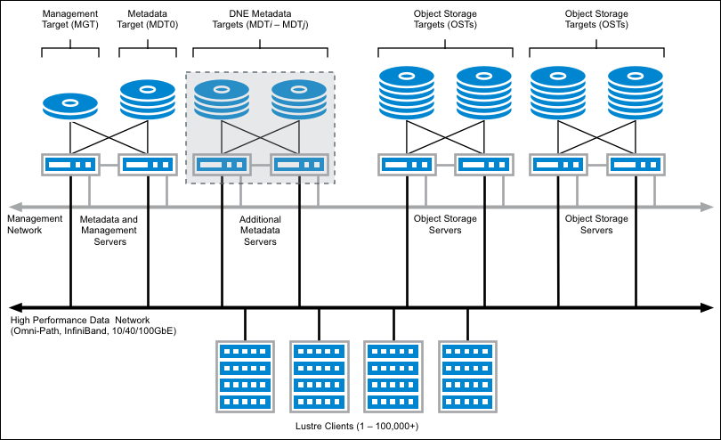
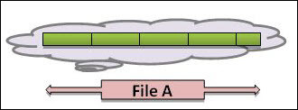
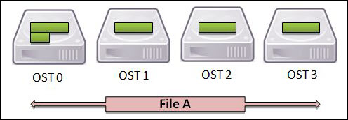
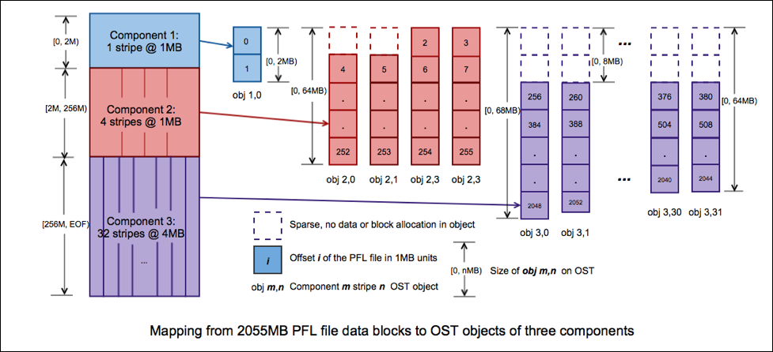
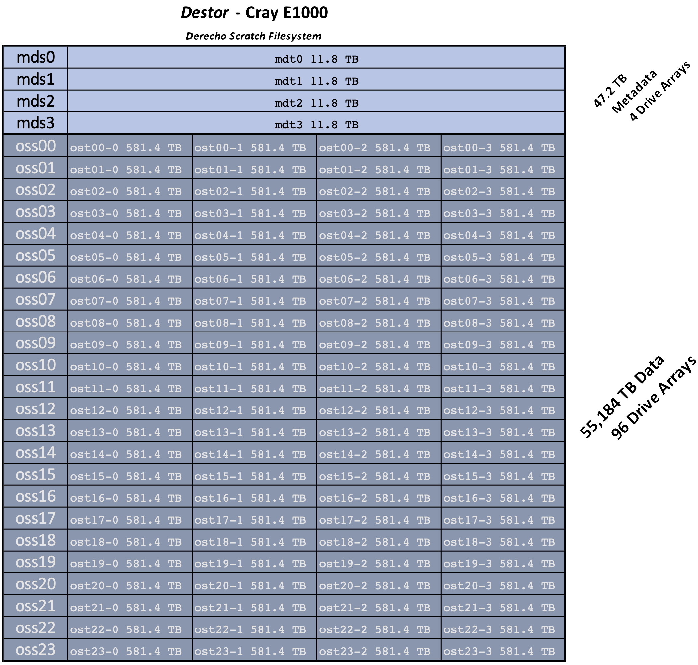

# Lustre scratch file system

The <strong>De</strong>recho <strong>Stor</strong>age subsystsem (**Destor**)
scratch file system is a Lustre-based
[Cray ClusterStor E1000](https://buy.hpe.com/us/en/enterprise-solutions/storage-solutions/cray-clusterstor-storage-systems/cray-clusterstor-e1000-storage-systems/cray-clusterstor-e1000-storage-systems/p/1012842049) product
configured as shown in the table below. An open-source, parallel system,
Lustre will be familiar to users of similar POSIX-compliant file
systems. This documentation provides a high-level overview of important
Lustre concepts and terminology to help users achieve optimal
performance.

## Capacity and components

Total capacity of the system is 40 TB of metadata and 60 PB of data.

| **Component**                | **Quantity** | **Details**                                                                                                                                                                         |
|------------------------------|--------------|-------------------------------------------------------------------------------------------------------------------------------------------------------------------------------------|
| Metadata servers (MDS)       | 4            | Each MDS has two 200 GbE CX6 Cassini network interfaces configured in an active/passive failover pair.                                                                              |
| Metadata targets (MDT)       | 4            | Each metadata server has a single 12 TB MDT composed of 11 drives in a RAID-10 configuration formatted with `ldiskfs` (~40 TB usable metadata across the entire file system). |
| Object storage servers (OSS) | 24           | Each OSS has a single 200 GbE CX6 Cassini network interface.                                                                                                                        |
| Object storage targets (OST) | 96           | Each OSS has four 582 TB OSTs. Each OST is composed of 53 drives in a GridRAID configuration formatted with `ldiskfs` (~60PB usable data across the entire file system).          |
| (Additional hardware details are [provided below](#configuration)). {: colspan=3} |

## Terminology

### Metadata and data

The notion of file metadata and data as related but separable entities
is important to understanding Lustre because it is fundamental to the
system's parallelization strategy. In a POSIX file system,
the ***metadata*** describes information about a file (name,
permissions, access controls, timestamps, and so on), and
the ***data*** contains the contents of the file itself.

Lustre employs one or more ***metadata servers*** (MDS) to store the
metadata and data layout of each file, and several ***object storage
servers*** (OSS) to hold the file contents.

Each MDS has one or more ***metadata targets*** (MDT), which are storage
devices attached to the MDS. Similarly, each OSS has one or more ***object
storage target*** (OST) storage devices. Typically, the MDTs and OSTs are
accessible from two different servers, providing fault tolerance and
failover capabilities. A typical Lustre file system is shown in Figure 1
below.



<br>**Figure 1:** Sample Lustre file system: 4 metadata servers (MDS), 4
object storage servers (OSS).
Credit: [*Introduction to Lustre Wiki*](https://wiki.lustre.org/Introduction_to_Lustre).


A file system may employ several metadata servers for scalability and
load balancing, and several object storage servers for capacity and
performance scalability. When a user creates a file on a Lustre file
system, it communicates with an MDS that is responsible for managing the
metadata of the file. The MDS also holds the file's ***striping layout***,
which is a template used to map file contents (conceptually, data
blocks) onto one or more OSTs.

This is important to understand because when users are interacting with
a Lustre file, they are really interfacing with several storage servers.
Different file operations require different server communication
requirements. For example, querying a file's modification time is a
metadata-only operation and thus requires communication only with the
MDS, whereas querying a file's size involves each OSS over which the
file is striped.

### File striping

File striping is a key feature of Lustre file systems. A file is said to
be striped when its sequence of bytes is separated into small chunks,
or ***stripes***, so that read and write operations can involve multiple
OSTs concurrently. This process is illustrated in Figures 2 and 3. In
Figure 2, the sample file is split into five stripes: the first four are
the same size while the fifth is smaller and contains the "remainder" of
the file. This introduces an important striping concept: the ***stripe
size***.


{width="400"}
<br>**Figure 2:** Logical view of a file, broken into five "stripe"
segments. The first four are the same size while the fifth is smaller
and contains the "remainder" of the file.
Credit: [*Lustre User Guide*](https://oit.utk.edu/hpsc/isaac-open/lustre-user-guide/).


Figure 3 shows how the stripes can be mapped onto several OSTs as
defined by the *stripe count*. In this example, the stripe count is four
and the stripe segments are assigned in a round-robin fashion.


{width="400"}
<br>**Figure 3:** Physical view of a file broken into five stripes across
four OST devices.
Credit: [*Lustre User Guide*](https://oit.utk.edu/hpsc/isaac-open/lustre-user-guide/).


Striping has important benefits as well as some drawbacks. Striping over
more OSTs allows for more bandwidth. In general, as more OSTs are used,
more servers are involved, so more network and disk subsystem bandwidth
is available. Striping also allows for files larger than any single OST.
The primary drawback of striping is overhead: as more OSTs are employed
to store a file, more network overhead is required to orchestrate the
components.

The preceding discussion is focused on striping the blocks of a given
file. When multiple MDTs are present in the file system, as is the case
with Derecho, metadata striping is also typically employed and the
contents of directories are spread across the available MDSs in the
system.

### Progressive file layouts

The configurable *stripe size* and *stripe count* parameters were at one
time the only modifiable parameters available to govern striping
behavior, which made it difficult to implement a one-size-fits-all
default configuration on large systems with varied use cases. The
introduction of ***progressive file layouts*** (PFLs) in modern Lustre
versions, however, extended the striping concept to multiple,
progressive segments of files, as shown in Figure 4.



<br>**Figure 4:** Sample progressive file layout with three components of
different stripe patterns.
Credit: [*PFL Prototype High Level Design*](https://wiki.lustre.org/PFL_Prototype_High_Level_Design).


In Figure 4, a single file is mapped to three separate components, each
with a different striping layout. The first component has a stripe size
of 1 MB with a stripe count of 1, and is 2 MB in total extent. This
means the first 2 MB of the file will be striped over only one OST, in
two 1-MB chunks.

The second component begins beyond this 2 MB threshold up to 256 MB
size. It employs a stripe size of 1 MB but increases the stripe count to
four.

Finally, the third and final component begins when the file size exceeds
256 MB. The stripe size increases to 4 MB and the stripe count to 32
OSTs.

PFLs are useful because they define a template that is much more general
than a single stripe size/count pair. They allow small files to be
striped over a small number of OSTs and only incur the overhead of
additional OST stripes when the file is sufficiently large to benefit
from increased bandwidth.

### `inodes` and data blocks

When a file system is constructed, the underlying storage device blocks
are segregated into two components: *data blocks* and *inodes*.

Data blocks are the most familiar; storing a 1 GB file simply requires a
sufficient number of data blocks to hold its contents.

Inodes, by contrast, are index nodes that hold the metadata associated
with a file or directory: ownership, time stamps, striping information,
and so on. The number of inodes available in a file system is generally
fixed and provides a strict limit on the number of files and directories
the file system can hold.

This is especially important in a Lustre file system. Its capacity is
limited by the size and quantity of OSTs, and its file count capacity is
also limited by the number of inodes available on the MDTs. In an
extreme example, it is possible to exhaust the available inodes in a
file system before its storage capacity by creating many tiny files, so
it is important to manage both the overall file system data
volume *and* the file count.

---

## Derecho's *Destor* Lustre scratch file system
With the background provided [above](#terminology), we can now discuss
Derecho's **Destor** Lustre file system specific storage
configuration.

### Configuration
Derecho's **Destor** Lustre file system hardware configuration is
shown schematically below.  The system has 4 MDS servers (each with a
single MDT), and 24 OSS servers (each with 4 OSTs).



#### Default Striping

!!! info "Destor default striping configuration"

    Destor uses *progressive file layouts* (PFLs) to accommodate a wide variety of file sizes and access patterns.

    | File Segment | Stripe Count | Stripe Size |
    |--------------|--------------|-------------|
    | 0-16MB       | 1            | 1MB         |
    | 16MB-16GB    | 4            | 16MB        |
    | 16GB-64GB    | 12           | 16MB        |
    | 64GB+        | 24           | 16MB        |


    This default PFL was created at the base of the file system and is inherited by default for all sub-directories.
    Users may apply alternate striping patterns for any directory or file they own.  (File striping must be set prior to creation and cannot be changed on existing files.)

    **Note that per-directory file striping is inherited by new files and sub-directories created within.**

    The default Destor stripe configuration can be applied if needed with the `lfs setstripe` command:
    ```bash
    lfs setstripe \
              -E 16M -c 1  -S  1M \
              -E 16G -c 4  -S 16M \
              -E 64G -c 12 -S 16M \
              -E  -1 -c 24 -S 16M
    ```

    See `man lfs-setstripe` for additional details.

### Performance expectations
Lustre in general, and on Derecho specifically, is designed for high-speed, parallel access to **large files**.

Key points:

*  Derecho has >2400 compute nodes (each a Lustre client),
*  All scratch metadata traffic, for all users, is served by only 4 MDS servers
    *  **Tiny files do not effectively use the primary performance potential.**
*  **Large files can be effectively spread across the storage cluster.**
    *  **5,088 hard drives** spread across **96 OSTs** served up by **24 OSSes**.
    * *Destor* can deliver over 300 GB/sec of large file access bandwdth.

### Jobstats
Lustre provides a mechanism to collate I/O statistics for reporting purposes using the [job stats](https://doc.lustre.org/lustre_manual.xhtml#jobstats) mechanism.
On Destor we collect job statistics according to `PBS_JOBID`.  These statistics are then presented in a
[graphana dashboard](https://grafana.hpc.ucar.edu/d/luNSUtmIz/lustre-jobstats-derecho?orgId=1&refresh=30m),
where users can optionally query the statistics for a particular job.


---

## Best practices

### Manage your file count and file volume

Users have quotas for both data volume and file count on the Derecho
Lustre file system. The `gladequota` utility is preferred for
reporting comprehensive storage usage across all GLADE file spaces,
including Lustre scratch spaces. Additionally, the `lfs quota` command
can be used to query Lustre-specific quota information.

Many simulation codes produce large quantities of small, diagnostic
output files that are useful for diagnosing problems but not often
referenced for successful production runs. Consider removing or tarring
such files incrementally in your workflow to manage overall file count.

### Avoid unnecessary metadata requests

From the background provided above, it is clear not all metadata access
requests are equal. Querying a file's timestamps is a cheap operation
requiring communication with the appropriate MDT, whereas querying a
file's size requires communication with each and every OST holding data
stripes. Therefore, it is a best practice to be aware of these
performance implications and request only the metadata needed for a
given operation.

For example, especially when in a large directory with hundreds of
files, avoid typing `ls -l` if a simple `ls` will do. The former
will communicate with every MDS and OSS in the file system in order to
determine the current file size, while the latter is simply an MDS
communication. Unnecessary communication can make the file system feel
slower to you and other users. When file size is required, limit the
request to the file(s) of interest when practical.

Finally, Lustre provides the notion of a "lazy" file size that can be
useful in circumstances where approximation is appropriate, for example
finding the largest or smallest files in a directory tree. See examples
below.

Similarly, avoid excessive file status calls when possible. When
repeatedly checking a file's status in a script – inside a loop for
example – consider adding a `sleep` command as a preventive measure.
This will prevent flooding the MDS with status requests when your loop
executes very quickly.

### Prefer Lustre-specific `lfs find` command

Lustre's `lfs find` is an optimized implementation of the
familiar `find` command. It will request only the data required to
perform the specified action, and so should be preferred whenever
possible. See the examples and use cases below.

---

## Examples, tools, tips, tricks

### Using `df` and `lfs df` to query file system status

Use the familiar `df` utility to query overall file system capacity.
For example, `df -h` shows the *data size* of a file system in a
human-readable format:
```pre
df -h /glade/derecho/scratch
Filesystem                            Size  Used Avail Use% Mounted on
10.14.64.3@tcp:10.14.64.4@tcp:/desc1   55P  5.9P   49P  11% /glade/derecho/scratch
```

Use `df -ih` to get the corresponding *metadata* information:
```pre
df -ih /glade/derecho/scratch
Filesystem                           Inodes IUsed IFree IUse% Mounted on
10.14.64.3@tcp:10.14.64.4@tcp:/desc1    16G  105M   16G    1% /glade/derecho/scratch
```

In the example, the file system overall capacity is 1.2 PB, of which 35
TB is used. The file system has 1.2 billion inodes, 19 million of which
are used, providing an additional limit on the total number of files and
directories that can be stored.

Running `lfs df` provides similar information but at the Lustre-aware
component level. For example, `lfs df -h` shows the data size broken
down by MDS and OST components:

```pre
lfs df -h /glade/derecho/scratch
UUID                       bytes        Used   Available Use% Mounted on
desc1-MDT0000_UUID         11.8T       26.9G       11.6T   1% /glade/derecho/scratch[MDT:0]
desc1-MDT0001_UUID         11.8T       29.7G       11.6T   1% /glade/derecho/scratch[MDT:1]
desc1-MDT0002_UUID         11.8T       32.7G       11.6T   1% /glade/derecho/scratch[MDT:2]
desc1-MDT0003_UUID         11.8T       22.9G       11.6T   1% /glade/derecho/scratch[MDT:3]
desc1-OST0000_UUID        581.4T       62.3T      513.2T  11% /glade/derecho/scratch[OST:0]
desc1-OST0001_UUID        581.4T       61.7T      513.9T  11% /glade/derecho/scratch[OST:1]
desc1-OST0002_UUID        581.4T       62.2T      513.3T  11% /glade/derecho/scratch[OST:2]
desc1-OST0003_UUID        581.4T       62.0T      513.5T  11% /glade/derecho/scratch[OST:3]
...
desc1-OST005c_UUID        581.4T       61.7T      513.8T  11% /glade/derecho/scratch[OST:92]
desc1-OST005d_UUID        581.4T       62.2T      513.3T  11% /glade/derecho/scratch[OST:93]
desc1-OST005e_UUID        581.4T       61.8T      513.7T  11% /glade/derecho/scratch[OST:94]
desc1-OST005f_UUID        581.4T       62.4T      513.1T  11% /glade/derecho/scratch[OST:95]

filesystem_summary:        54.5P        5.8P       48.1P  11% /glade/derecho/scratch
```

This sample file system is composed of four MDTs and 96 OSTs, and `lfs
df` shows the data size of each component. Administrators typically
monitor this information to ensure overall file system health, but it
can provide useful user diagnostics as well. If one or more of the OSTs
is temporarily unavailable due to a storage server issue, for
example, `lfs df` will hang at the affected component, indicating the
file system is not healthy. Using `lfs dh -ih` works similarly,
showing the per-component inode usage. Because Lustre file systems
typically have a smaller number of MDTs than OSTs, the per-MDT inode
usage is an important bound on the overall file system file/directory
count capacity.

### Using `lfs find` to change directory tree ownership or permissions

Tools such as `chown`, `chgrp`, and `chmod` provide a recursive
option to allow easy application to all the contents of a given
directory. Best practice is to *avoid such features* and invoke the
desired action through `lfs find` instead.

For example, if you want to change the group ownership of an entire
directory tree, you might run a command similar to `chgrp -R <newgroup> <dirname>`.
However, you can do it more efficiently –
albeit more verbosely – with `lfs find` as follows:
```pre
lfs find <dirname> -print0 | xargs -0 chgrp <newgroup>
```

To be UNIX-specific about the preceding command, it first asks `lfs
find` to list all the contents of a directory and print them separated
with a `NULL` character (`\0`). This list is then sent to the
command `xargs`, which is told to expect a `NULL`-separated list with
the `-0` flag. Then `xargs` will run the command `chgrp
<newgroup>` on batches of files and split what could be a long list
of files into small enough chunks to comply with UNIX's maximum command
line argument restrictions. See `man lfs-find` and `man xargs` for
additional details and examples.

### Using `lfs find` to `tar` a directory tree

This example shows how to create a `tar` archive file from a specified
directory tree efficiently:
```pre
lfs find <dirname> -print0 | \
   tar --create --acls --no-recursion \
      --verbose --index-file=my_archive.idx --tape-length=1G \
      --file=my_archive-{0000..9999}.tar --null -T -
```

First, `lfs find` will list all contents of the directory, `NULL`
separated. Then `tar` will operate on the list of files and
subdirectories. Its behavior is modified by the following flags:

- `--create` – Create a tar archive.

- `--acls` – Include any file/subdirectory access control lists (ACLs)
  encountered in the output tar files. This option is necessary to
  preserve ACL information when unpacking the archives later.

- `--no-recursion` – List everything in the directory: files, links,
  subdirectories, etc. By default `tar` will recurse into any
  directory name it encounters, so `--no-recursion` tells it not to do
  so, since the contents will be listed anyway. Combined
  with `--acls` this allows you to properly set ACLs on directories.

- `--verbose` – Print each file/subdirectory as it is processed.

- `--index-file=my_archive.idx` – Redirect the list created
  by `--verbose` into a file named `my_archive.idx`.

- `--tape-length=1G --file=my_archive-{0000..9999}.tar` – This
  instructs `tar` to create a series of files
  – `my_archive-0000.tar`, `my_archive-0001.tar`, and so on – in which
  each file is no larger than 1 GB.

- `--null -T -` – This tells `tar`that the input file list is
  `NULL`-separated and coming in on standard input.

The process creates several tar files but does not modify the original
source tree directory. One consequence is that storage volume increases
during this process until the user removes the directory. An alternative
to consider carefully is to also use the `--remove-files` option. It
will remove each source file after it is successfully added to the tar
archive, so the overall storage requirements should remain flat. This is
just one example of many possibilities with this approach. See
`man lfs-find` and `man tar` for more ideas.

### Using `lfs find --lazy` to efficiently locate old, large files

Determining the precise size of a file on a Lustre system is generally
an expensive operation in that it requires communication with every
object storage server that stores segments of the file. In some cases,
knowing the approximate file size may be sufficient, and it can be
obtained solely from the metadata server(s). For example, to locate all
files in a directory modified seven or more days ago that are
approximately 10 MB or larger, run:
```pre
lfs find <dirname> --lazy --size +10M --mtime +7 -type f -print
```

The `--lazy` flag requests the approximate file size instead of
requiring the precise size and the associated communication overhead.
That approach can be useful for quickly locating files to clean up and
recover quota space. It could also be combined
with `xargs` and `rm` to remove the files, similar to
the `chgrp` example.

## More resources

- [Introduction to
  Lustre](https://wiki.lustre.org/Introduction_to_Lustre)

- [lustre.org](https://www.lustre.org/)

- [Oak Ridge Leadership Computing Facility Lustre 101
  resources](https://lustre.ornl.gov/lustre101-courses/)

<!--  LocalWords:  Destor graphana
 -->
