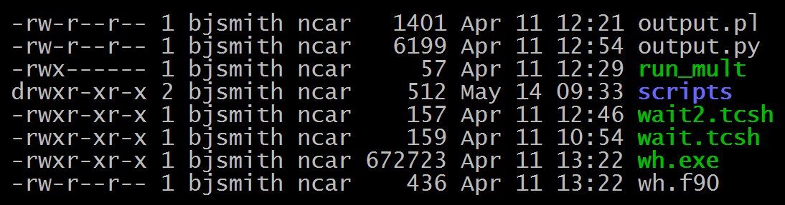

# Setting file and directory permissions

This information is intended to help **GLADE file system** users
understand common POSIX-standard commands. Note that:

- Experienced users may prefer to manage permissions using octal numbers
  rather than the methods described below.

- Some also find access control lists (ACLs) useful for facilitating
  short-term file sharing among selected users. See [Using access
  control lists](file:////display/RC/Using+access+control+lists).

#### Existing files and directories

Should you need to change permissions for *existing files or
directories* – to allow other users to modify or execute them, for
example – [follow the chmod examples
below](#Settingfileanddirectorypermissions-chmo).

#### New files and directories

Files and directories that you *create* in your GLADE file spaces have
certain permissions by default. To change the default settings, use the
[umask command](#Settingfileanddirectorypermissions-umas) described
below.

!!! danger "Don’t run sudo on NCAR systems"
    If you need help with tasks that you think require **sudo** privileges,
    or if you aren’t sure, please contact [HPC User
    Support](file:////display/RC/User+support) before trying to run sudo
    yourself. The command fails when unauthorized users run it and sends a
    security alert to system administrators.


## About permissions

Files in a UNIX system have associated permissions that determine who
can **read (r)**, **write (w)**, and **execute (x)** them.

Directory permissions use those same flags to indicate who can list
files in a directory (r), create and remove files in the directory (w),
or cd into or traverse (x) the directory. Carefully consider both the
file permissions and the directory permissions to get the desired end
result. For example, you can give a user read permission for a file, but
the user won't have access to it without also having permission to
traverse the directory tree that contains the file.

Three additional things to note regarding directory permissions:

1.  Users who have write permission for a directory can delete files in
    the directory without having write permission for those files.


2.  Subdirectories can have less restrictive permissions than their
    parent directories. However, if you change directory permissions
    recursively
    (see [chmod](#Settingfileanddirectorypermissions-chmo) below), you
    are changing them for all of the files and subdirectories in that
    directory tree.


3.  An alternative to changing permissions recursively is to set them
    selectively as shown in [this
    example <u>below</u>](#Settingfileanddirectorypermissions-sele).

**About execute flags: X vs. x**

When setting permissions, the execute flag can be set to
upper-case **X**, which differs from the lower-case **x** setting.
The **X** permission allows execution only if the target is a directory
or if the execute permission has already been set for the user or group.
It is useful in the case of handling directory trees recursively.

To see who can work with your files and directories, log in and look at
the output of an **ls ‑l** command.

Here is an example.

{width="500"}

The first column is a string of 10 permission flags.

The first flag indicates, for most directory contents, that what is
listed is a file (-) or a directory (d).

The other nine flags, in groups of three, indicate:

| \- the user’s (owner’s) permissions | **-rwxr-xr-x** |
|-------------------------------------|----------------|
| \- group members’ permissions       | **-rwxr-xr-x** |
| \- others’ permissions              | **-rwxr-xr-x** |

"Others" means everyone else who can log in on the machine.

## Changing permissions with chmod

To modify the permission flags on existing files and directories, use
the **chmod** command ("change mode"). It can be used for individual
files or it can be run recursively with the **-R** option to change
permissions for all of the subdirectories and files within a directory.

The chmod command specifies
which *class* or *classes* (**u**ser, **g**roup, **o**ther) have access
to the file or directory in
various *modes* (**r**ead, **w**rite, **e**xecute).

- Use the *operators* **+ **and **-** to add or remove selected
  permissions for a class without changing its other permissions.

- Use **= **to specify all of the permissions for a class at once. If a
  class is not mentioned explicitly, the permissions are unchanged even
  if the **= **operator is used for a different class.

Follow this format:
```pre
chmod [classes][operator][modes] filename
```
### Examples

#### Add selected permissions for a group

Only the owner can read, write, and execute this file:
```pre
-rwx------ 1 username group 57 Apr 11 12:29 filename
```
Add group (g) permissions to read (r) and execute (x) like this:
```pre
chmod g+rx filename
```
The new file permissions are shown here:
```pre
-rwxr-x--- 1 username group 57 May 14 09:54 filename
```
Note that the permissions that were not specified were not changed: The
user class permissions and other class permissions did not change, and
the writing permission for the group class remains unchanged.

#### Specify all permissions for a group

To set permissions for a single class, such as group (g), use
the **=** operator.
```pre
chmod g=rx filename
```
In this case, the only permissions affected were those for the specified
class: group. The group can only read or execute the file, but not
write. Permissions for the user class and other class were not changed
because they were not specified.

#### Specify permissions for sets of classes

To set permissions for multiple classes with a single command, separate
the class settings with a comma.
```pre
chmod u=rwx,g=rwx,o+rx filename
```
The new file permissions are shown here:
```pre
-rwxrwxr-x 1 username group 57 May 14 09:54 filename
```
#### Set permissions selectively

This example shows how to give your group access to all of the files and
subdirectories in a directory but limit other users' access to specified
files.
```pre
chmod -R u=rwx,g=rwx,o+x /glade/u/home/username/directory/

chmod u=rwx,g=rwx,o+rx
/glade/u/home/username/directory/subdirectory/file1

chmod u=rwx,g=rwx,o+rx
/glade/u/home/username/directory/subdirectory/file2
```
The result is that group members have all rights to files in the
specified directories and subdirectories. Others have permission to
traverse the directories as needed to read and execute two specified
files.

## Changing default permissions with umask

To change the default permissions that are set when you create a file or
directory within a session or with a script, use the **umask** command.

The syntax is similar to that of chmod (above), but use
the **=** operator to set the default permissions.

### Examples

The `umask` examples shown here will give you and group members read,
write, and execute permission. Others will have only read and execute
permission.

#### bash users
```pre
umask u=rwx,g=rwx,o=rx
```
#### tcsh users
```pre
umask 002
```

## Managing groups

Several additional commands are useful for managing groups to control
who can access files and directories. For example, you can limit access
to users who share your core-hour or storage space allocation.

Say you don't want all members of the **ncar** group to have group
permissions to read, write, and execute certain files. You should have a
UNIX group that corresponds to your project code – such as
group **uabc0001** for project code **UABC0001**. You can use the
commands described below to set or change group ownership of certain
files and directories so only members of that UNIX group have permission
to access them.

If there is no group that allows you to share as needed with other users
who have NCAR user accounts:

- Consider using the [setfacl
  command](file:////display/RC/Using+access+control+lists) to set up an
  access control list.

- Request creation of a custom group.

To share with colleagues *who do not have NCAR user accounts*,
see [Sharing data and making unattended
transfers](file:////display/RC/Sharing+data+and+making+unattended+transfers).

### Identifying current group and others - id

Files or directories that you create or edit become associated with your
current UNIX group. Usually, that is your *default primary group* unless
you change groups after you log in. (See "Changing current group"
below.)

If you aren't sure what your current group is, or which other groups you
belong to, you can find out by running the **id **command after you log
in. It will return your user ID (uid) and your current group (gid), and
it will list any other groups with which you are associated.

Example:
```pre
id

uid=12345(jsmith) gid=1000(ncar) groups=1000(ncar),54321(cisl)
```

### Changing current group - sg

*To change from one group to another during a login session*, follow
this example using the **sg** command and the name of the new group.
```pre
sg new_groupname
```

The command will start a new shell with your new current group ID in
effect. When you exit that shell, you change back to your previously
used group ID.

Some users prefer **newgrp** over **sg** for this, but **sg** has the
advantage of retaining your existing user environment while changing
your current group.

### Changing default group

*To change your default primary group* – the group that will be in
effect each time you subsequently log in – use the Systems Accounting
Manager ([SAM](https://sam.ucar.edu/)). Changes made in SAM typically
take effect the next business day.

### Changing group ownership of a file or directory - chgrp

Use **chgrp** as shown here to change ownership of a file or directory
to a different group.
```pre
chgrp new_groupname filename

chgrp new_groupname directory
```

To change group ownership of a directory and all of the files and
subdirectories in that directory, use chgrp recursively.
```pre
chgrp -R new_group directory
```