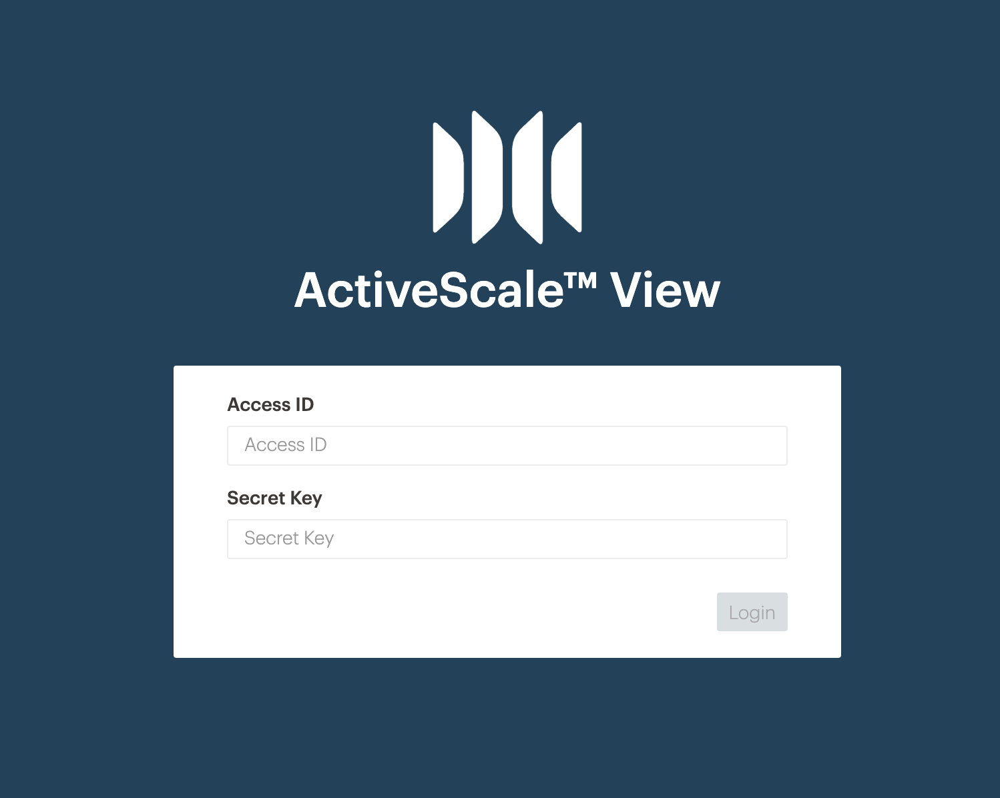
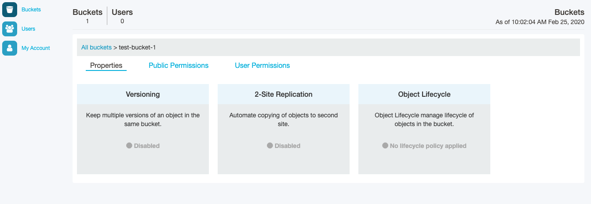
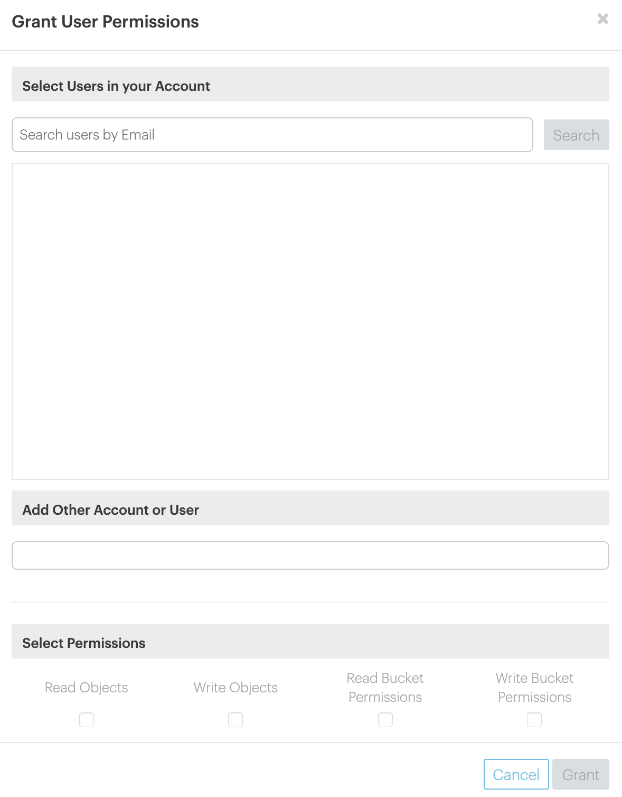
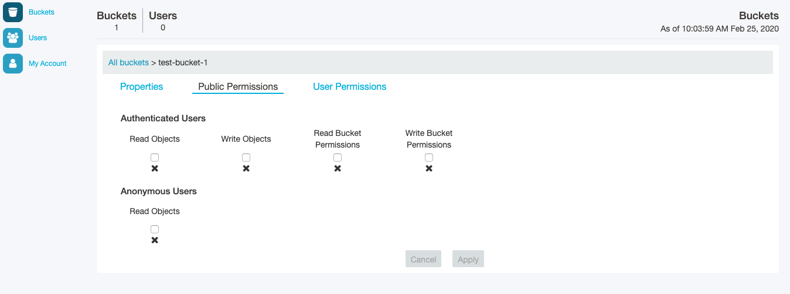

# Getting started with an object storage admin account

This page describes and shows how to get started as an admin for the
Stratus object storage system.

## Using the web GUI to log into your S3 admin account

After connecting to the UCAR StaffNet network or the VPN:

- Set your browser to point to this
  URL: https://stratus-admin.ucar.edu:10443/asview

- Enter your access ID and secret key

*Figure 1.*

## Creating buckets

Figure 2 shows the screen where you'll create buckets. To create a
bucket, press the "Create Bucket" button and you'll be prompted for a
bucket name. Note that the bucket name must be globally unique for the
entire system. If a different account holder on the system already has a
bucket with that name, you'll get an error. This behavior conforms with
the AWS S3 API. (See also <https://stackoverflow.com/a/59656742/25891>)

*Figure 2.*

Figure 3 shows your new bucket and will show all your buckets as you
create them.

*Figure 3.*

Now that a bucket has been created, you can write objects to the bucket
and read from it using the access and secret keys that you used to log
onto the web interface.

There are many clients that can be used to take S3 actions, such as
transferring objects to/from the system, listing buckets, etc.

- For example, the *cyberduck* desktop client can be utilized.

- Or python scripts (using the boto3 library) can be used to perform S3
  operations. CISL has tried alternative access libraries bucketstore
  and apache-libcloud, but they lack the ability to select the URL where
  to connect, and therefore cannot be used with CISL's hardware (only
  with AWS).

These other clients can also be used to create buckets and manage your
account (not everything has to be done through this web interface).

When connecting to the system with a client to perform S3 operations
(e.g., transfer data, etc.), use the host name `stratus.ucar.edu` rather
than `stratus-admin.ucar.edu`. The IP
name `stratus-admin.ucar.edu` should only be used to connect to the
administrative web GUI.

## Granting permissions to other users

By default, only the account owner has the privileges to write to and
read from buckets in the account. It's possible to grant other users on
the system and even anonymous users (those without any keys) write and
read privileges.
The account owner is responsible for informing additional users of CISL
communications regarding this system, such as announcements of planned
downtime, or ensuring that they subscribe to the "Stratus Object
Storage" [Notifier](https://notifier.ucar.edu/) list.

To grant other users access, you may need to first add the user. Press
the “Users” link on the left side of the screen and add the user.  Once
the user has been added click on a specific bucket name shown in the
list of buckets in Figure 3. Figure 4 shows the options you will see for
granting access. Selecting “User Permission” will allow you to grant
access to a specific user.

*Figure 4.*

*Figure 5.*

In the section titled "Add Other Account or User" as shown in Figure 5,
enter the email address of the person you would like to grant access to.
Next, select the permissions you want to grant:

| **Permission**           | **Meaning**                                                                                                                   |
|--------------------------|-------------------------------------------------------------------------------------------------------------------------------|
| Read objects             | Allows the user to read objects from the bucket                                                                               |
| Write objects            | Allows the user to write objects to the bucket                                                                                |
| Read bucket permissions  | Allows the user to read the permissions on the bucket and, for example, see what other users have permissions on the bucket   |
| Write bucket permissions | Allows the user to change the permissions on a bucket. For example, a user could grant another user permissions on the bucket |

Once granted, the specific user will have the permissions that you've
configured for that bucket. ***Since each bucket has its own
permissions, you'll need to set permissions for each bucket if you want
other users to be able to access it.***

It's also possible to grant permissions to what are termed public users.
 A public user is defined as either an *anonymous* user or
an *authenticated* user. An anonymous user means a user who does not
need any keys to access the bucket; *anonymous* users can only read
objects from buckets. An *authenticated* user means any user on the
system. To grant permissions to public users, click on "Public
Permissions" in the screen that was visited earlier and shown in Figure
6.

*Figure 6.*

*Figure 7.*

Select the permissions you want to grant, as shown in Figure 7, to
enable access for *authenticated* users or *anonymous* users. Note that
the Data Commons System is currently only reachable from devices on the
StaffNet network. Devices outside of the UCAR network are not able
to access the storage system, even for *anonymous* access.

## Vendor documentation

Here is a link to vendor documentation that may help you:
[S3 API Reference](https://drive.google.com/open?id=11GP4alM1zxTeKUEzjU6IEdlcG-2bVvkM)

## Glossary

**AWS SDK** - Amazon Web Services Software Development Kit for Python
(Boto3) (<http://aws.amazon.com/sdk-for-python/>)

**Bucket** - Container to store objects, similar to a directory

**Cyberduck** - Cloud storage browser
([http://cyberduck.io](http://cyberduck.io/))

**Object** - Data structure that stores both file metadata and data
